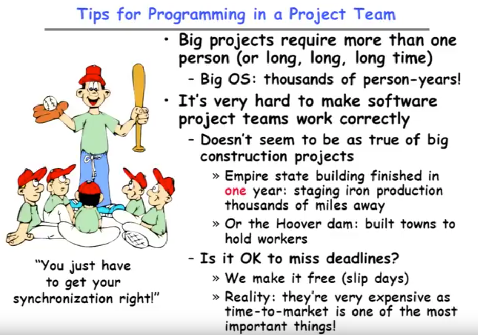
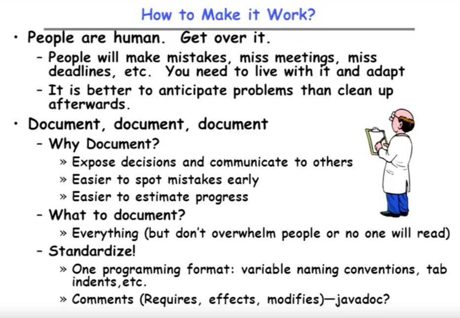
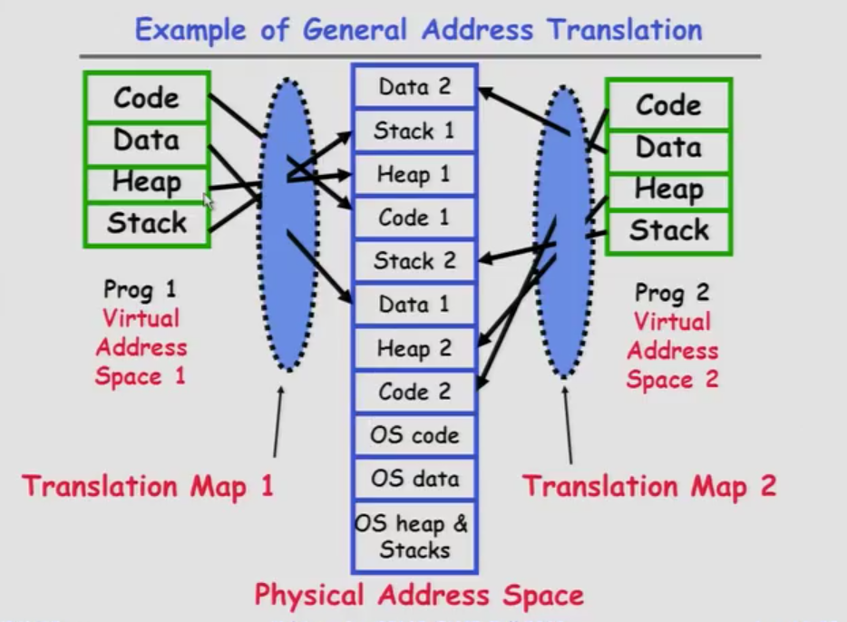

## Lecture 6 Synchronization

#### Review:	ThreadFork(): Create a New Thread

* _ThreadFork()_ is a user-level procedure that creates a new thread and places it on ready queue
	+ We called this CreateThread() earlier

* __Arguments__ to _ThreadFork()_
	+ Pointer to application routine (fcnPtr)
	+ Pointer to array of arguments (fcnArgPtr)
	+ Size of stack to allocate

* __Implementation__
	+ Sanity Check arguments
	+ Enter Kernel-mode and Sanity Check arguments again
	+ Allocate new Stack and TCB
	+ Initialize TCB and place on ready list (Runnable)

---------------

#### Review:	How does Thread get started?

> We're in kernel mode when we switch.

---------------

#### Review: What does ThreadRoot() look like?

")

----------------

* Correctness for systems with concurrent threads (具有并发线程的系统的正确性)

+ Independent Threads
	- No state shared with other threads
	- Deterministic(确定性的) -> Input state determines results
	- Reproducible(可复制的) -> Can recreate Starting Conditions, I/O
	- Scheduling order doesn't matter (if `switch()` works!!!)

+ Cooperating Threads
	- Shared State between multiple threads
	- Non-deterministic
	- Non-reproducible

+ Non-deterministic and Non-reproducible means that __bugs can be intermittent__(间歇的)
	- Sometimes called "**Heisenbugs**"

	> Heisenbugs: these are the bugs where you go to look at them and they disappear on you.

----------------

#### Goals for Today

* Concurrency examples
* Need for synchronization(同步)
* Examples of valid synchronization

----------------

* Interactions Complicate Debugging (交互使得更难debug)

	+ Is any program truly independent ?
		- No!

	+ You probably don't realize how much you depend on reproducibility

	+ Non-deterministic errors are really difficult to find!

	

----------------

* Why allow cooperating threads?

	+ People cooperate; computers help/enhance people's lives, so computers must cooperate
		- By analogy, the non-reproducibility/non-determinism of people is a notable problem for "carefully laid plans"

	+ Advantage
		1. Share resources
			- One computer, many users
			- One back balance, many ATMs ( What if ATMs were only updated at night?)
			- Embedded systems (robot control: coordinate arm & hand)

		2. Speedup
			- Overlap I/O and computation (Many different file systems do read-ahead)

		3. Modularity
			- More important than you might think
			- Chop large problem up into simpler pieces (To compile, for instance, gcc calls cpp | cc1 | cc2 | as | id )  (Makes system easier to extend)

> gcc (GNU编译器套装 GNU Compiler Collection )， 指一套编程語言编译器，以GPL及LGPL许可证所发行的自由软件，也是GNU計畫的关键部分，也是GNU工具链的主要組成部份之一。GCC（特别是其中的C语言编译器）也常被认为是跨平台编译器的事实标准。它原本只能处理C語言。GCC在发布后很快地得到扩展，变得可處理C++。之後也變得可處理Fortran、Pascal、Objective-C、Java、Ada，Go與其他語言。
>
> cpp 是程序设计语言C++的另一种书写形式。“C Plus Plus”的简称。是继C语言之后又一种计算机编程语言，C++编程语言同时支持所有的C语言语法。C++和C相似：但C是面向过程的程序设计语言，而C++是面向对象的程序设计语言，不过C++语言保持了对C语言的兼容，也就说是在C++程序可以不用修改的插入C语言代码。

----------------

* Threaded Web Server

* Advantages of Threaded Version:
	+ Can share file caches kept in memory, results of CGI scripts, other things
	+ Threads are __much cheaper to create than processes__, so this has a lower per-request overhead

> CGI (Common Gateway Interface, 通用网关接口), 是Web 服务器运行时外部程序的规范,按CGI 编写的程序可以扩展服务器功能。CGI 应用程序能与浏览器进行交互,还可通过数据库API 与数据库服务器等外部数据源进行通信,从数据库服务器中获取数据。格式化为HTML文档后，发送给浏览器，也可以将从浏览器获得的数据放到数据库中。几乎所有服务器都支持CGI,可用任何语言编写CGI,包括流行的C、C ++、VB 和Delphi 等。
>> CGI 分为标准CGI 和间接CGI两种。标准CGI 使用命令行参数或环境变量表示服务器的详细请求，服务器与浏览器通信采用标准输入输出方式。间接CGI 又称缓冲CGI,在CGI 程序和CGI 接口之间插入一个缓冲程序，缓冲程序与CGI 接口间用标准输入输出进行通信。

> CGI 是WWW技术中最重要的技术之一，有着不可替代的重要地位。CGI是外部应用程序（CGI程序）与WEB服务器之间的接口标准，是在CGI程序和Web服务器之间传递信息的过程。CGI规范允许Web服务器执行外部程序，并将它们的输出发送给Web浏览器，CGI将Web的一组简单的静态超媒体文档变成一个完整的新的交互式媒体。绝大多数的CGI程序被用来解释处理来自表单的输入信息，并在服务器产生相应的处理，或将相应的信息反馈给浏览器。CGI程序使网页具有交互功能。

+ What if too many requests come in at once?

----------------

* Thread Pools

	+ Problem with previous version: Unbounded Threads
		- When web-site becomes too popular - throughput sinks(吞吐量下降、生产量下降)

	+ Instead, allocate a bounded "pool" of threads, representing the maximum level of multiprogramming

	

>> De-queue 和 queue 是simultaneously 同时的。

> Thread pool is a pretty simple technique, but it lets us get by the unbounded parallelism problem while same time having the advantage of more than one thread.

----------------

* ATM Bank Server

* Example

* How could we speed this up?
	+ More than one request being processed at once
	+ Event driven (overlap computation and I/O)
	+ Multiple threads (multi-proc, or overlap computation and I/O)

+ This technique is used for graphical programming
> The graphical programming model is so well defined and constrained that they can basically do this devision, they can kind of figure out where the event boundaries are and they can do it once for everybody that uses the windowing system.

----------------

* Can Threads Make This Easier?

	+ Threads yield overlapped I/O and computation without "deconstructing" code into non-blocking fragments
		- One thread per request

	+ Requests proceeds to completion, blocking as required：

-----------------

* Problem is at the lowest level

> 当Thread没有共享数据，两者没有任何影响和联系。
>
> 当Thread共享 data,取决于两个Thread的顺序等其他条件。

-----------------

* Atomic Operations (原子操作)

	+ To understand a concurrent program, we need to know what the underlying indivisible operations are!

	+ __Atomic Operation__: an operation that always runs to completion or not at all
		- It's _indivisible_: it cannot be stopped in the middle and state cannot be modified by someone else in the middle
		- Fundamental building block - if no atomic operations, then have no way for threads to work together

	+ On most machines, memory references and assignments (i.e. loads and stores) of words are atomic
		- Consequently - weird example that produces "3" on previous slide can't happen

	+ Many instructions are not atomic
		- Double-precision floating point store often not atomic
		- VAX and IBM 360 had an instruction to copy a whole array

> Atomic Operation(原子操作，不可被中断的一个或一系列操作。）指不会被线程调度机制打断的操作；一旦开始，就一直运行到结束，中间不会有任何 context switch（切换到另一个线程）。

> 2.术语定义
>> 

> 3.处理器如何实现原子操作：32位IA-32处理器使用基于 _对缓存加锁_ 或 _总线加锁_ 的方式来实现多处理器之间的原子操作

>> 3.1 处理器自动保证基本内存操作的原子性:	首先处理器会自动保证基本的内存操作的原子性。处理器保证从系统内存当中读取或者写入一个字节是原子的，意思是当一个处理器读取一个字节时，其他处理器不能访问这个字节的内存地址。奔腾6和最新的处理器能自动保证单处理器对同一个缓存行里进行16/32/64位的操作是原子的，但是复杂的内存操作处理器不能自动保证其原子性，比如跨总线宽度，跨多个缓存行，跨页表的访问。但是处理器提供总线锁定和缓存锁定两个机制来保证复杂内存操作的原子性。

>> 3.2 使用总线锁保证原子性:
>>> 如果多个处理器同时对共享变量进行读改写（i++就是经典的读改写操作）操作，那么共享变量就会被多个处理器同时进行操作，这样读改写操作就不是原子的，操作完之后共享变量的值会和期望的不一致，举个例子：如果i=1,我们进行两次i++操作，我们期望的结果是3，但是有可能结果是2。 原因是有可能多个处理器同时从各自的缓存中读取变量i，分别进行加一操作，然后分别写入系统内存当中。那么想要保证读改写共享变量的操作是原子的，就必须保证CPU1读改写共享变量的时候，CPU2不能操作缓存了该共享变量内存地址的缓存。

>> 处理器使用总线锁就是来解决这个问题的。所谓总线锁就是使用处理器提供的一个LOCK＃信号，当一个处理器在总线上输出此信号时，其他处理器的请求将被阻塞住,那么该处理器可以独占使用共享内存。

>> 3.3 使用缓存锁保证原子性
>>> 在同一时刻我们只需保证对某个内存地址的操作是原子性即可，但总线锁定把CPU和内存之间通信锁住了，这使得锁定期间，其他处理器不能操作其他内存地址的数据，所以总线锁定的开销比较大，最近的处理器在某些场合下使用缓存锁定代替总线锁定来进行优化。频繁使用的内存会缓存在处理器的L1，L2和L3高速缓存里，那么原子操作就可以直接在处理器内部缓存中进行，并不需要声明总线锁，在奔腾6和最近的处理器中可以使用“缓存锁定”的方式来实现复杂的原子性。所谓“缓存锁定”就是如果缓存在处理器缓存行中内存区域在LOCK操作期间被锁定，当它执行锁操作回写内存时，处理器不在总线上声言LOCK＃信号，而是修改内部的内存地址，并允许它的缓存一致性机制来保证操作的原子性，因为缓存一致性机制会阻止同时修改被两个以上处理器缓存的内存区域数据，当其他处理器回写已被锁定的缓存行的数据时会起缓存行无效，在例1中，当CPU1修改缓存行中的i时使用缓存锁定，那么CPU2就不能同时缓存了i的缓存行。

>> 但是有两种情况下处理器不会使用缓存锁定。第一种情况是：当操作的数据不能被缓存在处理器内部，或操作的数据跨多个缓存行（cache line），则处理器会调用总线锁定。第二种情况是：有些处理器不支持缓存锁定。对于Inter486和奔腾处理器,就算锁定的内存区域在处理器的缓存行中也会调用总线锁定。

> 以上两个机制我们可以通过Inter处理器提供了很多LOCK前缀的指令来实现。比如位测试和修改指令BTS，BTR，BTC，交换指令XADD，CMPXCHG 和其他一些操作数和逻辑指令，比如ADD（加），OR（或）等，被这些指令操作的内存区域就会加锁，导致其他处理器不能同时访问它。

> 在java中可以通过锁和循环CAS的方式来实现原子操作。

--------------------

* Correctness Requirements

	+ Threaded programs must work for all interleavings of thread instruction sequences
		- Cooperating threads inherently non-deterministic and non-reproducible
		- Really hard to debug unless carefully designed!

	+ Example: Therac-25; Software errors caused the death of sesveral patients

--------------------

* Space Shuttle Example

> primary avionics 初级航空电子

--------------------

> Could this happen on a uniprocessor?
>> Yes! Unlikely, but if you depending on it not happenning, it will and your system will break...

--------------------

--------------------

* Definitions

	+ __Synchronization__:	using atomic operations to ensure cooperation between threads
		- For now, only loads and stores are atomic
		- We are going to show that its hard to build anything usefule with only reads and writes

	+ __Mutual Exclusion__: ensuring that only one thread does a particular thing at a time
		- One thread _excludes_ the other while doing its task

	+ __Critical Section__: piece of code that only one thread can execute at once. Only one thread at a time will get into this section of code.
		- Critical section is the result of mutual exclusion
		- Critical section and mutual exclusion are two ways of describing the same thing.

		> 每个线程中访问临界资源的那段程序称为 __临界区（Critical Section）__ （ _临界资源_ 是一次仅允许一个线程使用的共享资源）。每次只准许一个线程进入临界区，进入后不允许其他线程进入。不论是硬件临界资源，还是软件临界资源，多个线程必须互斥地对它进行访问。(critical section 是每个线程中访问临界资源的那段代码，不论是硬件临界资源，还是软件临界资源，多个线程必须互斥地对它进行访问。)

	+ __Lock__: prevents someone from doing something
		- Lock before entering critical section and before accessing shared data
		- Unlock when leaving, after accessing hared data
		- Wait if locked

		>>> All synchronization involves waiting

> Fixes too much !

--------------------

* Too Much Milk:	Correctness Properties

	+ Need to be careful about correctness of concurrent programs, since non-deterministic (非确定的)
		- Always write down behavior first
		- Impulse is to start coding first, then when it doesn't work, pull hair out
		- Instead, think first, then code

	+ What are the correctness properties for the "Too much milk" problem?？？
		- Never more than one person buys
		- Someone buys if needed

	+ Restrict ourselves to use only atomic load and store operations as building blocks (限制我们只使用原子负载和存储操作作为构建块)

--------------------
##### Solution 1

> Why only occasionally?
>>> These checks here are not atomic. Suppose that both of us check for there being no milk and now by the way, there is a invisible roomate. And both of you see there's no note at the same time, both of you leave a note and head out to buy milk.

>> So there is a synchronization condition built into this code that is a weird interleaving where things switch just at the wrong time. Right after you've looked throught the conditions you switch over to the other guy they look through the condition they leave not you come back and leave the note...

> 这种情况其实更差。因为看似解决掉了问题所在，但实际上有少数机会还是会发生错误，并且很难debug！

--------------------

##### Solution 1.5

--------------------

##### Solution 2

> Maby A leave a note and B leave a note, then nobody buys any milk.

> 在极少数情况下会出错、发生没有人去购买牛奶，因为彼此都认为对方会去购买。这种极端的潜在的情况下发生会使得非常的麻烦。This is one of the heisenbugs or it looks like it that it's going to show up at the worst possible time. This one's even less likely than the previous one.

> 与并发相关的关键术语:
>> __原子操作__ ：要保证指令的序列作为一个组来操作执行，要么都不执行；要么执行要直接执行到指令完毕，中间不能中断

>> __临界区__ ：是一段代码，在这段代码中进程将访问共享资源，当有一个进程在这段代码中运行时，其他进程不能在这段代码中运行

>> __死锁__ ：两个或两个以上的进程因其中的每个进程都在等待其他进程做完某些事情而不能继续执行，这种情形称为死锁

>> __互斥__ ：当一个进程在临界区访问共享资源时，其他进程不能进入该临界区访问任何共享资源，这种情形称为互斥

>> __同步__ ：同步是在互斥的基础上（大多数情况），通过对其他机制实现访问者对资源的有序访问

>> __饥饿__ ：指一个可运行的进程尽管能继续执行，但被调度程序无限期地忽视，而不能调度执行的情形

>> __竞争条件__ ：多个线程或进程在读写一个共享数据时，结果依赖于它们执行的相对时间，这种情形称为竞争条件

--------------------

##### Solution 3

>> One thing we can say about this code is each chunk(块）here is protecting a critical section. So basically think of this part leave note A while note B is an entry and the remove note is a exit and this if no milk buy milk is a critical section. And it's over here to that we want to make sure only one of the people do at a time. We don't want any interleaving on the if no milk buy milk critical section. That's what this is being what we're protecting here.

--------------------

##### Solution 4

--------------------

#### Summary

* Concurrent threads are a very useful abstraction
	+ Allow transparent overlapping of computation and I/O
	+ Allow use of parallel processing(并行处理) when available

------------------

## Lecture 7, Mutual Exclusion, Semaphores, Monitors, and Condition Variables(条件变量)

##### Review: Synchronization problem with Threads

-------------------

##### Review: Too Much Milk Solution #3

> "if not milk, buy milk" is on both sides that's the critical section we're really trying to protect or that's the atomic operation in this case.

-------------------

#### Goals for Today

* Hardware Support for Synchronization
* Higher-level Synchronization Abstractions
	+ Semaphores, monitors, and condition variables(信号量、监视器和条件变量)
* Programming paradigms for concurrent programs(并发程序的编程范例)

-------------------

* High-Level Picture

	+ The abstraction of threads is good:
		- Maintains sequential execution model
		- Allows simple parallelism to overlap I/O and computation

	+ Unfortunately, still too complicated to access state shared between threads
		- Consider "too much milk" example
		- Implementing a concurrent program with only loads and stores would be tricky and error-prone(易错的)

	+ Today, we'll implement higher-level operations on top of atomic operations provided by hardware
		- Develop a "synchronization toolbox"
		- Explore some common programming paradigms(范例)

-------------------

##### Solution 4

-------------------

* How to implement Locks?

	+ __Lock__: prevents someone from doing something
		- Lock before entering critical section and before accessing shared data
		- Unlock when leaving, after accessing shared data
		- Wait if locked
			> Important idea: _all synchronization involves waiting_

			> Should _sleep_ if waiting for a long time

	+ Atomic Load/Store: get solution like Milk #3
		- Locked at this last lecture
		- Pretty complex and error prone

	+ Hardware Lock instruction
		- Is this a good idea?
		- What about putting a task to sleep?
			- How do you handle the interface between the hardware and scheduler?
		- Complexity?
			- Done in the Intel 432
			- Each feature makes hardware more complex and slow

-------------------

* Naive use of Interrupt Enable/Disable

	+ How can we build multi-instruction atomic operations?
		- Recall: dispatcher gets control in two ways.

		> Internal: Thread does something to relinquish(放弃、让出) the CPU			

		> External: Interrupts cause dispatcher to take CPU

		- On a uniprocessor, can avoid context-switching by:

		> Avoiding internal events (although virtual memory tricky)

		> Preventing external events by disabling interrupts

	+ Consequently, naive Implementation of locks:
		`LockAcquire { disable ints; } // disable interrupts`
		`LockRelease { enable ints; } // enable interrupts`

	+ Problems with this approach:
		- __Can't let user do this!__ Consider following:

			`LockAcquire(); `
			`While(TRUE) {;} `
			> Interrupts will never go off again, the OS will never grab the CPU back and basically you're busy computing zero or something.

		- Real-Time system - no guarantees on timing!
			- Critical Sections might be arbitrarily long

		- What happens with I/O or other important events?
			- "Reactor about to meltdown. Help?"

-------------------

* Better Implementation of Locks by Disabling Interrupts

	+ Key idea: Maintain a lock variable and impose mutual exclusion only during operations on that variable

-------------------

* New Lock Implementation: Discussion

	+ _Why do we need to disable interrupts at all?_
		- Avoid interruption between checking and setting lock value
		- Otherwise two threads could think that they both have lock

> Between disable and enable we have a very short time in here.

> You have to sort of separate the implementation of the lock from the use of the lock. So if you have some code that acquires the lock and goes and computes a million digits of PI and then release the lock. That's okay here because we only disable and enable interrupts just during the period of acquiring and releasing the lock, not during this critical section which the user programs using.

> So you got to distinguish the implementation of the lock from the use of the lock. So the use of a lock can take as long as they want.

-------------------

* Interrupt re-enable in going to sleep

	+ Enable Position before putting  thread on the wait queue?
	

	+ After putting the thread on the wait queue
	

	+ Want to put it after _sleep()_
	

-------------------

* How to Re-enable After Sleep()?

	+ In _Nachos_, since interrupts are disabled when you call _sleep_:
		- Responsibility of the next thread to re-enable interrupt
		- When the sleeping thread wakes up, returns to acquire and re-enables interrupts

	

-------------------

* Interrupt disable and enable across context switches

	+ An important point about structuring code:
		- In Nachos code you will see lots of comments about assumptions made concerning when interrupts disabled
		- This is an example of where modifications to and assumptions about program state can't be localized within a small body of code
		- In these cases it is possible for your program to eventually "acquire" bugs as people modify code

	+ Other cases where this will be a concern?
		- What about exceptions that occur after lock is acquired? Who releases the lock?

	

-------------------

* Interrupt disable and enable across context switches

+ An important point about structuring code:
    - In Nachos code you will see lots of comments about assumptions made concerning when interrupts disabled
    - This is an example of where modifications to and assumptions about program state can't be localized within a small body of code
    - In these cases it is possible for your program to eventually "acquire" bugs as people modify code

+ Other cases where this will be a concern?
    - What about exceptions that occur after lock is acquired? Who releases the lock?

-------------------

* Atomic Read-Modify-Write instructions

    + Problem with previous solution:
        - Can't give lock implementation to users (assuming you can't give an interrupt disabled to the user)
        > If you give interrupts disabled to the user, then they will lock up the machine whether or not it's intentional.

        - Doesn't work well on multiprocessor
            * Disabling interrupts on all processors requires messages and would be very time consuming

    + Alternative: __atomic instruction sequences__
    - These instructions read a value from memory and write a new value atomically
    - Hardware is responsible for implementing this correctly
        * on both uniprocessors(not too hard)
        * and multiprocessors(requires help from cache coherence protocal)
    - Unlike disabling interrupts, can be used on both uniprocessors and multiproecssors

-------------------

* Example of Read-Modify-Write

> 1. Test and set operation, it wasn't always true.

>> Zero is unlocked and one is locked, and the reason this works as was being explained before my machine crashed was that no matter how many people simultaneously try to get a lock, only one of them will be the lucky enough one to catch the zero and store the one, everybody else will get a one back. It's truly atomic even though everybody goes at it simultaneously, only one of them gets the zero back and they're the ones that have the lock. How do you release the lock? You write a zero.

> 2. Swap this is grab the value that's down there store the value, and you have register that's another atomic one that you can do stuff with.

> 3. Compare and swap turns out this one is actually seems complicated but it was on the 680000 processor and interestingly you can do some pretty cool lock free cue examples.

> 4. Load-lined store conditional is another example of a type of atomic operation that you can get on processors.

>> This one was on the Alpha and our 4000 the point is that these are more complicated operations than just loader store. They combinations a load and store and as a result those combinations are enough sufficiently sophisticated enough that we can build locks out of them.

-------------------

* Implementing Locks with test&set

-------------------

* 	Problem: Busy-Waiting for Lock

    + Positives for this solution
        - Machine can receive interrupts
        - User code can use this lock
        - Works on a multiprocessor

    + Negatives
        - This is very inefficient because the busy-waiting thread will consume cycles waiting
        - Waiting thread may take cycles away from thread holding lock (no one wins!)
        - __Priority Inversion__: If busy-waiting thread has higher priority than thread holding lock --> no progress! (never getting run)

    + Priority Inversion problem with original Martian rover
    + For semaphores and monitors, waiting thread may wait for an arbitrary length of time!
        - Thus even if busy-waiting was OK for locks, definitely no ok for other primitives
        - Homework/exam solutions should not have busy-waiting!

> 忙碌等待（Busy waiting、busy-looping、spinning）是一种以进程反复检查一个条件是否为真为根本的技术，条件可能为键盘输入或某个锁是否可用。忙碌等待也可以用来产生一个任意的时间延迟，若系统没有提供生成特定时间长度的方法，则需要用到忙碌等待。
>
>> 对于多核CPU，忙碌等待的优点是不切换线程，避免了由此付出的代价。因此一些多线程同步机制不使用切换到内核态的同步对象，而是以用户态的自旋锁或其衍生机制（如轻型读写锁）来做同步，付出的时间复杂度相差3个数量级。忙碌等待可使用一些机制来降低CPU功耗，如Windows系统中调用YieldProcessor，实际上是调用了SIMD指令_mm_pause。

-------------------

* Better Locks using test&set

> Lock is blue, guard is red.		

		

>> So the busy-waiting in this instance is limited to very infrequent or short periods of time because even if you're stuck spinning, the person who's got the lock is going through very fast code and they're gonna release it quickly.

-------------------

* 	Higher-level Primitives than Locks

+ __Synchronization__ is a way of coordinating multiple concurrent activities that are using shared state
    - This lecture and the next presents a couple of ways of structuring the sharing

-------------------

* Semaphores

    + Semaphores are a kind of generalized lock
        - First defined by Dijkstra in late 60s
        - Main synchronization primitive used in original UNIX

    + Definition: a Semaphores has a non-negative integer value and supports the following two operations:
        - __P()__: an atomic operation that waits for semaphore to become positive, then decrements it by 1
            * Think of this as the wait() operation
        - __V()__: an atomic operation that increments the semaphore by 1, waking up a waiting P, if any
            * This of this as the signal() operation
        - Note that __P()__ stands for "_proberen_" (to test) (普罗布林) and __V()__ stands for"_verhogen_" (to increment) (维尔根) in Dutch

-------------------

* Semaphores Like Integers Except

    + Semaphores are like integers, except:
        - No negative value
        - Only operations allowed are P and V - can't read or write value, except to set it initially
        - Operations must be atomic
            * Two P's together can't decrement value below zero
            * Similarly, thread going to sleep in P won't miss wakeup from V - even if they both happen at same time

    + Semaphore from railway analogy
        - Here is a semaphore initialized to 2 for resource control:

-------------------

* Two Uses of Semaphores

    1. Mutual Exclusion (initial value = 1)
        - Also called "Binary Semaphore"
        - Can be used for mutual exclusion:

    2. Scheduling Constraints (initial value = 0)
        - Locks are fine for mutual exclusion, but what if you want a thread to wait for something?
        - Example: suppose you had to implement _ThreadJoin_ which must wait for thread to terminate:

-------------------

* Producer-consumer with a bounded buffer

    + Problem Definition

    + Don't want producer and consumer to have work in lockstep(前后紧接;步伐一致), so put a fixed-size buffer between them
        - Need to synchronize access to this buffer
        - Producer needs to wait if buffer is full
        - Consumer needs to wait if buffer is empty

-------------------

* Correctness constraints for solution

    + Correctness Constraints：
        - Consumer must wait for producer to fill buffers, if none full (scheduling constraint)
        - Producer must wait for consumer to empty buffers, if all full (scheduling constraint)
        - Only one thread can manipulate buffer queue at a time (mutual exclusion)

    + Remember why we need mutual exclusion
        - Because computers are stupid
        - Imagine if in real life, the delivery person is filling the machine and somebody comes up and tries to stick their money into the machine

    + General rule of thumb:
    __Use a separate semaphore for each constraint__
    `-Semaphore fullBuffers; // consumer's constraint`
    `-Semaphore emptyBuffers; // producer's constraint`
    `-Semaphore mutex; // mutual exclusion`

-------------------

* Full Solution to Bounded Buffer

* Discussion about Solution
    + Why asymmetry?
        - Producer does: `emptyBuffer.P(),  fullBuffer.V()`
        - Consumer does: `fullBuffer.P(),  emptyBuffer.V()`

        > Producer and consumer want to wake up for different events.

    + Is order of P's important?
        - Yes! Can cause deadlock

        > why it cause deadlock? -- If you have a mutex suppose so as we switch these if we grab the lock and then we end up going to sleep on this guy which is swapped. Then we've effectively gone to sleep with the lock. And therefore nobody will ever wake up again because nobody will ever be able to Dequeue any items to wake us up.

    + Is order of V's important?
        - No, except that it might affect scheduling efficiency

        > The order of V doesn't matter from a correctness standpoint.(It's about performance problem) The worst that might happen is you wake somebody up who goes immediately to sleep who wakes up again. In fact, probably that won't even happen that way because you'll just execute the two V's in rapid succession and then one of them will put somebody on a ready queue they'll run later.

    + What if we have 2 producers or 2 consumers?
        - Do we need to change anything?

        > It works though we don't change code.

-------------------

* Motivation for Monitors and Condition Variables

* _Semaphores are a huge step up; just think of trying to do the bounded buffer with only loads and stores_
    - Problem is that semaphores are dual purpose:
        * They are used for both mutex(互斥) and scheduling constraints(调度限制)
        > Example: the fact that flipping of P's in bounded buffer gives deadlock is not immediately obvious. How do you prove correctness to someone?

* Clear idea: __Use _locks_ for mutual exclusion and _condition variables_ for scheduling constraints__

* Definition:
    -  __Monitor__: a lock and zero or more
    - __Condition variables__: for managing concurrent access to shared data

    > Some languages like Java provide this natively

    > Most others use actual locks and condition variables

    >> 条件变量(condition variable)是利用线程间共享的全局变量进行同步的一种机制，主要包括两个动作：一个线程等待某个条件为真，而将自己挂起；另一个线程使的条件成立，并通知等待的线程继续。为了防止竞争，条件变量的使用总是和一个互斥锁结合在一起。

    >> In a semaphore, you can never go to sleep while you're holding a lock.  Condition variables, that's exactly what you do with them. You grab the lock, check sub condition. If the condition aren't right, you go to sleep with the lock, then later you release the lock.

-------------------

> 进程的交互
>> 可以根据进程相互之间知道对方是否存在的程度，对进程的交互方式进行分类：1.进程之间不知道对方的存在;  2.进程间接知道对方的存在（如共享对象); 3.进程直接知道对方的存在（他们有可用的通信原语）

> 互斥
>> 互斥的要求: 1.必须强制实施互斥：在与相同资源或共享对象的临界区有关的所有进程中，一次只允许一个进程进入临界区;  2.一个在非临界区停止的进程不能干涉其他进程;  3.决不允许出现需要访问临界区的进程被无限延迟的情况，即不会死锁或饥饿;  4.当没有进程在临界区时，任何需要进入临界区的进程必须能够立即进入;  5.对相关进程的执行速度和数目没有任何要求和限制;  6.一个进程驻留在临界区中的时间必须是有限的;

>> 实现互斥的几种方法：中断禁用；专用机器指令；信号量；管程；消息传递

>>> __中断禁用__, 只适用于单处理器，而且该方法代价非常高，执行效率低下

>>> __专用机器指令__, 比较和交换指令，适用于单处理器或共享内存的多处理器
非常简单且易于证明, 但是使用了忙等待（消耗 CPU 时间）可能饥饿和死锁

>>> __信号量__, P、V操作必须成对出现，处理互斥时出现在同一进程中，处理同步时出现在不同进程中。同步 P 操作先于互斥 P 操作的调用，V 的顺序无关紧要
互斥信号量一般初始值为 1。

>>> __管程__, 局部数据变量只能被管程的过程访问，任何外部程序都不能访问。一个进程通过调用管程的一个过程进入管程。在任何时候，只能有一个进程在管程中执行，调用管程的任何其他进程都被阻塞，以等待管程可用

>>> __消息传递__, 消息传递有一个优点：它可在分布式系统、共享内存的多处理系统和单处理系统中实现。消息传递的实际功能以一对原语的形式提供：send 与 receive. 一般使用无阻塞 send 和 阻塞 receive 这一组搭配

> 死锁
>> 死锁的原因：竞争资源，进程推进顺序不当。

>> 资源通常可以分为两类：可重用资源和可消耗资源。
>>> 可重用资源：指一次只能供一个进程安全地使用，并且不会由于使用而耗尽的资源。

>>>可消耗资源：可以被创建和销毁的资源。通常对某种类型可消耗资源的数目没有限制，一个无阻塞的生产进程可以创建任意数目的这类资源。当消费进程得到一个资源时，该资源就不再存在了。

>> 死锁的条件：1. 互斥（必要条件）：一次只有一个进程可以使用一个资源;  2. 占有且等待（必要条件）：当一个进程等待其他进程时，继续占有已经分配的资源;  3. 不可抢占（必要条件）：不能抢占进程已经占有的资源;  4. 循环等待（非必要条件）：存在一个封闭的进程链，使得每个进程至少占有此链中下一个进程所需要的一个资源

>> 死锁预防：试图设计一种系统来排除发生死锁的可能性。
>>> 间接的死锁预防方法：防止三个必要条件的任何一个发生。

>>> 直接的死锁预防方法：防止循环等待的发生

>> 死锁避免：两种死锁避免方法。1. 如果一个进程的请求会导致死锁，则不启动此进程;  2. 如果一个进程增加的资源请求会导致死锁，则不允许此分配（银行家算法）
>>> 优点：不需要死锁预防中的抢占和回滚进程，比死锁预防限制少

>>> 缺点：1. 必须事先声明每个进程请求的最大资源;  2. 执行顺序不能有任何同步限制;  2. 分配资源数目必须固定; 4. 在占有资源时，进程不能退出

>> 死锁检测：
>>> 检测时机：1. 当进程因申请资源而等待时检测死锁（系统开销大); 2. 定时检测;  3. 系统资源利用率下降时检测

>>> 检测时机处决于：死锁发生的频率，死锁影响的进程数量。

------------------

* Simple Monitor Example

------------------

#### Summary

* important concept:	_Atomic Operations_
    - An operation that runs to completion or not at all
    - These are the primitives on which to construct various synchronization primitives

* Talked about hardware atomicity primitives:
    - Disabling of Interrupts, test&set, swap, comp&swap, load-linked/store conditional

* Showed several constructions of locks
    - Must be very careful not to waste/tie up machine resources
        * Shouldn't disable interrupts for long
        * Shouldn't spin wait for long
    - Key idea: Separate lock variable, use hardware mechanisms to protect modifications of that variable

* Talked about Semaphores, Monitors, and Condition Variables
    - Higher level constructs that are harder to "screw up"

------------------

## Lecture 8, Readers-Writers Language Support for Synchronization

##### Review: Implementation of Locks by Disabling Interrupts

+ Key idea: Maintain a lock variable and impose mutual exclusion only during operations on that variable

> You can't let a user have enable and disenable of interrupts, because we don't trust user code. If nothing else we don't trust user code to be bug free.

> If we put require and release in a library that library would be running things at user level. And this disable interrupt and enable interrupt wouldn't really be available. So this isn't something we could package and give to the user. You could do something like this in the kernel, but you can't do this give this to the users.

---------------

##### Review: How to Re-enable After Sleep()?

---------------

##### Review: Lock using test&set

> Lock is blue, guard is red.		

		

>> So the busy-waiting in this instance is limited to very infrequent or short periods of time because even if you're stuck spinning, the person who's got the lock is going through very fast code and they're gonna release it quickly.

---------------

##### Review: Semaphores

> This example is initialized 2 at first.
>> The first P that gets executed decremented, the second one decrement. And the third one comes along goes to decrement, it sees there's a zero there, put the thread to sleep instead. So now we can essentially have two threads sharing a resource or two threads in a critical section. And then of course when this one exits and executes V, it immediately wakes up the sleeping thread and now it can exits from P having decremented the value back to zero.

> These P and V operations are atomic so it's never the case that you can kind of get a half, two Ps going on simultaneously such that the value ends up below zero or something like that that never happens.

---------------

#### Goals for Today

* Continue with Synchronization Abstractions
	- Monitors and condition variables
* Readers-Writers problem and solution
* Language Support for Synchronization

---------------

##### Review: Full Solution to Bounded Buffer

* Discussion about Solution
    + Why asymmetry?
        - Producer does: `emptyBuffer.P(),  fullBuffer.V()`
        - Consumer does: `fullBuffer.P(),  emptyBuffer.V()`

        > Producer and consumer want to wake up for different events.

	+ Is order of P's important?
        - Yes! Can cause deadlock

        > why it cause deadlock? -- If you have a mutex suppose so as we switch these if we grab the lock and then we end up going to sleep on this guy which is swapped. Then we've effectively gone to sleep with the lock. And therefore nobody will ever wake up again because nobody will ever be able to Dequeue any items to wake us up.

	+ Is order of V's important?
        - No, except that it might affect scheduling efficiency

        > The order of V doesn't matter from a correctness standpoint.(It's about performance problem) The worst that might happen is you wake somebody up who goes immediately to sleep who wakes up again. In fact, probably that won't even happen that way because you'll just execute the two V's in rapid succession and then one of them will put somebody on a ready queue they'll run later.

---------------

* Motivation for Monitors and Condition Variables

* _Semaphores are a huge step up; just think of trying to do the bounded buffer with only loads and stores_
    - Problem is that semaphores are dual purpose:
        * They are used for both mutex(互斥) and scheduling constraints(调度限制)

        >>> Example: the fact that flipping of P's in bounded buffer gives deadlock is not immediately obvious. How do you prove correctness to someone?

> The motivation to change our synchronization is really that... we can do this with semaphores and UNIX was founded on semaphores but it's easy to get it wrong, especially when there are lots of different things you try to do with semaphores. Some of them resource constraints, some of them locking constraints, or scheduling constraints.

* So here is the clear idea:

 __Use _locks_ for mutual exclusion and _condition variables_ for scheduling constraints__

> That's basically what we get when we have a monitor.

* Definition:
    -  __Monitor__: a lock and zero or more
    > The zero part means it's a very boring monitor, it's just a lock. But technically speaking you could write code in a monitor style with no condition variables and I guess you could call it a monitor.

    - __Condition variables__: for managing concurrent access to shared data

> Use of Monitors is a programming paradigm
>> Monitors are a programming style or paradigm. Think of monitors as a pattern that you're gonna use for programming.

> Some languages like Java provide monitors in the language natively

> Most others use actual locks and condition variables

* The lock provides mutual exclusion to shared data:
	+ Always acquire before accessing shared data structure
	+ Always release after finishing with shared data
	+ Lock initially free

---------------

* Simple Monitor Example (version 1)

> This one works, but it's not a particularly elegant way to build a queue. What we'd like instead is that the thread that tries to execute remove from queue actually gets put to sleep until an item shows up.

---------------

* Condition Variables

	+ How do we change the RemoveFromQueue() routine to wait until something is on the queue?
		- Could do this by keeping a count of the number of things on the queue (with semaphores), but error prone

	+ __Condition Variable__: a queue of threads waiting for something _inside_ a critical section
		- Key idea: allow sleeping inside critical section by atomically releasing lock at time we go to sleep
		- Contrast to semaphores: Can't wait inside critical section

	+ Operations:
		- __Wait(&lock)__: Atomically release lock and go to sleep. Re-acquire lock later, before returning.
		- __Signal()__: Wake up one waiter, if any
		- __Broadcast()__: Wake up all waiters

	+ Rule: Must hold lock when doing condition variable ops(including wait, signal, broadcast )!
		- In Birell paper, he says can perform signal() outside of lock - IGNORE HIM(this is only an optimization)

---------------

* Complete Monitor Example (with condition variable)

> It can go to sleep with the lock.

> Between the lock acquire and lock release, there is a lock. So any code that's executing here is being is executing inside the critical section. It's important for instance, if I check to see if the queue is empty and it's false, then I fall through the the while loop. I know that if I de queue/dequeue, I know that's still non-empty and I'm gonna get a non-null item.

>> If it weren't the case that I had the lock, then it's possible that some other person might execute remove from queue steal it out from under me and so after I found out it was not empty and I went to DQ I got no anyway.

> All the code between acquire and the release is under lock and key literally and we don't have to worry about anybody else coming in there and changing the conditions out from under us.

>>> It's possible for us to wake up and notice this queue is no longer non-empty, it's empty still, and to back to sleep. But as long as we're running and don't actually go to sleep, we know we have the lock so that's the subtlety(微妙、细微的差别). Because we wake up doesn't mean we have the condition satisfied, but if we never go to sleep and we're running then we know the conditions not gonna change out from under us.

---------------

* Mesa vs. Hoare monitors

> There are two types of scheduling that you can get with condtion variables. One's called Mesa scheduling and one's called horf scheduling which is there are person.

>> We keep checking condition over and over again. Basically we exit from wait and we check it again. While signal in the simple case just puts you on the ready queue, it's possible for somebody else to have been on the ready queue woken up grab the item out from under you before you got a chance to run.

			

---- If loop 似乎比 while 更加的自然贴切。But why didn't do that?

* It depends on the type of scheduling!
	+ Moare-style(most textbooks)
	+ Mesa-style(Nachos, most real operating systems)

---------------
---------------

* Using of Compare& Swap for queues

>> As long as what's in the root still matches what's in our one, then go ahead and store the object address into root. Otherwise, it fails and we do all this over again.

> It's a great example of a lock free algorithm that's permitted by a more complex atomic operation and as many people as you want can be simultaneously adding to the head of this linked list.

---------------

* Readers/Writers Problems

	+ Motivation: Consider a shared database
		- Two classes of users:
			* Readers - never modify database
			* Writers - read and modify database

		- Is using a single lock on the whole database sufficient?
			* Like to have many readers at the same time
			* Only one writer at a time

---------------

* Basic Readers/Writers Solution

	+ Correctness Constraints:
		- Readers can access database when no writers
		- Writers can access database when no readers or writers
		- Only one thread manipulates state variables at a time

	+ Basic structure of a solution:

> Two condition variables are going to make our solution simple initially

---------------

* Code for a Reader

	> The first thing you're going to do is this is a monitor. What's the pattern is you grab the lock you do some stuff. So we just grab the lock.

* Why Release the Lock here？

	1. Statement number 1 is no longer touching any of shared variables that are parts of the control entrance, so we can release it.
	2. So somebady else can read. If we don't release lock here, then another reader would get stuck trying to acquire and they would never make it down here. The fact we released the lock means that there's a potential for more than one reader to actually make it into the database at the same time as well.

---------------

* Code for a Writer

+ Why did I release the lock in the middle?

	- By releasing the lock here, we make sure that the reader code can actually at least get in there and generate waiting readers on the reader code.
	- If we did the read right inside the lock, it would still be correct. But it would be a little more chaotic because we'd have a whole bunch of people sleeping on the acquire of the lock. It's one thing. And the second is as a general rule, if you can set up your monitors so that you're not holding the lock for a huge period of time but rather for kind of the minimum that's required. It's probably a better programming style but you're right it could still be right.

* Why broadcast() here instead of signal()?

> We're broadcasting means that every reader is going to come out a wait but they're going to come out a wait one at a time (because only one can hold the lock at a time). So the fact that we did broadcast put a whole bunch of them onto the ready queue but only one at a time cna they wake up with the lock (because only one can have a lock). So the first one will wake up go back here and say "I can really run go through". The second one will wake up and so on.

* Why do we only do signal on the writers?

> Basically we're only gonna let one writer through the loop anyway. Let's suppose that we set a bunch of a mop and a bunch of them down here. ( 看Writer()前半code )Then the first one will wake up fall through this loop increase active writers (AW++), the next one will wake up and then suddently it'll get stuck and go back to sleep again. So basically we broadcast on the right what happens is one of them makes it through and all the rest of them go through the trouble waking up doing some calculation going back to sleep.
>> 因为每次 Writer()判断一次成功后 AW++。 因此如果此时返回 while loop，就必定会满足 (AW + AR) > 0, 进而进入loop进行sleep

> So basically we're allowing more than one reader to actually be runnig at a time.

---------------

* Why does this code check for waiting writers(WW) first before checks for waiting readers(WR) ?

> Because the writers have more up-to-date information I would buy that as one.

>If we did the broadcast first and there was a waiting writer, all these readers would broadcast they'd wake up they go right back to sleep again. Because we actually and this was pointed out very early we actually gave precedence to the writers in this part of code. So if we wake up a bunch of readers, and there was a waiting writer that would be pointless because they'd all just go back to sleep. (Writer() 前半code)

>> There is no danger of actually losing data because we're making all the writers will work their way through here. The danger here is starvation(饥饿) which means that the readers will never get to run. Not actually going to lase any data. If you have so many writers that they're overwriting the same record over and over again, it may be that there's some updates that are never observed by anybody but that's different than losing data. It just means that there's a more up-to-date version and intermediate version just never got noticed by anybody.

---------------

* Simulation of Readers/Writers solution

> 1. When W1 comes, it can't write because there is 2 readers (AW + AR > 0). So the writer just goes to sleep.

> 2. When R3 comes, (AW + WW > 0), R3 is sleeping

> 3. Our two finishes it's going to exit, it's substract one from active readers. We're now down to one. The last of the readers finishes, it wakes up a writer. (Because it says if active readers(AR) is zero and there's a waiting writer(WW), --> signal() )

> 4. Now we've got an active writer(AW) and a waiting reader(WR).

> WR = 1, do a broadcast. It wakes up the reader so now we have one active reader(AR). When it completed, done.

---------------

* Question

> 1. Individual writer and a group of reader?
>> No, readers won't starve.

> 2. Erase the condition check?
>> Won't give us incorrect behaviors. Because the writers are in a loop. They're clever enough to say " I just woke up, let me recheck my condition is it ok for me to run?". If not, go to sleep. (进入口还会有检查，因此不会出错)

> 3. Turn signal() into broadcast()?
>> If there is 20 writers waiting and we're still an active reader in the system and we wake them all up. It works! Because every writer wakes up, goes checks its condition goes back to sleep again. _But it's not good code, because it's wasting time waking things up only to put them back to sleep again._ So the original code has a nice economy of scheduling to it, only wakes somebody up that them can go forward.

> 4. Only one condition variable?
>> It works! Because everybody wakes up they check their conditions. The fortunate one who happens to wake up at the right time to meet the conditions gets to go and the rest of them go back to sleep again.

---------------

* Can we construct Monitors from Semaphores?

> 1. If you go to sleep having grabbed the lock by executing wait(), you've just deadloacked your system again. Because remember how wait() needs to somehow atomically release the lock after putting you to sleep. So this code is very broken for at least that reason. __If you don't have a condition variable, do not go to sleep holding a lock!__

> 2. No. Condition variables have no history, semaphores have history.

>> 1). signal() but no one is waiting?  ---- Nothing! You could signal your hearts contents, you could signal your loop for a thousand times. If there is no thread wait (like a tree falls in a forest, does anybody hear anything? -- No).

>> 2). thread later waits? __In a condition variables, wait _always_ put you to sleep!__

> Problem with the previous try is that P() and V() are basically commutative(可交换的、替代的).

---------------

* Monitor Conclusion

	+ Monitors represent the logic of the program
		- Wait if necessary
		- Signal when change something so any waiting threads can proceed

	+ Basic structure of monitor-based program:

---------------

#### Summary

* Semaphores: Like integers with restricted interface
	+ Two operations:
		- P(): Wait if zero; decrement when becomes non-zero
		- V(): Increment and wake a sleeping task (if exists)
		- Can initialize value to any non-negative value
	+ Use separate semaphore for each constraint

* Monitors: A lock plus one or more condition variables
	+ Always acquire lock before accessing shared data
	+ Use condition variables to wait inside critical section
		- Three Operations: __Wait()__, __Signal()__, __Broadcast()__

* Readers/Writers
	+ Readers can access database when no writers
	+ Writers can access database when no readers
	+ Only one thread manipulates state variables at a time

* Language support for synchronization:
	+ Java provides __synchronized__ keyword and one condition-variable per object (with __wait()__ and __notify()__ )

---------------

## Lecture 9, Tips for Working in a Project Team/Cooperating Processes and Deadlock

##### Review:	Definition of Monitor

* Semaphores are confusing because dual purpose:
	+ Both mutual exclusion and scheduling constraints
	+ Cleaner idea: Use __locks__ for mutual exclusion and __condition variables__ for scheduling constraints

* __Monitor__: a lock and zero or more condition variables for managing concurrent access to shared data
	+ Use of Monitors is a programming paradigm

* __Lock__: provides mutual exclusion to shared data:
	+ Always acquire before accessing shared data structure
	+ Always release after finishing with shared data

* __Condition Variable__: a queue of threads waiting for something _inside_ a critical section
	+ Key idea: allow sleeping inside critical section by atomically releasing lock at time we go to sleep
	+ Contrast to semaphores: Can't wait inside critical section

--------------------

##### Review: Monitor Conclusion

> The reason we unlock here and relock there was this do something was very long lived process of some sort like going after a database and really the conditional variables that the monitor was protecting were kind of the access control to that database. And so we don't want to hold the lock on those for very long.

--------------------

#### Goals for Today

* Tips for Programming in a Project Team
* Language Support for Synchronization
* Discussion of Deadlocks
	+ Conditions for its occurrence
	+ Solutions for breaking and avoiding deadlock

--------------------

* Tips for Programming in a Project Team

--------------------

* C language Support for Synchronization

	+ C language: Pretty straightforward synchronization(非常简单直白的同步)
		- Just make sure you know _all_ the code paths out of a critical section

> Proc B calls `setjmp` which is really setting up a pointer to this stack frame.

> And then C requires a lock and then you get down to D.

> Then E causes an exception whatever that is and it calls something called `longjmp` which really just throws out this about amount of stack and restores you back to where the `setjmp` was.

So it's a way of doing a non-local exit, kind of like an exception in a more modern language.

--------------------

* C++ Language Support for Synchronization

	+ Languages with exceptions like C++
		- Languages that support exceptions are problematic (easy to make a non-local exit without releasing lock) 支持异常的语言是容易有问题的（很容易在不释放锁的情况下实现非本地退出）

--------------------

* Java Language Support for Synchronization

	+ Java has explicit support for threads and thread synchronization

	+ Bank Account Example:
		- Every object has an associated lock which gets automatically acquired and released on entry and exit from a _synchronized_ method

	+ Java also has _synchronized_ statements
		- Since every Java object has an associated lock, this type of statement acquires and releases the object's lock on entry and exit of the body
		- Works properly even with exceptions

	+ In addition to a lock, every object has __a single__ condition variable associated with it
		- How to wait inside a synchronization method of block
		- How to signal in a synchronized method or block
		- Condition variables can wait for a bounded length of time. This is useful for handling exception cases.

--------------------

* Resources

	+ Resources - passive entities(实体) needed by threads to do their work
		- CPU time, disk space, memory

	+ Two types of resources:
		- Preemptable (抢占的、优先的) - can take it away
			* CPU, Embedded security chip
		- Non-preemptable - must leave it with the thread
			* Disk space, plotter, chunk of virtual address space
			* Mutual exclusion - the right to enter a critical section

	+ Resources may require exclusive access or may be sharable
		- Read-only files are typically sharable
		- Printers are not sharable during time of printing

	+ One of the major tasks of an operating system is to manage resources

--------------------

--------------------

* Condition for Deadlock

	+ Deadlock not always deterministic(确定性的) - Example 2 mutexes:
		- Deadlock won't always happen with this code
			* Have to have exactly the right timing ("wrong" timing?)
			* So you release a piece of software, and you tested it, and there it is, controlling a nuclear power plant...

			> _Only occasionally_ does thread A grab X.P() and then switch over to thread B grabbing and now we're deadlocked.

	+ Deadlocks occur with multiple resources
		- Means you can't decompose the problem
		- Can't solve deadlock for each resource independently

	+ Example: System with 2 disk drives and two threads
		- Each thread need 2 disk drives to function
		- Each thread gets one disk and waits for another one

		

--------------------

* Bridge Crossing Example

	+ Each segment of road can be viewed as a resource
		- Car must own the segment under them
		- Must acquire segment that they are moving into

	+ For bridge: must acquire both halves
		- Traffic only in one direction at a time
		- Problem occurs when two cars in opposite directions on bridge: each acquires one segment and needs next

	+ If a deadlock occurs, it can be resolved if one car backed up (preempt resources and rollback 抢占资源和回转)
		- Several cars may have to be backed up

	+ Starvation is possible
		- East-going traffic really fast -> no one goes west

--------------------

* Train Example (Wormhole-Routed Network 虫洞路由网络)

	+ Circular Dependency (Deadlock!)
		- Each train wants to turn right
		- Blocked by other trains
		- Similar problem to multiprocessor networks

	+ Fix? Imagine grid extends in all four directions
		- __Force ordering of channels__ (tracks)
			* Protocol: Always go east-west first, then north-south
		- Called "dimension ordering" 维数排序 (X then Y)

--------------------

* Dining Lawyers Problem

	+ Five chopsticks/Five lawyers (really cheap restaurant)
		- Free-for all: Lawyer will grab any one they can
		- Need two chopsticks to eat

	+ What if all grab at same time?
		- Deadlock!

	+ How to fix deadlock?
		- Make one of them give up a chopstick (Hah!)
		- Eventually everyone will get chance to eat

	+ How to prevent deadlock?
		- Never let lawyer take last chopstick if no hungry lawyer has two chopsticks afterwards

		> If there is one chopsticks on the table, you're never going to allow somebody to take it. If nobody else has two chopsticks.
		>> If somebody has two chopsticks, they will finish eating put the chopsticks back.

--------------------

* Four requirements for Deadlock

	+ __Mutual exclusion__
		- Only one thread at a time can use a resource

	+ __Hold and wait__
		- Thread holding at least one resource is waiting to acquire additional resources held by other threads

	+ __No preemption__
		- Resources are released only voluntarily by the thread holding the resource, after thread is finished with it

	+ __Circular wait__
		- There exists a set {T1, ..., Tn} of waiting threads
			* T1 is waiting for a resource that is held by T2
			* T2 is waiting for a resources that is held by T3
			* ...
			* Tn is waiting for a resource that is held by T1

--------------------

* Resource-Allocation Graph

	+ System Model
		- A set of Threads T1, T2, ..., Tn
		- Resource types R1, R2, ..., Rm
			* CPU cycles, memory space, I/O devices
		- Each resource type Ri has Wi instances
		- Each thread utilizes a resource as follows:
			* Request()/ Use()/ Release()

	+ Resource-Allocation Graph:
		- V is partitioned into two types:
			* T = { T1, T2, ..., Tn}, the set threads in the system
			* R = { R1, R2, ..., Rm}, the set of resource types in system
		- request edge - directed edge T1 -> Rj
		- assignment edge - directed edge Rj -> Ti

* Recall:
	- request edge - directed edge T1 -> Rj
	- assignment edge - directed edge Rj -> Ti

> Deadlock has the cycle: T1 is waiting for R1, R1 is waiting for T2, T2 is waiting for R2, R2 is waiting for T3, T3 is waiting for R3. And R3 is not going to get free because both of them are waiting for threads that are waiting.

> This cycle is not a deadlock: T4 can go and put the resource back. T3 can get the resource and it can finish and then R1 and so on... T2 and T4 can finish right off the bat and then T1 and T3 are able to go. (right off the bat 立刻、马上)

--------------------

* Methods for Handling Deadlocks

	+ Allow system to enter deadlock and then recover
		- Requires deadlock detection algorithm
		- Some technique for forcibly preempting resources and/or terminating tasks

	+ Ensure that system will __never__ enter a deadlock
		- Need to monitor all lock acquisitions
		- Selectively deny those that __might__ lead to deadlock

	+ Ignore the problem and pretend that deadlocks never occur in the system
		- Used by most operating systems, including UNIX

--------------------

* Deadlock Detection Algorithm

	+ Only one of each type of resource --> look for loops

	+ More General Deadlock Detection Algorithm
		- Let[X] represent an m-ary vector of non-negative integers (quantities of resources of each type):
		- See if tasks can eventually terminate on their own
		- Nodes left in UNFINISHED --> deadlocked

--------------------

#### Summary

+ Techniques for addressing Deadlock
	- Allow system to enter deadlock and then recover
	- Ensure that system will __never__ enter a deadlock
	- Ignore the problem and pretend that deadlocks never occur in the system

+ Deadlock detection
	- Attempts to assess whether waiting graph can ever make progress

+ Next Time: Deadlock prevention
	- Assess, for each allocation, whether it has the potential to lead to deadlock
	- Banker's algorithm gives one way to assess this

--------------------

## Lecture 10.  Deadlock(cont'd), Thread Scheduling

##### Review: Deadlock

* Starvation vs. Deadlock

	+ __Starvation__: thread waits indefinitely

	+ __Deadlock__: circular waiting for resources

	+ __Deadlock --> Starvation but not vice versa (不是反之亦然)__

* Four Conditions for Deadlock

	+ __Mutual exclusion__
		- Only one thread at a time can use a resource

	+ __Hold and wait__
		- Thread holding at least one resource is waiting to acquire additional resources held by other threads

	+ __No preemption__
		- Resources are released only voluntarily by the thread holding the resource, after thread is finished with it

	+ __Circular wait__
		- There exists a set {T1, ..., Tn} of threads with a cyclic waiting pattern
			* T1 is waiting for a resource that is held by T2
			* T2 is waiting for a resources that is held by T3
			* ...
			* Tn is waiting for a resource that is held by T1

--------------------

##### Review:	Resource Allocation Graph Examples

* Recall:
	- request edge - directed edge T1 -> Rj
	- assignment edge - directed edge Rj -> Ti

			

> The deadlock will never get resolved.

--------------------

##### Review: Methods for Handling Deadlock

+ Allow system to enter deadlock and then recover
	- Requires deadlock detection algorithm
	- Some technique for forcibly preempting resources and/or terminating tasks

+ Ensure that system will __never__ enter a deadlock
	- Need to monitor all lock acquisitions
	- Selectively deny those that __might__ lead to deadlock

+ Ignore the problem and pretend that deadlocks never occur in the system
	- Used by most operating systems, including UNIX

--------------------

#### Goals for Today

* Preventing Deadlock
* Scheduling Policy goals
* Policy Options
* Implementation Considerations

--------------------

##### Review: Deadlock Detection Algorithm

+ Only one of each type of resource --> look for loops

+ More General Deadlock Detection Algorithm
	- Let[X] represent an m-ary vector of non-negative integers (quantities of resources of each type):
	- See if tasks can eventually terminate on their own
	- Nodes left in UNFINISHED --> deadlocked

--------------------

* What to do when detect deadlock?

	+ Terminate thread, force it to give  up resources
		- In Bridge example, Godzilla picks up a car, hurls it into the river.  --> Deadlock solved!
		- Shoot a dining lawyer
		- But, not always possible - killing a thread holding a mutex leaves world inconsistent

	+ Preempt resources without killing off thread
		- Task away resources from thread temporarily
		- Doesn't always fit with semantics of computation

	+ Roll back actions of deadlocked threads
		- Hit the rewind button on TiVo, pretend last few minutes never happened
		- For bridge example, make one car roll backwards (may require others behind him)
		- Common technique in databases (transactions)
		- Of course, if you restart in exactly the same way, may reenter deadlock once again

--------------------

* Techniques for Preventing Deadlock

	+ _Infinite resources_
		- Include enough resources so that no one ever runs out of resources. Doesn't have to be infinite, just large
		- Give illusion of infinite resources (e.g. virtual memory)
		- Examples:
			* Bay bridge with 12,000 lanes. Never wait!
			* Infinite disk space (not realistic yet?)

	+ _No sharing of resources (totally independent threads)_
		- Not very realistic

	+ _Don't allow waiting_
		- How the phone company avoid deadlock
			* Call to your Mom in Teledo, works its way through the phone line, but if blocked get busy signal.
		- Technique used in Ethernet/some multiprocessor nets
			* Everyone speaks at once. On collision, back off and retry
		- Inefficient, since have to keep retrying
			* Consider: driving to San Francisco; when hit traffic jam, suddenly you're transported back home and told to retry!

	+ _Make all threads request everything they'll need at the beginning_
		- Problem: Predicting future is hard, tend to over-estimate resources
		- Example:
			* If need 2 chopsticks, request both at same time
			* Don't leave home until we know no one is using any intersection between here and where you want to go; only one car on the Bay Bridge at a time

	+ _Force all threads to request resources in a particular order preventing any cyclic use of resources_
		- Thus, preventing deadlock
		- Example (x.P, y.P, z.P, ...)
			* Make tasks request disk, then memory, then...
			* Keep from deadlock on freeways around SF by requiring everyone to go clockwise

--------------------

##### Review: Train Example (Wormhole-Routed Network 虫洞路由网络)

+ Circular Dependency (Deadlock!)
	- Each train wants to turn right
	- Blocked by other trains
	- Similar problem to multiprocessor networks

+ Fix? Imagine grid extends in all four directions
	- __Force ordering of channels__ (tracks)
		* Protocol: Always go east-west first, then north-south
	- Called "dimension ordering" 维数排序 (X then Y)

--------------------

* Banker's Algorithm for Preventing Deadlock

	+ Toward right idea:
		- State maximum resource needs in advance
		- Allow particular thread to proceed if:
			* (available resources - #requested) >= max remaining that might be needed by any thread

	+ Banker's algorithm (less conservative):
		- Allocate resources dynamically
			* Evaluate each request and grant if some ordering of threads is still deadlock free afterward
			* __Technique: pretend each request is granted, then run deadlock detection algorithm, substituting ([Max(node)] - [Alloc(node)] <= [Avail] ) for ( [Request(node)] <= [Avail] ) Grant request if result is deadlock free (conservative!)__
			* Keeps system in a "SAFE" state, i.e. there exists a sequence {T1, T2, ... Tn} with T1 requesting all remaining resources, finishing then T2 requesting all remaining resources, etc..
		- Algorithm allows the sum of maximum resource needs of all current threads to be greater then total resources

--------------------

* Banker's Algorithm Example

	+ Banker's algorithm with dining lawyers
		- "Safe" (won't cause deadlock) if when try to grab chopstick either
			* Not last chopstick
			* Is last chopstick but someone will have two afterwards
		- What if k-handed lawyers? Don't allow if:
			* It's the last one, no one would have k
			* It's 2nd to last, and no one would have k-1
			* It's 3rd to last, and no one would have k-2

--------------------

* CPU Scheduling

+ Earlier, we talked about the life-cycle of a thread
	- Active threads work their way from Ready queue to Running to various waiting queues.

+ Questions: How is the OS to decide which of several tasks to take off a queue?
	- Obvious queue to worry about is ready queue
	- Other can be scheduled as well, however

+ __Scheduling__: deciding which threads are given access to resources form moment to moment

--------------------

* Scheduling Assumptions

	+ CPU scheduling big area of research in early 70's
	+ Many implicit assumptions for CPU scheduling:
		- One program per user
		- One thread per program
		- Programs are independent

	+ Clearly, these are unrealistic but they simplify the problem so it can be solved
		- For instance, is "fair" about fairness among users or programs?
			* If I run one compilation job and you run five, you get five times as much CPU on many operating systems

	+ The high-level goal: Dole out(少量发放) CPU time optimize some desired parameters of system

--------------------

* Assumption: CPU Bursts

	+ Execution model: Programs alternate between bursts of CPU and I/O
		- Program typically uses the CPU for some period of time, then does I/O, then uses CPU again
		- Each scheduling decision is about which job to give to the CPU for use by its next CPU burst

> What is this peak saying is saying there's a lot of short burst and some long bursts. And it's frequent.

>> Interaction applications have a tendency to have a lot of short bursts while they're waiting for the user. And then maybe there's periods where they compute something, like they put up a picture on screen of some sort maybe they render some cool thing.

> Those rendering operations might be the things that have the long long tail, and the interaction with the user is the short tail. So if we're mixing things together, we've got a bunch of these situations where we run for a very short period and then wait on the user. And then others where we run for a long time. So that's what the graph saying.

>>> This application and application specific it depends on what the mix of apps are if you have some machine whose sole job, it was to play chess, it's possible that it would spend most of its time computing, so the mix would be different.

--------------------

* Scheduling Policy Goals/Criteria

	+ Minimize Response Time
		- Minimize ellapsed time to do an operation (or job)
		- Response time is what user see
			* Time to echo a keystroke in editor
			* Time to compile a program
			* Real-Time Tasks: Must meet deadlines imposed by World

	+ Maximize Throughput(生产量、吞吐量)
		- Maximize operations (or jobs) per second
		- Throughput related to response time, but not identical:
			* Minimizing response time will lead to more context switch than if you only maximized throughput
		- Two parts to maximizing throughput
			* Maximize overhead (eg. context-switching)
			* Efficient use of resources (CPU, disk, memory, etc)

	+ Fairness
		+ Shared CPU among users in some equitable way
		+ Fairness is not minimizing average response time:
			* Better average response time by making system _less_ fair

--------------------

* First-Come, First-Served(FCFS) Scheduling

	+ First-Come, First-Served(FCFS)
		- Also "First-In, First-Out(FIFO)" or "Run until done"
			* In early system, meant one program schedule util done (including I/O); Now means keep CPU until thread blocks

	+ _Convoy effect(护送效应): short process behind long process_

	

	

	+ In second case:
		- Average waiting time is much better
		- Average completion time is better

	+ __FIFO Pros and Cons__
		- Simple (+)
		- Short jobs get stuck behind long ones (-)
			* Safeway: Getting milk, always stuck behind cart full of small items. Upside: get to read about space aliens!

--------------------

* Round Robin (RR)

	+ FCFS Scheme: Potentially bad for short jobs!
		- Depends on submit order
		- If you are first in line at supermarket with milk, you don't care who is behind you, on the other hand..

	+ Round Robin Scheme
		- Each process gets a small unit of CPU time (time quantum), usually 10-100 milliseconds
		- After quantum expires, the process is preempted and added to the end of the ready queue
		- n processes in ready queue and time quantum is _q_ -->
			* Each process gets 1/n of the CPU time
			* In chunks of at most _q_ time units
			* __No process waits more than (n-1)q time units__

	+ Performance
		- q large --> FCFS
		- q small --> Interleaved (really small --> hyper-threading?)
		- q must be large with respect to context switch, otherwise overhead is too high (all overhead)

+ Thus, Round-Robin Pros and Cons:
	- Better for short jobs, Fair (+)
	- Context-switching time adds up for long jobs (-)

--------------------

* Round Robin Discussion

	+ How to choose time slice?
		- Too big? -- Response time suffers
		- Infinite？ -- Get back FIFO
		- Too small? -- Throughput suffers!

	+ Actual choices of time-slice:
		- Initially, UNIX time-slice one second:
			* Worked ok when UNIX was used by one or two people
			* What if three compilation going on? 3 seconds to echo each keystroke!(3秒来回击每个击键)
		- In practice, need to balance short-job performance and long-job throughput
			* Typical time slice today is between __10ms - 100ms__
			* Typical context-switching overhead is __0.1ms - 1ms__
			* Roughly __1%__ overhead due to context-switching

--------------------

* Comparisons between FCFS & Round Robin
	+ Assuming zero-cost context-switching time, is RR always better then FCFS?

	+ Completion Times:
		* Both RR and FCFS finish at the same time. Average response time is much worse under RR!

	+ Also: Cache state must be shared between all jobs with RR but can be devoted to each job with FIFO
		* _Total time for RR longer even for zero-cost switch!_

--------------------

--------------------

#### Summary

* __Four Conditions required for Deadlock__:

	+ __Mutual exclusion__
		- Only one thread at a time can use a resource

	+ __Hold and wait__
		- Thread holding at least one resource is waiting to acquire additional resources held by other threads

	+ __No preemption__
		- Resources are released only voluntarily by the thread holding the resource, after thread is finished with it

	+ __Circular wait__
		- There exists a set {T1, ..., Tn} of threads with a cyclic waiting pattern

* __Scheduling__: selecting a waiting process from the ready queue and allocating the CPU to it

	* __FCFS Scheduling__:
		+ Run threads to completion in order of submission
		+ Pros: Simple (+)
		+ Cons: Short jobs get stuck behind long ones (-)

	* __Round-Robin Scheduling__:
		+ Give each thread a small amount of CPU time when it executes; cycle between all ready threads
		+ Pros: Better for short jobs (+)
		+ Cons: Poor when jobs are same length (-)

	* __Shortest Job First(SJF)/Shortest Remaining Time First(SRTF)__:
		+ Run whatever job has the least amount of computation to do/least remaining amount of computation to do
		+ Pros: Optimal (average response time) (+)
		+ Cons: Hard to predict future, Unfair (-)

--------------------

## Lecture 11, Thread Scheduling(con't), Protection: Address Spaces

##### Review: Banker's Algorithm for Preventing Deadlock

+ Banker's algorithm (less conservative):
		- Allocate resources dynamically
			* Evaluate each request and grant if some ordering of threads is still deadlock free afterward
			* __Technique: pretend each request is granted, then run deadlock detection algorithm, substituting ([Max(node)] - [Alloc(node)] <= [Avail] ) for ( [Request(node)] <= [Avail] ) Grant request if result is deadlock free (conservative!)__
			* Keeps system in a "SAFE" state, i.e. there exists a sequence {T1, T2, ... Tn} with T1 requesting all remaining resources, finishing then T2 requesting all remaining resources, etc..
		- Algorithm allows the sum of maximum resource needs of all current threads to be greater then total resources

----------------------

##### Review: Scheduling

* __Scheduling__: selecting a waiting process from the ready queue and allocating the CPU to it

	* __FCFS Scheduling__:
		+ Run threads to completion in order of submission
		+ Pros: Simple (+)
		+ Cons: Short jobs get stuck behind long ones (-)

	* __Round-Robin Scheduling__:
		+ Give each thread a small amount of CPU time when it executes; cycle between all ready threads
		+ Pros: Better for short jobs (+)
		+ Cons: Poor when jobs are same length (-)

	* __Shortest Job First(SJF)/Shortest Remaining Time First(SRTF)__:
		+ Run whatever job has the least amount of computation to do/least remaining amount of computation to do
		+ Pros: Optimal (average response time)
		+ Cons: Hard to predict future, Unfair

----------------------

##### Review: FCFS and RR Example with different Time Quantum

> Idea here is that short bursts are frequent and long bursts are not. The reason why short bursts are frequent is because they're coming from people doing I/O typing whatever. Those are the ones that we'd like to somehow give precedence to not annoy people.

> That let us to reject FCFS because it didn't service well the short bursts cases.

>> Best FCFS is the shortest should be first, and then next shortest so on and so forth. That's has the _best average waiting time_ and the _best average completion time_!

----------------------

* What if we Know the Future?

	+ Could we always mirror best FCFS?
	+ _Shortest Job First(SJF)_:
		- Run what ever job has the least amount of computation to do
		- Sometimes called "Shortest Time to Completion First" (STCF)

	+ _Shortest Remaining Time First (SRTF)_:
		- Preemptive version of SJF: if job arrives and has a shorter time to completion than the remaining time on the current job, immediately preempt CPU
		- Sometimes called "Shortest Remaining Time to Completion First" (SRTCF)

	+ These can be applied either to a whole program or the current CPU burst of each program
		- Idea is to get short jobs out of the system
		- _Big effect on short jobs, only small effect on long ones_
		- Result is _better average response time_

----------------------

* Discussion

	+ _SJF/SRTF are the best you can do at minimizing average response time_
		- Probably optimal (SJF among non-preemptive, SRTF among preemptive)
		- Since SRTF is always at least as good as SJF, focus on SRTF

	+ Comparison of SRTF with FCFS and RR
		- What if all jobs the _same length_ ?
			* SRTF becomes the same as FCFS (i.e. FCFS is best can do if all jobs the same length)
		- What if jobs have _varying length_ ?
			* SRTF (and RR): short jobs not stuck behind long ones

----------------------

* Example to illustrate benefits of SRTF

> Job C is a multimedia app. It does some compute for a millisecond accesses say a CD-ROM for nine milliseconds and then compute so on.

>> 1. It's not doing well. Fraction is too low.
>> 2. Disk Utilization is good. But there is more switch time than there was before. So we really don't know whether we get exactly 90. It's likely we're not going to get a little under 90. And a lot switching is wasteful.
>> 3. It's an ideal because what happen is C runs for its millisecond then A starts running, then C is ready to go again. So now it's shortest remaining time. It's gets to run and then keeps running and so on.

>>> Why do we keep running A instead of B? ---- Now A is basically shorter than B after the very first slice so now A is going to go to completion. This has a lot benefits. First, we get 90% disk utilization; Second, gets us pretty close to 100% utilization for both A and B.

> B has to wait.
>> 1. From _average completion or response time_: It's good because the average response time between A and B is better than if we swap all the time.
>> 2. If you are a person that started job B, it's bad.

----------------------

* Predicting the Length of the Next CPU Burst

	+ __Adaptive__: Changing policy based on past behavior
		- CPU scheduling, in virtual memory, in file systems, etc
		- Works because programs have predictable behavior
			* If program was I/O bound in past, likely in future
			* If computer behavior were random, wouldn't help

	+ Example: SRTF with estimated burst length:

----------------------

* Multi-Level Feedback Scheduling

	+ Another method for exploiting past behavior
		- First used in CTSS
		- __Multiple queues, each with different priority__
			* Higher priority queues often considered "foreground" tasks
		_ __Each queue has its own scheduling algorithm__
			* e.g foreground - RR, background - FCFS
			* Sometimes multiple RR priorities with quantum increasing exponentially (highest: 1ms, next: 2ms, next: 4ms, etc)

	+ Adjust each job's priority as follows (details vary)
		- Job starts in highest priority queue
		- If timeout expires, drop one level
		- If timeout doesn't expire, push up one level (or to top)

> Why does it kind like SRTF? ----  We sort threads. The short things up and the longer things down further.

----------------------

* Scheduling Details

	+ Result approximates SRTF:
		- CPU bound jobs drop like a rock
		- Short-running I/O bound jobs stay near top

	+ Scheduling must be done between the queues
		- __Fixed priority scheduling__:
			* serve all from highest priority, then next priority, etc
		- __Time slice__:
			* each queue gets a certain amount of CPU time
			* e.g, 70% to highest, 20% next, 10% lowest

	+ __Countermeasure__(对策): user action that can foil intent of the OS designer
		- For multi-lever feedback, put in a bunch of meaningless I/O to keep job's priority high
		- Of course, if everyone did this, wouldn't work!

	+ Example of Other program:
		- Playing against competitor, so key was to do computing at higher priority the competitors
			* Put in printf's, ran much faster!

----------------------

* Scheduling Fairness

	+ What about fairness?
		- Strict fixed-priority scheduling between queues is unfair (run highest, then next, etc):
			* Long running jobs may never get CPU
			* In multics, shut down machine, found 10-year-old job
		- Must give long-running jobs a fraction of the CPU even when there are shorter jobs to run
		- __Tradeoff: fairness gained by hurting avg response time!__

	+ How to implement fairness?
		- Could give each queue some fraction of the CPU
			* What if one long-running job and 100 short-running ones?
			* Like express lanes in a supermarket -- sometimes express lanes get so long, get better service by going into one of the other lines
		- Could increase priority of jobs that don't get service
			* What is done in UNIX
			* This is ad hoc-- what rate should you increase priorities?
			* And, as system gets overloaded, no job gets CPU time, so everyone increases in priority --> interactive jobs suffer

----------------------

* Lottery Scheduling

	+ Yet another alternative: Lottery Scheduling
		- Given each job some number of lottery tickets
		- On each time slice, randomly pick a winning ticket
		- On average, CPU time is proportional(按比例的) to number of tickets given to each job

	+ How to assign tickets?
		- To approximate SRTF, short running jobs get more, long running jobs get fewer
		- To avoid starvation, every job gets at least one ticket （everyone makes progress)

	+ Advantage over strict priority scheduling: behaves gracefully as load changes
		- Adding or deleting a job affects all jobs proportionally, independent of how many tickets each job processes

----------------------

* How to Evaluate a Scheduling algorithm?

	+ Deterministic modeling
		- takes a predetermined workload(工作量) and compute the performance of each algorithm for that workload

	+ Queueing models
		- Mathematical approach for handling stochastic(随机的) workloads

	+ implementation/Simulation:
		- Build system which allows actual algorithms to be run against actual data. Most flexible/general.

----------------------

* A Final World On Scheduling

	+ When do the details of the scheduling policy and fairness really matter?
		- When there aren't enough resources to go around

	+ When should you simply buy a faster computer?
		- (Or network link, or expanded highway, or...)
		- One approach: Buy it when it will pay for itself in improved response time
			* Assuming you're paying for worse response time in reduced productivity, customer angst, etc
			* Might think that you should buy a faster X when X is utilized 100%, but usually, response time goes to infinity as utilization --> 100%

	+ An interesting implication of this curve:
		- Most scheduling algorithms work fine in the "linear" portion of the load curve, fail otherwise
		- Argues for buying a faster X when hit "knee" of curve

----------------------

* Virtualizing Resources

	+ Physical Reality: Different Processes/Threads share the same hardware
		- Need to multiplex CPU (Just finished: scheduling)
		- Need to multiplex use of Memory (Today)
		- Need to multiplex disk and devices (later in term)

	+ Why worry about memory sharing?
		- The complete working state of a process and/or kernel is defined by its data in memory (and registers)

		- Consequently, cannot just let different threads of control use the same memory
			* Physics: two different pieces of data cannot occupy the same locations in memory
		- Probably don't want different threads to even have access to each other's memory (protection)

------------------

* Recall: Single and Multi-threaded Processes

	+ __Threads encapsulate concurrency__:
		- "Active" component of a process

	+ __Address spaces encapsulate protection__:
		- Keeps buggy program from trashing the system
		- "Passive" component of a process

------------------

* Important Aspects of Memory Multiplexing

	+ __Controlled overlap__:
		- Separate state of threads should not collide in physical memory. Obviously, unexpected overlap causes chaos!
		- Conversely, would like the ability to overlap when desired (for communication)

	+ __Translation__:
		- Ability to translate accesses from one address space (virtual) to a different one (physical)
		- When translation exists, processor uses virtual addresses, physical memory uses physical addresses
		- Side effects(副作用):
			* Can be used to avoid overlap
			* Can be used to give uniform view of memory to programs

	+ __Protection__:
		- Prevent access to private memory of other processes
			* Different pages of memory can be given special behavior (Read Only, Invisible to user programs, etc)
			* Kernel data protected from User programs
			* Programs protected form themselves

	

------------------

* Binding of Instructions and Data to Memory

	+ Binding(绑定) of instructions and data to addresses:
		- Choose addresses for instructions and data from the standpoint of the processor(从处理器的角度选择指令和数据的地址)

		- Could we place `data1, start`, and/or `checit` at different addresses?
			* Yes
			* When? Compile time/Load time/Execution time

		- Related: which physical memory locations hold particular instructions or data?

------------------

* Multi-step Processing of a Program for Execution

	+ Preparation of a program for execution involves components at:
		- Compile time (i.e. "gcc")
		- Link/Load time (unix "Id" does link)
		- Execution time (e.g. dynamic libs)

	+ Addresses can be bound to final values anywhere in this path
		- depends on hardware support
		- Also depends on operating system

	+ Dynamic Libraries
		- Linking postponed until execution
		- Small piece of code, stub, used to locate the appropriate memory-resident library routine
		- Stub replaces itself with the address of the routine and executes routine

------------------

* Recall: Uniprogramming

	+ Uniprogramming (no Translation or Protection)
		- Application always runs at same place in physical memory since only one application at a time
		- Applicaation can access any physical address
		- Application given illusion of dedicated machine by giving it reality of dedicated machine(通过赋予专用机器的真实性赋予专用机器的错觉)

	

------------------

* Multiprogramming (First Version)

	+ Multiprogramming without Translation or Protection
		- Must somehow prevent address overlap between threads
		- Trick: Use Loader/Linker: Adjust addresses while program loaded into memory (loads, stores, jumps)
			* Everything adjusted to memory location of program
			* Translation done by a linker-loader
			* Was pretty common in early days

	+ With this solution, no protection: bugs in any program can cause other programs to crash or even the OS

	")

------------------

* Multiprogramming (Version with Protection)

	+ Can we protect programs from each other without translation?
		- Yes: use two special registers _Base_ and _Limit_ to prevent user from staying outside designated area(指定的区域)
			* If user tries to access an illegal address, cause an error
		- During switch, kernel loads new base/limit from TCB
			* User not allowed to change base/limit registers

")

------------------

* Segmentation with Base and Limit registers

	+ Could use base/limit for __dynamic address translation__ (often called "segmentation"):
		- Alter address of every load/store by adding "base"
		- User allowed to read/write within segment
			* Accesses are relative to segment so don't have to be relocated when program moved to different segment
		- User may have multiple segments available (e.g x86)
			* Loads and stores include segment ID in opcode:
			* Operating system moves around segment base pointers as necessary

------------------

* Issues with simple segmentation method

	+ Fragmentation(分裂、破碎) problem
		- Not every process is the same size
		- Over time, memory space becoms fragmented

	+ Hard to do inter-process sharing
		- Want to share code segments when possible
		- Want to share memory between processes
		- Helped by providing multiple segments per process

	+ Need enough physical memory for every process

	

------------------

* Multiporgramming (Translation and Protection Version 2)

	+ Problem: Run multiple applications in such a way that they are protected from one another

	+ Goals:
		- Isolate processes and kernel from one another
		- Allow flexible translation that:
			* Doesn't lead to fragmentation
			* Allows easy sharing between processes
			* Allows only part of process to be resident in physical memory

	+ (Some of the required) Hardware Mechanisms:
		- General Address Translation
			* Flexible: Can fit physical chunks of memory into arbitrary places in users address space
			* Not limited to small number of segments
			* Think of this as providing a large number (thousands) of fixed-sized segments (called "pages")
		- Dual Mode Operation
			* Protection base involving kernel/user distinction

	")

------------------

* Example of General Address Translation

------------------

* Two Views of Memory

	+ Recall: Address Space
		* All the addresses and state a process can touch
		* Each process and kernel has different address space

	+ Consequently: Two Views of Memory:
		* View from the CPU (what program sees, virtual memory)
		* View from memory (physical memory)
		* Translation box converts between the two views

	+ Translation helps to implement protection
		* If task A cannot even gain access to task B's data, no way for A to adversely affect B

	+ With translation, every program can be linked/loaded into same region of user address space
		* Overlap avoided through translation, not relocation

------------------

#### Summary

* Shortest Job First (SJF)/ Shortest Remaining Time First(SRTF):
	+ Run whatever job has the least amount of computation to do/least remaining amount of computation to do
	+ Pros: Optimal (average response time)
	+ Cons: Hard to predict future, Unfair

* Multi-Level Feedback Scheduling:
	+ Multiple queues of different priorities
	+ Automatic promotion/demotion of process priority in order to approximate SJF/SRTF

* Lottery Scheduling:
	+ Given each thread a priority-dependent number of tokens (short tasks --> more tokens)
	+ Reserve a minimum number of tokens for every thread to ensure forward progress/fairness(为每个线程预留最小数量的记号以确保前进进程/公平性)

* Evaluation of mechanisms:
	+ Analytical(分析的), Queuing Theory, Simulation

.
