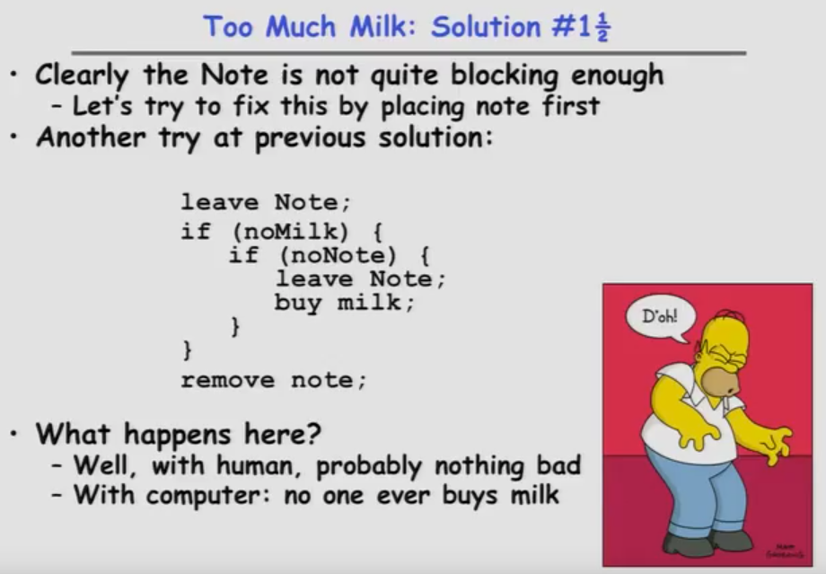
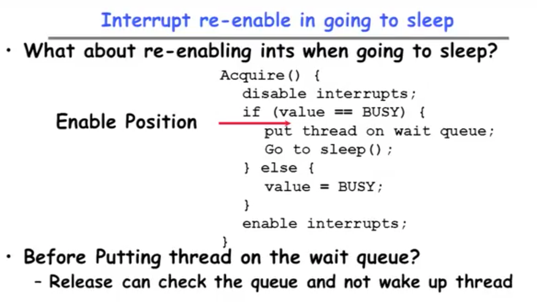
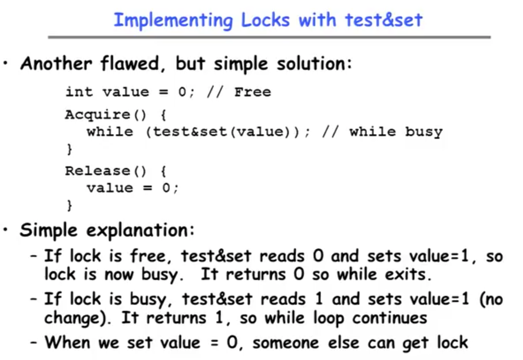

## Lecture 6 Synchronization

#### Review:	ThreadFork(): Create a New Thread

* _ThreadFork()_ is a user-level procedure that creates a new thread and places it on ready queue
	+ We called this CreateThread() earlier

* __Arguments__ to _ThreadFork()_
	+ Pointer to application routine (fcnPtr)
	+ Pointer to array of arguments (fcnArgPtr)
	+ Size of stack to allocate

* __Implementation__
	+ Sanity Check arguments
	+ Enter Kernel-mode and Sanity Check arguments again
	+ Allocate new Stack and TCB
	+ Initialize TCB and place on ready list (Runnable)

---------------

#### Review:	How does Thread get started?

> We're in kernel mode when we switch.

---------------

#### Review: What does ThreadRoot() look like?

")

----------------

* Correctness for systems with concurrent threads (具有并发线程的系统的正确性)

+ Independent Threads
	- No state shared with other threads
	- Deterministic(确定性的) -> Input state determines results
	- Reproducible(可复制的) -> Can recreate Starting Conditions, I/O
	- Scheduling order doesn't matter (if `switch()` works!!!)

+ Cooperating Threads
	- Shared State between multiple threads
	- Non-deterministic
	- Non-reproducible

+ Non-deterministic and Non-reproducible means that __bugs can be intermittent__(间歇的)
	- Sometimes called "**Heisenbugs**"

	> Heisenbugs: these are the bugs where you go to look at them and they disappear on you.

----------------

#### Goals for Today

* Concurrency examples
* Need for synchronization(同步)
* Examples of valid synchronization

----------------

* Interactions Complicate Debugging (交互使得更难debug)

	+ Is any program truly independent ?
		- No!

	+ You probably don't realize how much you depend on reproducibility

	+ Non-deterministic errors are really difficult to find!

	

----------------

* Why allow cooperating threads?

	+ People cooperate; computers help/enhance people's lives, so computers must cooperate
		- By analogy, the non-reproducibility/non-determinism of people is a notable problem for "carefully laid plans"

	+ Advantage
		1. Share resources
			- One computer, many users
			- One back balance, many ATMs ( What if ATMs were only updated at night?)
			- Embedded systems (robot control: coordinate arm & hand)

		2. Speedup
			- Overlap I/O and computation (Many different file systems do read-ahead)

		3. Modularity
			- More important than you might think
			- Chop large problem up into simpler pieces (To compile, for instance, gcc calls cpp | cc1 | cc2 | as | id )  (Makes system easier to extend)

> gcc (GNU编译器套装 GNU Compiler Collection )， 指一套编程語言编译器，以GPL及LGPL许可证所发行的自由软件，也是GNU計畫的关键部分，也是GNU工具链的主要組成部份之一。GCC（特别是其中的C语言编译器）也常被认为是跨平台编译器的事实标准。它原本只能处理C語言。GCC在发布后很快地得到扩展，变得可處理C++。之後也變得可處理Fortran、Pascal、Objective-C、Java、Ada，Go與其他語言。
>
> cpp 是程序设计语言C++的另一种书写形式。“C Plus Plus”的简称。是继C语言之后又一种计算机编程语言，C++编程语言同时支持所有的C语言语法。C++和C相似：但C是面向过程的程序设计语言，而C++是面向对象的程序设计语言，不过C++语言保持了对C语言的兼容，也就说是在C++程序可以不用修改的插入C语言代码。

----------------

* Threaded Web Server

* Advantages of Threaded Version:
	+ Can share file caches kept in memory, results of CGI scripts, other things
	+ Threads are __much cheaper to create than processes__, so this has a lower per-request overhead

> CGI (Common Gateway Interface, 通用网关接口), 是Web 服务器运行时外部程序的规范,按CGI 编写的程序可以扩展服务器功能。CGI 应用程序能与浏览器进行交互,还可通过数据库API 与数据库服务器等外部数据源进行通信,从数据库服务器中获取数据。格式化为HTML文档后，发送给浏览器，也可以将从浏览器获得的数据放到数据库中。几乎所有服务器都支持CGI,可用任何语言编写CGI,包括流行的C、C ++、VB 和Delphi 等。
>> CGI 分为标准CGI 和间接CGI两种。标准CGI 使用命令行参数或环境变量表示服务器的详细请求，服务器与浏览器通信采用标准输入输出方式。间接CGI 又称缓冲CGI,在CGI 程序和CGI 接口之间插入一个缓冲程序，缓冲程序与CGI 接口间用标准输入输出进行通信。

> CGI 是WWW技术中最重要的技术之一，有着不可替代的重要地位。CGI是外部应用程序（CGI程序）与WEB服务器之间的接口标准，是在CGI程序和Web服务器之间传递信息的过程。CGI规范允许Web服务器执行外部程序，并将它们的输出发送给Web浏览器，CGI将Web的一组简单的静态超媒体文档变成一个完整的新的交互式媒体。绝大多数的CGI程序被用来解释处理来自表单的输入信息，并在服务器产生相应的处理，或将相应的信息反馈给浏览器。CGI程序使网页具有交互功能。

+ What if too many requests come in at once?

----------------

* Thread Pools

	+ Problem with previous version: Unbounded Threads
		- When web-site becomes too popular - throughput sinks(吞吐量下降、生产量下降)

	+ Instead, allocate a bounded "pool" of threads, representing the maximum level of multiprogramming

	

>> De-queue 和 queue 是simultaneously 同时的。

> Thread pool is a pretty simple technique, but it lets us get by the unbounded parallelism problem while same time having the advantage of more than one thread.

----------------

* ATM Bank Server

* Example

* How could we speed this up?
	+ More than one request being processed at once
	+ Event driven (overlap computation and I/O)
	+ Multiple threads (multi-proc, or overlap computation and I/O)

+ This technique is used for graphical programming
> The graphical programming model is so well defined and constrained that they can basically do this devision, they can kind of figure out where the event boundaries are and they can do it once for everybody that uses the windowing system.

----------------

* Can Threads Make This Easier?

	+ Threads yield overlapped I/O and computation without "deconstructing" code into non-blocking fragments
		- One thread per request

	+ Requests proceeds to completion, blocking as required：

-----------------

* Problem is at the lowest level

> 当Thread没有共享数据，两者没有任何影响和联系。
>
> 当Thread共享 data,取决于两个Thread的顺序等其他条件。

-----------------

* Atomic Operations (原子操作)

	+ To understand a concurrent program, we need to know what the underlying indivisible operations are!

	+ __Atomic Operation__: an operation that always runs to completion or not at all
		- It's _indivisible_: it cannot be stopped in the middle and state cannot be modified by someone else in the middle
		- Fundamental building block - if no atomic operations, then have no way for threads to work together

	+ On most machines, memory references and assignments (i.e. loads and stores) of words are atomic
		- Consequently - weird example that produces "3" on previous slide can't happen

	+ Many instructions are not atomic
		- Double-precision floating point store often not atomic
		- VAX and IBM 360 had an instruction to copy a whole array

> Atomic Operation(原子操作，不可被中断的一个或一系列操作。）指不会被线程调度机制打断的操作；一旦开始，就一直运行到结束，中间不会有任何 context switch（切换到另一个线程）。

> 2.术语定义
>> 

> 3.处理器如何实现原子操作：32位IA-32处理器使用基于 _对缓存加锁_ 或 _总线加锁_ 的方式来实现多处理器之间的原子操作

>> 3.1 处理器自动保证基本内存操作的原子性:	首先处理器会自动保证基本的内存操作的原子性。处理器保证从系统内存当中读取或者写入一个字节是原子的，意思是当一个处理器读取一个字节时，其他处理器不能访问这个字节的内存地址。奔腾6和最新的处理器能自动保证单处理器对同一个缓存行里进行16/32/64位的操作是原子的，但是复杂的内存操作处理器不能自动保证其原子性，比如跨总线宽度，跨多个缓存行，跨页表的访问。但是处理器提供总线锁定和缓存锁定两个机制来保证复杂内存操作的原子性。

>> 3.2 使用总线锁保证原子性:
>>> 如果多个处理器同时对共享变量进行读改写（i++就是经典的读改写操作）操作，那么共享变量就会被多个处理器同时进行操作，这样读改写操作就不是原子的，操作完之后共享变量的值会和期望的不一致，举个例子：如果i=1,我们进行两次i++操作，我们期望的结果是3，但是有可能结果是2。 原因是有可能多个处理器同时从各自的缓存中读取变量i，分别进行加一操作，然后分别写入系统内存当中。那么想要保证读改写共享变量的操作是原子的，就必须保证CPU1读改写共享变量的时候，CPU2不能操作缓存了该共享变量内存地址的缓存。

>> 处理器使用总线锁就是来解决这个问题的。所谓总线锁就是使用处理器提供的一个LOCK＃信号，当一个处理器在总线上输出此信号时，其他处理器的请求将被阻塞住,那么该处理器可以独占使用共享内存。

>> 3.3 使用缓存锁保证原子性
>>> 在同一时刻我们只需保证对某个内存地址的操作是原子性即可，但总线锁定把CPU和内存之间通信锁住了，这使得锁定期间，其他处理器不能操作其他内存地址的数据，所以总线锁定的开销比较大，最近的处理器在某些场合下使用缓存锁定代替总线锁定来进行优化。频繁使用的内存会缓存在处理器的L1，L2和L3高速缓存里，那么原子操作就可以直接在处理器内部缓存中进行，并不需要声明总线锁，在奔腾6和最近的处理器中可以使用“缓存锁定”的方式来实现复杂的原子性。所谓“缓存锁定”就是如果缓存在处理器缓存行中内存区域在LOCK操作期间被锁定，当它执行锁操作回写内存时，处理器不在总线上声言LOCK＃信号，而是修改内部的内存地址，并允许它的缓存一致性机制来保证操作的原子性，因为缓存一致性机制会阻止同时修改被两个以上处理器缓存的内存区域数据，当其他处理器回写已被锁定的缓存行的数据时会起缓存行无效，在例1中，当CPU1修改缓存行中的i时使用缓存锁定，那么CPU2就不能同时缓存了i的缓存行。

>> 但是有两种情况下处理器不会使用缓存锁定。第一种情况是：当操作的数据不能被缓存在处理器内部，或操作的数据跨多个缓存行（cache line），则处理器会调用总线锁定。第二种情况是：有些处理器不支持缓存锁定。对于Inter486和奔腾处理器,就算锁定的内存区域在处理器的缓存行中也会调用总线锁定。

> 以上两个机制我们可以通过Inter处理器提供了很多LOCK前缀的指令来实现。比如位测试和修改指令BTS，BTR，BTC，交换指令XADD，CMPXCHG 和其他一些操作数和逻辑指令，比如ADD（加），OR（或）等，被这些指令操作的内存区域就会加锁，导致其他处理器不能同时访问它。

> 在java中可以通过锁和循环CAS的方式来实现原子操作。

--------------------

* Correctness Requirements

	+ Threaded programs must work for all interleavings of thread instruction sequences
		- Cooperating threads inherently non-deterministic and non-reproducible
		- Really hard to debug unless carefully designed!

	+ Example: Therac-25; Software errors caused the death of sesveral patients

--------------------

* Space Shuttle Example

> primary avionics 初级航空电子

--------------------

> Could this happen on a uniprocessor?
>> Yes! Unlikely, but if you depending on it not happenning, it will and your system will break...

--------------------

--------------------

* Definitions

	+ __Synchronization__:	using atomic operations to ensure cooperation between threads
		- For now, only loads and stores are atomic
		- We are going to show that its hard to build anything usefule with only reads and writes

	+ __Mutual Exclusion__: ensuring that only one thread does a particular thing at a time
		- One thread _excludes_ the other while doing its task

	+ __Critical Section__: piece of code that only one thread can execute at once. Only one thread at a time will get into this section of code.
		- Critical section is the result of mutual exclusion
		- Critical section and mutual exclusion are two ways of describing the same thing.

		> 每个线程中访问临界资源的那段程序称为 __临界区（Critical Section）__ （ _临界资源_ 是一次仅允许一个线程使用的共享资源）。每次只准许一个线程进入临界区，进入后不允许其他线程进入。不论是硬件临界资源，还是软件临界资源，多个线程必须互斥地对它进行访问。(critical section 是每个线程中访问临界资源的那段代码，不论是硬件临界资源，还是软件临界资源，多个线程必须互斥地对它进行访问。)

	+ __Lock__: prevents someone from doing something
		- Lock before entering critical section and before accessing shared data
		- Unlock when leaving, after accessing hared data
		- Wait if locked

		>>> All synchronization involves waiting

> Fixes too much !

--------------------

* Too Much Milk:	Correctness Properties

	+ Need to be careful about correctness of concurrent programs, since non-deterministic (非确定的)
		- Always write down behavior first
		- Impulse is to start coding first, then when it doesn't work, pull hair out
		- Instead, think first, then code

	+ What are the correctness properties for the "Too much milk" problem?？？
		- Never more than one person buys
		- Someone buys if needed

	+ Restrict ourselves to use only atomic load and store operations as building blocks (限制我们只使用原子负载和存储操作作为构建块)

--------------------
##### Solution 1

> Why only occasionally?
>>> These checks here are not atomic. Suppose that both of us check for there being no milk and now by the way, there is a invisible roomate. And both of you see there's no note at the same time, both of you leave a note and head out to buy milk.

>> So there is a synchronization condition built into this code that is a weird interleaving where things switch just at the wrong time. Right after you've looked throught the conditions you switch over to the other guy they look through the condition they leave not you come back and leave the note...

> 这种情况其实更差。因为看似解决掉了问题所在，但实际上有少数机会还是会发生错误，并且很难debug！

--------------------

##### Solution 1.5

--------------------

##### Solution 2

> Maby A leave a note and B leave a note, then nobody buys any milk.

> 在极少数情况下会出错、发生没有人去购买牛奶，因为彼此都认为对方会去购买。这种极端的潜在的情况下发生会使得非常的麻烦。This is one of the heisenbugs or it looks like it that it's going to show up at the worst possible time. This one's even less likely than the previous one.

> 与并发相关的关键术语:
>> __原子操作__ ：要保证指令的序列作为一个组来操作执行，要么都不执行；要么执行要直接执行到指令完毕，中间不能中断

>> __临界区__ ：是一段代码，在这段代码中进程将访问共享资源，当有一个进程在这段代码中运行时，其他进程不能在这段代码中运行

>> __死锁__ ：两个或两个以上的进程因其中的每个进程都在等待其他进程做完某些事情而不能继续执行，这种情形称为死锁

>> __互斥__ ：当一个进程在临界区访问共享资源时，其他进程不能进入该临界区访问任何共享资源，这种情形称为互斥

>> __同步__ ：同步是在互斥的基础上（大多数情况），通过对其他机制实现访问者对资源的有序访问

>> __饥饿__ ：指一个可运行的进程尽管能继续执行，但被调度程序无限期地忽视，而不能调度执行的情形

>> __竞争条件__ ：多个线程或进程在读写一个共享数据时，结果依赖于它们执行的相对时间，这种情形称为竞争条件

--------------------

##### Solution 3

>> One thing we can say about this code is each chunk(块）here is protecting a critical section. So basically think of this part leave note A while note B is an entry and the remove note is a exit and this if no milk buy milk is a critical section. And it's over here to that we want to make sure only one of the people do at a time. We don't want any interleaving on the if no milk buy milk critical section. That's what this is being what we're protecting here.

--------------------

##### Solution 4

--------------------

#### Summary

* Concurrent threads are a very useful abstraction
	+ Allow transparent overlapping of computation and I/O
	+ Allow use of parallel processing(并行处理) when available

------------------

## Lecture 7, Mutual Exclusion, Semaphores, Monitors, and Condition Variables(条件变量)

##### Review: Synchronization problem with Threads

-------------------

##### Review: Too Much Milk Solution #3

> "if not milk, buy milk" is on both sides that's the critical section we're really trying to protect or that's the atomic operation in this case.

-------------------

#### Goals for Today

* Hardware Support for Synchronization
* Higher-level Synchronization Abstractions
	+ Semaphores, monitors, and condition variables(信号量、监视器和条件变量)
* Programming paradigms for concurrent programs(并发程序的编程范例)

-------------------

* High-Level Picture

	+ The abstraction of threads is good:
		- Maintains sequential execution model
		- Allows simple parallelism to overlap I/O and computation

	+ Unfortunately, still too complicated to access state shared between threads
		- Consider "too much milk" example
		- Implementing a concurrent program with only loads and stores would be tricky and error-prone(易错的)

	+ Today, we'll implement higher-level operations on top of atomic operations provided by hardware
		- Develop a "synchronization toolbox"
		- Explore some common programming paradigms(范例)

-------------------

##### Solution 4

-------------------

* How to implement Locks?

	+ __Lock__: prevents someone from doing something
		- Lock before entering critical section and before accessing shared data
		- Unlock when leaving, after accessing shared data
		- Wait if locked
			> Important idea: _all synchronization involves waiting_

			> Should _sleep_ if waiting for a long time

	+ Atomic Load/Store: get solution like Milk #3
		- Locked at this last lecture
		- Pretty complex and error prone

	+ Hardware Lock instruction
		- Is this a good idea?
		- What about putting a task to sleep?
			- How do you handle the interface between the hardware and scheduler?
		- Complexity?
			- Done in the Intel 432
			- Each feature makes hardware more complex and slow

-------------------

* Naive use of Interrupt Enable/Disable

	+ How can we build multi-instruction atomic operations?
		- Recall: dispatcher gets control in two ways.

		> Internal: Thread does something to relinquish(放弃、让出) the CPU			

		> External: Interrupts cause dispatcher to take CPU

		- On a uniprocessor, can avoid context-switching by:

		> Avoiding internal events (although virtual memory tricky)

		> Preventing external events by disabling interrupts

	+ Consequently, naive Implementation of locks:
		`LockAcquire { disable ints; } // disable interrupts`
		`LockRelease { enable ints; } // enable interrupts`

	+ Problems with this approach:
		- __Can't let user do this!__ Consider following:

			`LockAcquire(); `
			`While(TRUE) {;} `
			> Interrupts will never go off again, the OS will never grab the CPU back and basically you're busy computing zero or something.

		- Real-Time system - no guarantees on timing!
			- Critical Sections might be arbitrarily long

		- What happens with I/O or other important events?
			- "Reactor about to meltdown. Help?"

-------------------

* Better Implementation of Locks by Disabling Interrupts

	+ Key idea: Maintain a lock variable and impose mutual exclusion only during operations on that variable

-------------------

* New Lock Implementation: Discussion

	+ _Why do we need to disable interrupts at all?_
		- Avoid interruption between checking and setting lock value
		- Otherwise two threads could think that they both have lock

> Between disable and enable we have a very short time in here.

> You have to sort of separate the implementation of the lock from the use of the lock. So if you have some code that acquires the lock and goes and computes a million digits of PI and then release the lock. That's okay here because we only disable and enable interrupts just during the period of acquiring and releasing the lock, not during this critical section which the user programs using.

> So you got to distinguish the implementation of the lock from the use of the lock. So the use of a lock can take as long as they want.

-------------------

* Interrupt re-enable in going to sleep

	+ Enable Position before putting  thread on the wait queue?
	

	+ After putting the thread on the wait queue
	

	+ Want to put it after _sleep()_
	

-------------------

* How to Re-enable After Sleep()?

	+ In _Nachos_, since interrupts are disabled when you call _sleep_:
		- Responsibility of the next thread to re-enable interrupt
		- When the sleeping thread wakes up, returns to acquire and re-enables interrupts

	

-------------------

* Interrupt disable and enable across context switches

	+ An important point about structuring code:
		- In Nachos code you will see lots of comments about assumptions made concerning when interrupts disabled
		- This is an example of where modifications to and assumptions about program state can't be localized within a small body of code
		- In these cases it is possible for your program to eventually "acquire" bugs as people modify code

	+ Other cases where this will be a concern?
		- What about exceptions that occur after lock is acquired? Who releases the lock?

	

-------------------

* Interrupt disable and enable across context switches

+ An important point about structuring code:
    - In Nachos code you will see lots of comments about assumptions made concerning when interrupts disabled
    - This is an example of where modifications to and assumptions about program state can't be localized within a small body of code
    - In these cases it is possible for your program to eventually "acquire" bugs as people modify code

+ Other cases where this will be a concern?
    - What about exceptions that occur after lock is acquired? Who releases the lock?

-------------------

* Atomic Read-Modify-Write instructions

    + Problem with previous solution:
        - Can't give lock implementation to users (assuming you can't give an interrupt disabled to the user)
        > If you give interrupts disabled to the user, then they will lock up the machine whether or not it's intentional.

        - Doesn't work well on multiprocessor
            * Disabling interrupts on all processors requires messages and would be very time consuming

    + Alternative: __atomic instruction sequences__
    - These instructions read a value from memory and write a new value atomically
    - Hardware is responsible for implementing this correctly
        * on both uniprocessors(not too hard)
        * and multiprocessors(requires help from cache coherence protocal)
    - Unlike disabling interrupts, can be used on both uniprocessors and multiproecssors

-------------------

* Example of Read-Modify-Write

> 1. Test and set operation, it wasn't always true.

>> Zero is unlocked and one is locked, and the reason this works as was being explained before my machine crashed was that no matter how many people simultaneously try to get a lock, only one of them will be the lucky enough one to catch the zero and store the one, everybody else will get a one back. It's truly atomic even though everybody goes at it simultaneously, only one of them gets the zero back and they're the ones that have the lock. How do you release the lock? You write a zero.

> 2. Swap this is grab the value that's down there store the value, and you have register that's another atomic one that you can do stuff with.

> 3. Compare and swap turns out this one is actually seems complicated but it was on the 680000 processor and interestingly you can do some pretty cool lock free cue examples.

> 4. Load-lined store conditional is another example of a type of atomic operation that you can get on processors.

>> This one was on the Alpha and our 4000 the point is that these are more complicated operations than just loader store. They combinations a load and store and as a result those combinations are enough sufficiently sophisticated enough that we can build locks out of them.

-------------------

* Implementing Locks with test&set

-------------------

* 	Problem: Busy-Waiting for Lock

    + Positives for this solution
        - Machine can receive interrupts
        - User code can use this lock
        - Works on a multiprocessor

    + Negatives
        - This is very inefficient because the busy-waiting thread will consume cycles waiting
        - Waiting thread may take cycles away from thread holding lock (no one wins!)
        - __Priority Inversion__: If busy-waiting thread has higher priority than thread holding lock --> no progress! (never getting run)

    + Priority Inversion problem with original Martian rover
    + For semaphores and monitors, waiting thread may wait for an arbitrary length of time!
        - Thus even if busy-waiting was OK for locks, definitely no ok for other primitives
        - Homework/exam solutions should not have busy-waiting!

> 忙碌等待（Busy waiting、busy-looping、spinning）是一种以进程反复检查一个条件是否为真为根本的技术，条件可能为键盘输入或某个锁是否可用。忙碌等待也可以用来产生一个任意的时间延迟，若系统没有提供生成特定时间长度的方法，则需要用到忙碌等待。
>
>> 对于多核CPU，忙碌等待的优点是不切换线程，避免了由此付出的代价。因此一些多线程同步机制不使用切换到内核态的同步对象，而是以用户态的自旋锁或其衍生机制（如轻型读写锁）来做同步，付出的时间复杂度相差3个数量级。忙碌等待可使用一些机制来降低CPU功耗，如Windows系统中调用YieldProcessor，实际上是调用了SIMD指令_mm_pause。

-------------------

* Better Locks using test&set

> Lock is blue, guard is red.		

		

>> So the busy-waiting in this instance is limited to very infrequent or short periods of time because even if you're stuck spinning, the person who's got the lock is going through very fast code and they're gonna release it quickly.

-------------------

* 	Higher-level Primitives than Locks

+ __Synchronization__ is a way of coordinating multiple concurrent activities that are using shared state
    - This lecture and the next presents a couple of ways of structuring the sharing

-------------------

* Semaphores

    + Semaphores are a kind of generalized lock
        - First defined by Dijkstra in late 60s
        - Main synchronization primitive used in original UNIX

    + Definition: a Semaphores has a non-negative integer value and supports the following two operations:
        - __P()__: an atomic operation that waits for semaphore to become positive, then decrements it by 1
            * Think of this as the wait() operation
        - __V()__: an atomic operation that increments the semaphore by 1, waking up a waiting P, if any
            * This of this as the signal() operation
        - Note that __P()__ stands for "_proberen_" (to test) (普罗布林) and __V()__ stands for"_verhogen_" (to increment) (维尔根) in Dutch

-------------------

* Semaphores Like Integers Except

    + Semaphores are like integers, except:
        - No negative value
        - Only operations allowed are P and V - can't read or write value, except to set it initially
        - Operations must be atomic
            * Two P's together can't decrement value below zero
            * Similarly, thread going to sleep in P won't miss wakeup from V - even if they both happen at same time

    + Semaphore from railway analogy
        - Here is a semaphore initialized to 2 for resource control:

-------------------

* Two Uses of Semaphores

    1. Mutual Exclusion (initial value = 1)
        - Also called "Binary Semaphore"
        - Can be used for mutual exclusion:

    2. Scheduling Constraints (initial value = 0)
        - Locks are fine for mutual exclusion, but what if you want a thread to wait for something?
        - Example: suppose you had to implement _ThreadJoin_ which must wait for thread to terminate:

-------------------

* Producer-consumer with a bounded buffer

    + Problem Definition

    + Don't want producer and consumer to have work in lockstep(前后紧接;步伐一致), so put a fixed-size buffer between them
        - Need to synchronize access to this buffer
        - Producer needs to wait if buffer is full
        - Consumer needs to wait if buffer is empty

-------------------

* Correctness constraints for solution

    + Correctness Constraints：
        - Consumer must wait for producer to fill buffers, if none full (scheduling constraint)
        - Producer must wait for consumer to empty buffers, if all full (scheduling constraint)
        - Only one thread can manipulate buffer queue at a time (mutual exclusion)

    + Remember why we need mutual exclusion
        - Because computers are stupid
        - Imagine if in real life, the delivery person is filling the machine and somebody comes up and tries to stick their money into the machine

    + General rule of thumb:
    __Use a separate semaphore for each constraint__
    `-Semaphore fullBuffers; // consumer's constraint`
    `-Semaphore emptyBuffers; // producer's constraint`
    `-Semaphore mutex; // mutual exclusion`

-------------------

* Full Solution to Bounded Buffer

* Discussion about Solution
    + Why asymmetry?
        - Producer does: `emptyBuffer.P(),  fullBuffer.V()`
        - Consumer does: `fullBuffer.P(),  emptyBuffer.V()`

        > Producer and consumer want to wake up for different events.

    + Is order of P's important?
        - Yes! Can cause deadlock

        > why it cause deadlock? -- If you have a mutex suppose so as we switch these if we grab the lock and then we end up going to sleep on this guy which is swapped. Then we've effectively gone to sleep with the lock. And therefore nobody will ever wake up again because nobody will ever be able to Dequeue any items to wake us up.

    + Is order of V's important?
        - No, except that it might affect scheduling efficiency

        > The order of V doesn't matter from a correctness standpoint.(It's about performance problem) The worst that might happen is you wake somebody up who goes immediately to sleep who wakes up again. In fact, probably that won't even happen that way because you'll just execute the two V's in rapid succession and then one of them will put somebody on a ready queue they'll run later.

    + What if we have 2 producers or 2 consumers?
        - Do we need to change anything?

        > It works though we don't change code.

-------------------

* Motivation for Monitors and Condition Variables

* _Semaphores are a huge step up; just think of trying to do the bounded buffer with only loads and stores_
    - Problem is that semaphores are dual purpose:
        * They are used for both mutex(互斥) and scheduling constraints(调度限制)
        > Example: the fact that flipping of P's in bounded buffer gives deadlock is not immediately obvious. How do you prove correctness to someone?

* Clear idea: __Use _locks_ for mutual exclusion and _condition variables_ for scheduling constraints__

* Definition:
    -  __Monitor__: a lock and zero or more
    - __Condition variables__: for managing concurrent access to shared data

    > Some languages like Java provide this natively

    > Most others use actual locks and condition variables

    >> 条件变量(condition variable)是利用线程间共享的全局变量进行同步的一种机制，主要包括两个动作：一个线程等待某个条件为真，而将自己挂起；另一个线程使的条件成立，并通知等待的线程继续。为了防止竞争，条件变量的使用总是和一个互斥锁结合在一起。

    >> In a semaphore, you can never go to sleep while you're holding a lock.  Condition variables, that's exactly what you do with them. You grab the lock, check sub condition. If the condition aren't right, you go to sleep with the lock, then later you release the lock.

-------------------

> 进程的交互
>> 可以根据进程相互之间知道对方是否存在的程度，对进程的交互方式进行分类：1.进程之间不知道对方的存在;  2.进程间接知道对方的存在（如共享对象); 3.进程直接知道对方的存在（他们有可用的通信原语）

> 互斥
>> 互斥的要求: 1.必须强制实施互斥：在与相同资源或共享对象的临界区有关的所有进程中，一次只允许一个进程进入临界区;  2.一个在非临界区停止的进程不能干涉其他进程;  3.决不允许出现需要访问临界区的进程被无限延迟的情况，即不会死锁或饥饿;  4.当没有进程在临界区时，任何需要进入临界区的进程必须能够立即进入;  5.对相关进程的执行速度和数目没有任何要求和限制;  6.一个进程驻留在临界区中的时间必须是有限的;

>> 实现互斥的几种方法：中断禁用；专用机器指令；信号量；管程；消息传递

>>> __中断禁用__, 只适用于单处理器，而且该方法代价非常高，执行效率低下

>>> __专用机器指令__, 比较和交换指令，适用于单处理器或共享内存的多处理器
非常简单且易于证明, 但是使用了忙等待（消耗 CPU 时间）可能饥饿和死锁

>>> __信号量__, P、V操作必须成对出现，处理互斥时出现在同一进程中，处理同步时出现在不同进程中。同步 P 操作先于互斥 P 操作的调用，V 的顺序无关紧要
互斥信号量一般初始值为 1。

>>> __管程__, 局部数据变量只能被管程的过程访问，任何外部程序都不能访问。一个进程通过调用管程的一个过程进入管程。在任何时候，只能有一个进程在管程中执行，调用管程的任何其他进程都被阻塞，以等待管程可用

>>> __消息传递__, 消息传递有一个优点：它可在分布式系统、共享内存的多处理系统和单处理系统中实现。消息传递的实际功能以一对原语的形式提供：send 与 receive. 一般使用无阻塞 send 和 阻塞 receive 这一组搭配

> 死锁
>> 死锁的原因：竞争资源，进程推进顺序不当。

>> 资源通常可以分为两类：可重用资源和可消耗资源。
>>> 可重用资源：指一次只能供一个进程安全地使用，并且不会由于使用而耗尽的资源。

>>>可消耗资源：可以被创建和销毁的资源。通常对某种类型可消耗资源的数目没有限制，一个无阻塞的生产进程可以创建任意数目的这类资源。当消费进程得到一个资源时，该资源就不再存在了。

>> 死锁的条件：1. 互斥（必要条件）：一次只有一个进程可以使用一个资源;  2. 占有且等待（必要条件）：当一个进程等待其他进程时，继续占有已经分配的资源;  3. 不可抢占（必要条件）：不能抢占进程已经占有的资源;  4. 循环等待（非必要条件）：存在一个封闭的进程链，使得每个进程至少占有此链中下一个进程所需要的一个资源

>> 死锁预防：试图设计一种系统来排除发生死锁的可能性。
>>> 间接的死锁预防方法：防止三个必要条件的任何一个发生。

>>> 直接的死锁预防方法：防止循环等待的发生

>> 死锁避免：两种死锁避免方法。1. 如果一个进程的请求会导致死锁，则不启动此进程;  2. 如果一个进程增加的资源请求会导致死锁，则不允许此分配（银行家算法）
>>> 优点：不需要死锁预防中的抢占和回滚进程，比死锁预防限制少

>>> 缺点：1. 必须事先声明每个进程请求的最大资源;  2. 执行顺序不能有任何同步限制;  2. 分配资源数目必须固定; 4. 在占有资源时，进程不能退出

>> 死锁检测：
>>> 检测时机：1. 当进程因申请资源而等待时检测死锁（系统开销大); 2. 定时检测;  3. 系统资源利用率下降时检测

>>> 检测时机处决于：死锁发生的频率，死锁影响的进程数量。

------------------

* Simple Monitor Example

------------------

#### Summary

* important concept:	_Atomic Operations_
    - An operation that runs to completion or not at all
    - These are the primitives on which to construct various synchronization primitives

* Talked about hardware atomicity primitives:
    - Disabling of Interrupts, test&set, swap, comp&swap, load-linked/store conditional

* Showed several constructions of locks
    - Must be very careful not to waste/tie up machine resources
        * Shouldn't disable interrupts for long
        * Shouldn't spin wait for long
    - Key idea: Separate lock variable, use hardware mechanisms to protect modifications of that variable

* Talked about Semaphores, Monitors, and Condition Variables
    - Higher level constructs that are harder to "screw up"

------------------

## Lecture 8, Readers-Writers Language Support for Synchronization

.
