## Class 1  What is an Operating System?

* Moore's Law(摩尔定律)

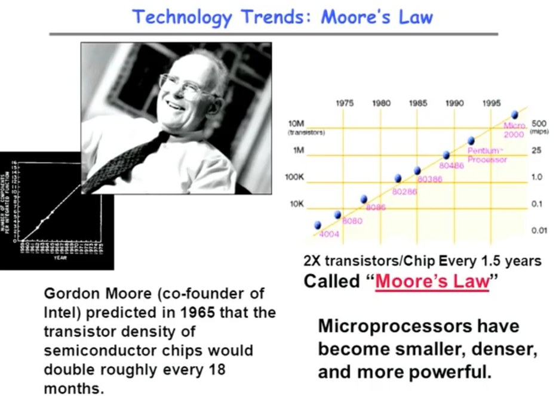

——————————————————————————————————————————

* Societal Scale Information Systems

——————————————————————————————————————————

* New Challenge: Slowdown in Joy's law of Performance

* Joy's Law of Performance:

	- First formulated by Sun Microsystems co-founder Bill Joy in 1983

	- states that the peak computer speed doubles each year and thus is given by a simple function of time.
--> Sea change in chip design: Multiple "cores"/ processor per chip.
多核使得问题更加复杂了。

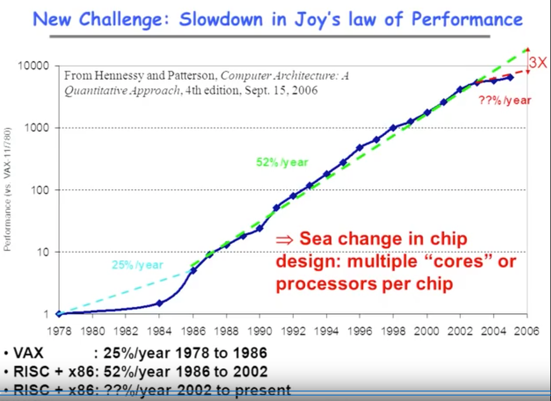

——————————————————————————————————————————

* ManyCore Chips

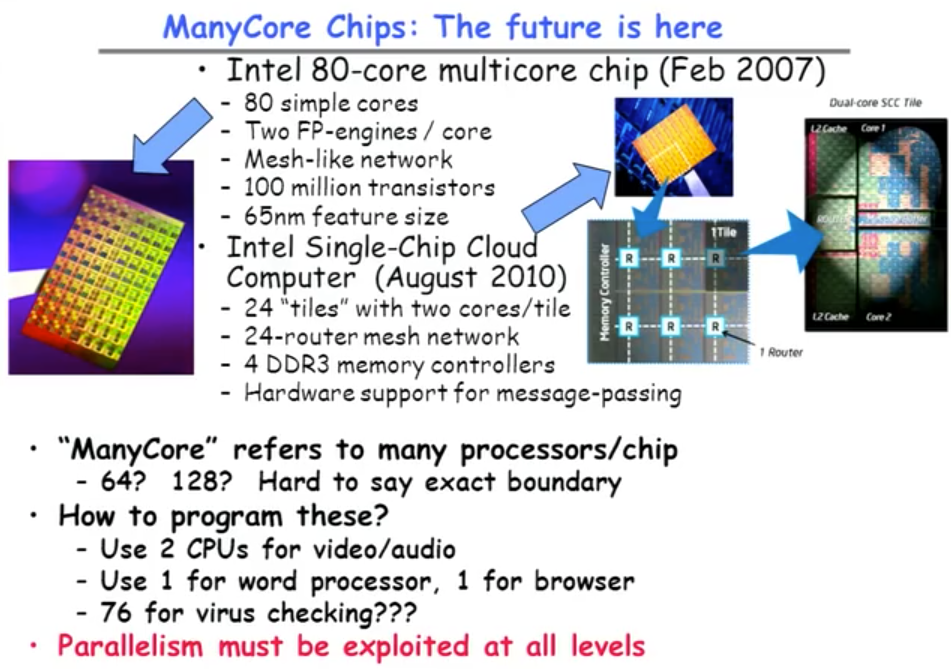

  **Parallelism must be exploited at all levels.(必须在各个层面上利用并行性。）**

——————————————————————————————————————————

* Another Challenge:  Power Density(比功率、功率密度)

	+ Power density becomes too high to cool chips inexpensively.(功率密度变得太高以至于不能廉价地冷却芯片。)

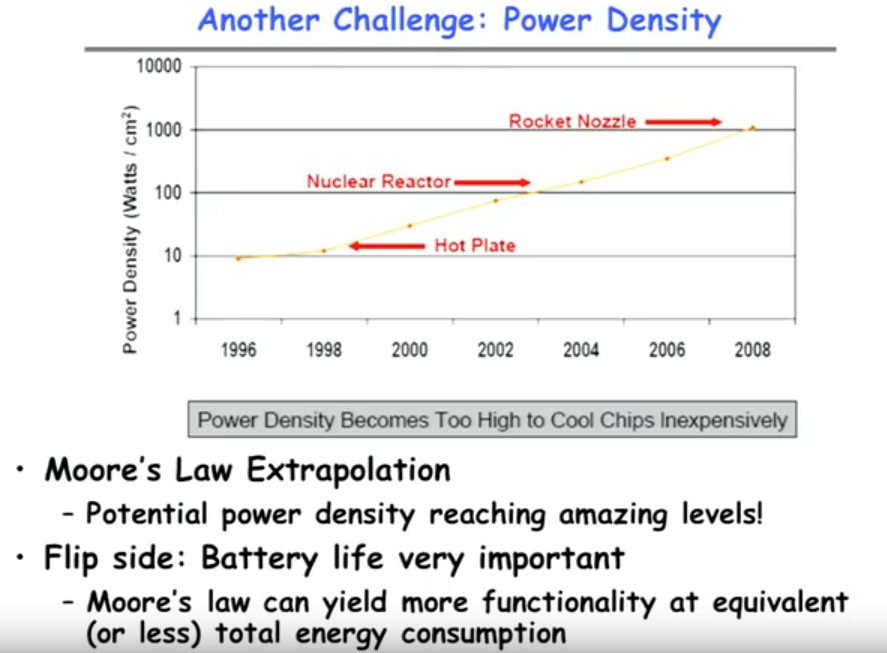

    - Moore's Law Extrapolation(推测、推断)
    - Flip side(比较不重要的方面): 相等、或更少的总能耗的情况下产生更多的功能。

——————————————————————————————————————————

* Computer System Organization:

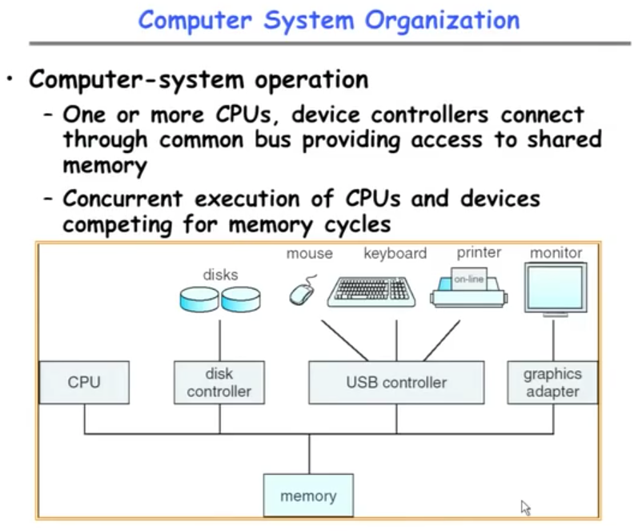

	- monitor: 显示器
	- disk controller:	磁盘控制系统
	- USB controller: USB控制器
	- graphics adapter: 图形配适器

——————————————————————————————————————————

* Functionality comes with great complexity!

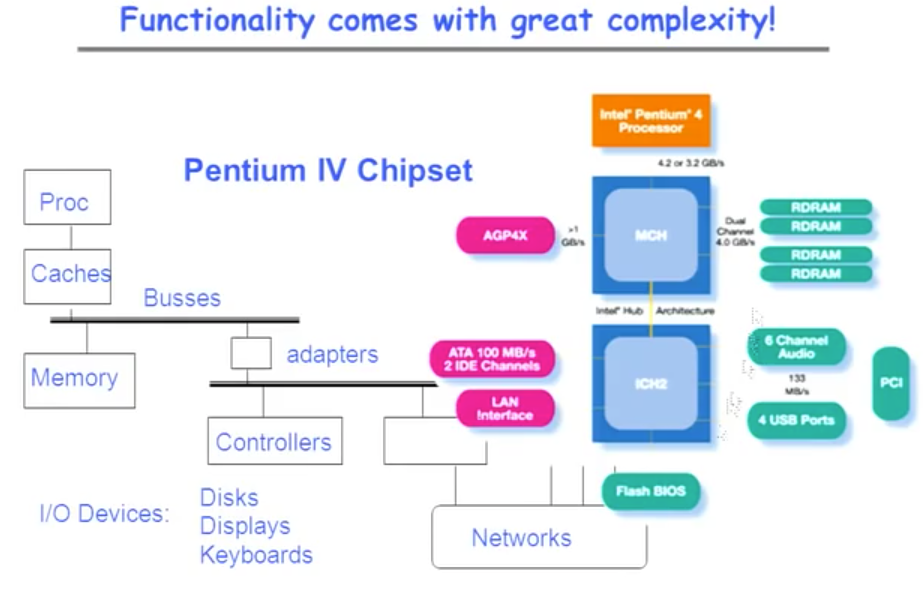

	Pentium IV Chipset（奔腾IV芯片组)
	Pentium 奔腾处理器/Intel第五代x86架构的微处理器。

——————————————————————————————————————————————

* Sample of Computer Architecture Topics

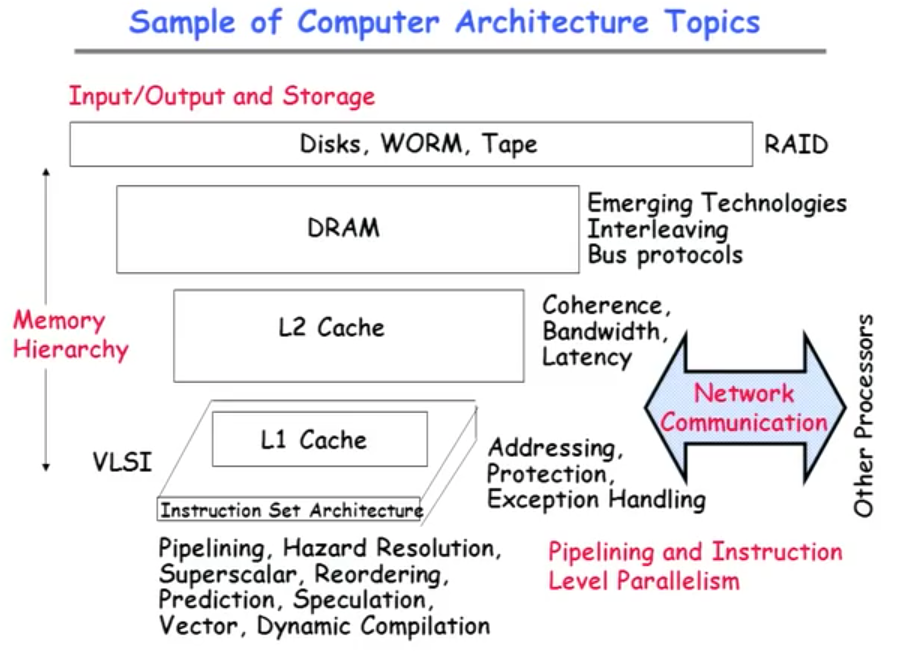

		Pipelining and Instruction Level Parallelism -- 流水线和指令级并行
		Superscalar 超标量体系结构
		Coherence 相关性	Bandwidth 带宽	Latency 潜伏期
		interleaving 交错
		Bus protocols	 总线协议

	+ 缓冲存储器(Cache,缓存)
		- 数据交换的缓冲区(称作Cache),是在CPU中速度非常块，而容量却很小的一种存
		储器,是计算机存储器中最强悍的存储器。由于技术限制，容量很难提升。当某一硬
		件要读取数据时，会先从缓存中查找需要的数据，如果找到了则直接执行，找不到的
		话则从内存中找。由于缓存的运行速度比内存快得多，故缓存的作用就是帮助硬件更
		快地运行。

	+ VLSI -- 超大规模集成电路(Very Large Scale Integration)
		- 几毫米见方的硅片上集成上万至百万晶体管、线宽在1微米以下的集成电路。由于
		晶体管与连线一次完成，故制作几个至上百万晶体管的工时和费用是等同的。大量生
		产时，硬件费用几乎可不计，而取决于设计费用。
		- 用超大规模集成电路制造的电子设备，体积小、重量轻、功耗低、可靠性高。利用
		超大规模集成电路技术可以将一个电子分系统乃至整个电子系统“集成”在一块芯片
		上，完成信息采集、处理、存储等多种功能。

	+ RAID -- 磁盘阵列（Redundant Arrays of Independent Disks)
		- 磁盘阵列是由很多价格较便宜的磁盘，组合成一个容量巨大的磁盘组，利用个别磁
		盘提供数据所产生加成效果提升整个磁盘系统效能。利用这项技术，将数据切割成许
		多区段，分别存放在各个硬盘上。

* Core Device vs. I/O Device:

Core device主要指芯片内部所使用的器件，数量最为庞大，为了达到节约功耗而常常会采用较低的电压（一般有1.0v ，1.2v，1.5v和1.8v）。
与core相对应的是I/O（input/output)，就是芯片与外部接口交互时所使用的器件，这类器件的工作电压一般比较高，且取决于外部接口的兼容·工作电压（一般为1.8v, 2.5v , 3.3v和5v）。
I/O Devices: Disks, Displays, Keyboards

* ROW vs. RAW

ROM和RAM指的都是半导体存储器，ROM是Read Only Memory的缩写，RAM是Random Access Memory的缩写。ROM在系统停止供电的时候仍然可以保持数据，而RAM通常都是在掉电之后就丢失数据，典型的RAM就是计算机的内存。

RAM，Random-Access Memory，即随机存取存储器，其实就是内存，断电会丢失数据。
主要分为 _SRAM（static）和 DRAM（dynamic)_。
主要的区别在于 存储单元，DRAM使用电容电荷进行存储。需要一直刷新充电；
SRAM是用锁存器锁住信息，不需要刷新。但也需要充电保持。

_DRAM（Dynamic Random Access Memory)_，即动态随机存取存储器，最为常见的系统内存。DRAM 只能将数据保持很短的时间。为了保持数据，DRAM使用电容存储，所以必须隔一段时间刷新（refresh）一次，如果存储单元没有被刷新，存储的信息就会丢失。 （关机就会丢失数据）

———————————————————————————————————————————————————

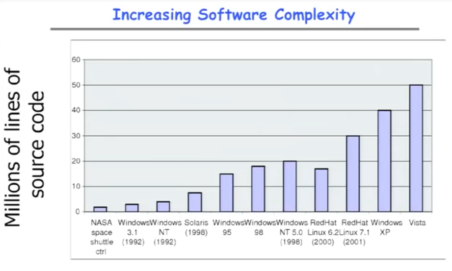

代码越来越长、复杂。

___________________________________________________

- Example: Some Mars Rover("Pathfinder") Requirements

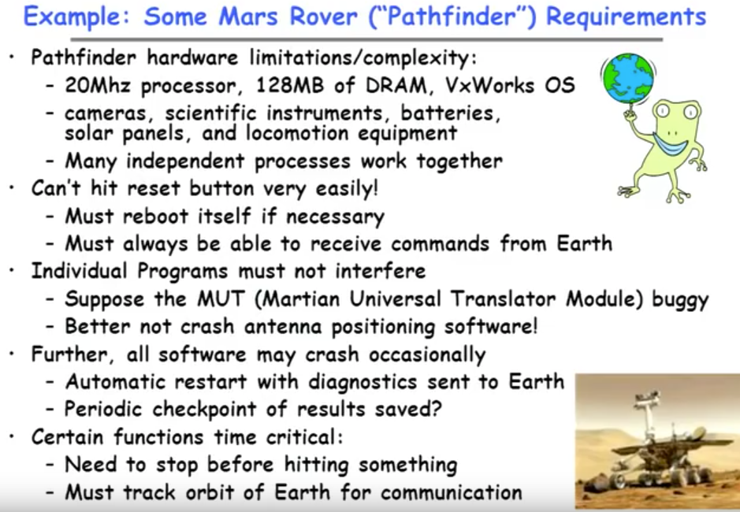

____________________________

________________________________

- How do we tame complexity ?

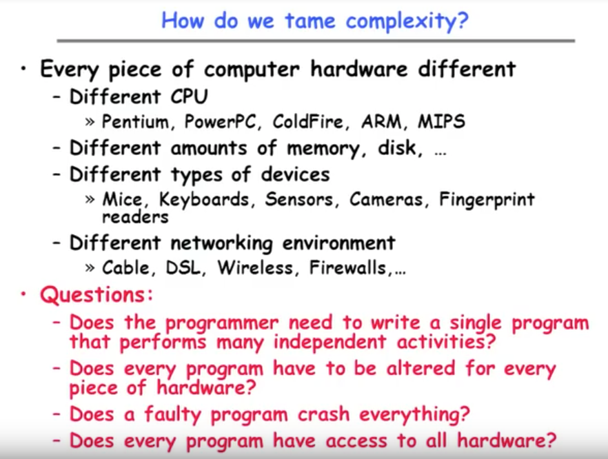

**Questions ———— No!**

	Pentium 奔腾处理器/Intel第五代x86架构的微处理器,PowerPC 是一种精简指令集
	(RISC)架构的中央处理器, ColdFire冷火处理器, ARM 是Acorn有限公司面向低预算
	市场设计的第一款RISC微处理器, MIPS 是单字长定点指令平均执行速度 Million
	Instructions Per Second的缩写，每秒处理的百万级的机器语言指令数。这是衡量
	CPU速度的一个指标。

	Cable 有线电视电缆, DSL 数字用户线路Digital Subscriber Line，是以电话线
	为传输介质的传输技术组合, Wireless, Firewalls 防火墙, 是一种位于内部网络与
	外部网络之间的网络安全系统。

————————————————————————————————————————————————————

- OS Tool: Virtual Machine Abstraction

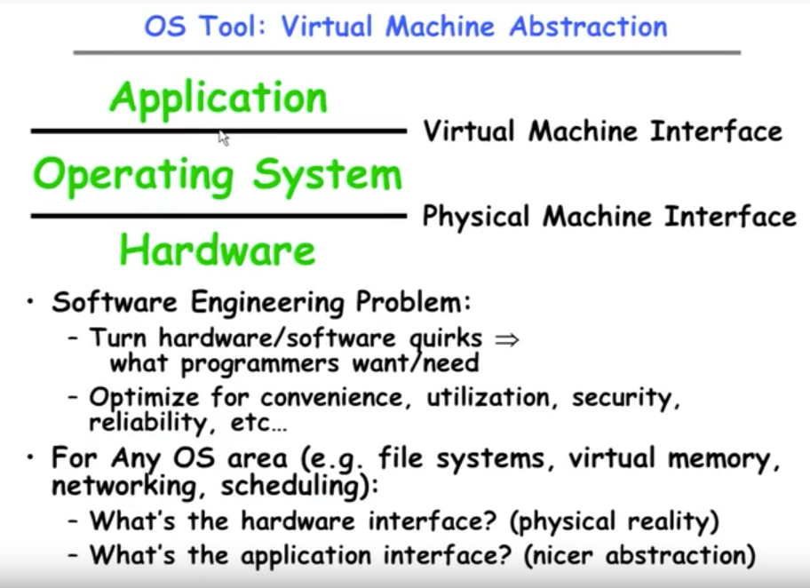

* Virtual Machine Interface

* Physical Machine Interface

———————————————————————————————————————————————

#### Virtual Machines

* Virtual Machines

    + Software emulation(仿真) of an abstract machine
        - Make it look like hardware has features you want
        - Programs from one hardware & OS on another one
    + Programming simplicity
        - Each process thinks it has all memory/CPU time
        - Each process thinks it owns all devices
        - Different Devices appear to have same interface
        - Device Interfaces more powerful than raw hardware
            -> Bitmapped display -> windowing system
            -> Ethernet card -> reliable, ordered, networking(TCP/IP)
    + Fault Isolation
        - Processes unable to directly impact other processes
        - Bugs cannot crash whole machine
    + Protection and Portability
        - Java interface safe and stable across many platforms
    + Useful for OS development -- Layers of OSs
        - When OS crashes, restricted to one VM
        - Can aid testing programs on other OSs

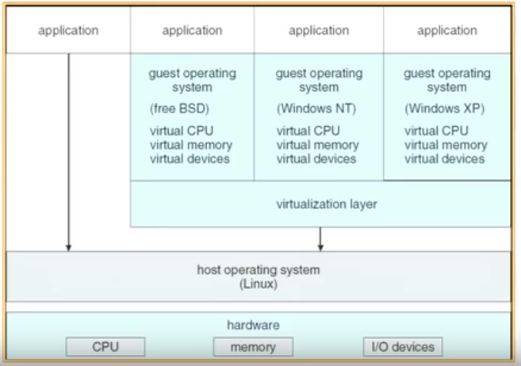

———————————————————————————————————————————

* What does an Operating System do?   
    + Silerschats & Gavin:
        - "An OS is Similar to a government"
        - Question: does a government do anything useful by itself?
    + Coordinator & Traffic Cop:
        - Manages all resources
        - Settles conflicting requests for resources
        - Prevent errors and improper use of the computer
    + Facilitator(促进者):
        - Provides facilities that everyone needs
        - Standard Libraries, Windowing systems
        - Make application programming easier, faster, less error-prone
    + Some features reflect both tasks:
        - E.g. File system is needed by everyone(Facilitator)
        - But File system must be Protected(Traffic Cop)

* What is an Operating System, ...?
    + Most Likely:
        - Memory Management
        - I/O Management
        - CPU Scheduling
        - Communications?(Does Email belong in OS?)
        - Multitasking/multiprogramming?
    + What about?
        - File System?
        - Multimedia Support?
        - User Interface?
        - Internet Browser?
    + Is this only interesting to Academics?

### Operating System Definition
    - No universally accepted definition
    - "Everything a vendor(小贩) ships when you order an operating system" is good approximation(近似值) -- But varies wildly
    - "The one program running at all times on the computer" is the _Kernel_(核心).
        Everything else is either a system program(ships with the operating system) or an application program

 _Loading the program is a function of OS._
* What if we didn't have OS ?
    - Source Code -> Compiler -> Object Code -> Hardware
    - How do you get object code onto the hardware?
    - How do you print out the answer?
    - Once upon a time, had to Toggle in program in binary and read out answer from LED's !

* Simple OS: What is only one application?
    + Examples:
        - Very early computers
        - Early PCs
        - Embedded controllers(elevators, cars, etc )
    + OS becomes just a library of standard services
        - Standard device drivers
        - Interrupt handlers
        - Math libraries

**MS-DOS**: A computer operating system by Microsoft Corporation(微软公司). It stands for "_Microsoft Disk Operating System_", and came from an operating system Microsoft bought called QDOS, or the "Quick and Dirty Operating System." ... OS/2 was originally made by a joint agreement with companies that are called Microsoft and IBM.

* MS-DOS Layer Structure

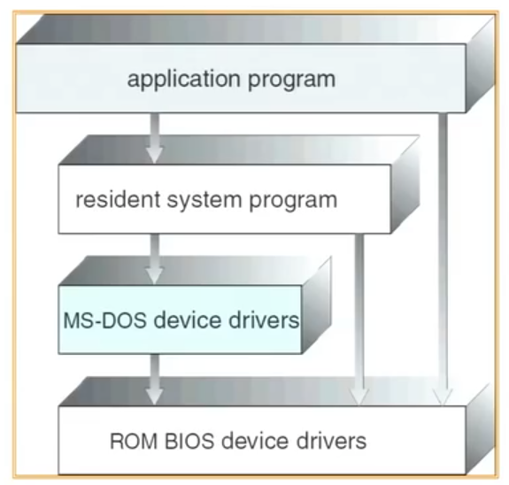

----------------------------------------

P.S. ROM是Read Only Memory的缩写，RAM是Random Access Memory的缩写。ROM在系统停止供电的时候仍然可以保持数据，而RAM通常都是在掉电之后就丢失数据，典型的RAM就是计算机的内存。

--------------------------------
More thought on Simple OS
    - What about Cell-phones, Xboxes, etc?
        Is this organization enough?
        What about an Android or iphone phone?
    - Can OS be encoded in ROM/Flash ROM?

--------------------------------
More complex OS: Multiple Apps
    + Full Coordination and Protection
        - Manage interactions between different users
        - Multiple programs running simultaneously
        - Multiplex and protect Hardware Resources
            -> CPU, Memory, I/O devices like disks, printers, etc
    + Facilitator
        - Still provides Standard libraries, facilities
    + Would this complexity make sense if there were only one application that you cared about?

--------------------------------

* Protecting Processes from Each Other
    + Problem: Run multiple applications in such a way that they are protected from one another
    + Goal:
        - Keep User Programs from Crashing OS
        - Keep User Programs from Crashing each other
        - Keep part of OS from Crashing other part?
    + _Mechanisms(机制)_:
        1. Address Translation
        2. Dual(双重的) Mode Operation
    + Simple Policy:
        - Programs are not allowed to read/write memory of other programs or of OS

--------------------------------
- Example of Address Translation

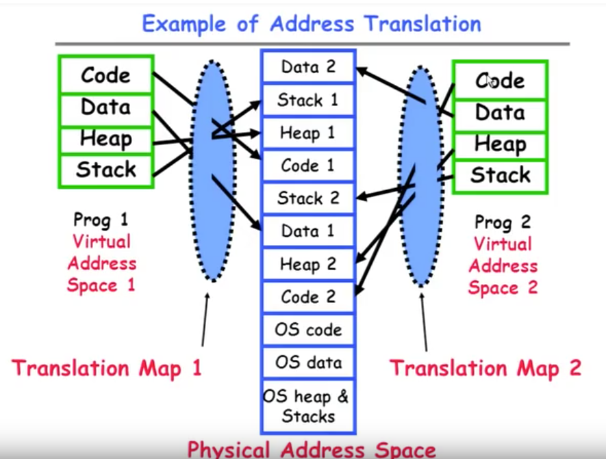

Program 有自己的 Virtual Address(method等), 通过translation map
可以找到Physical Address

————————————————————————————————

 **Address Translation**
     * Network address translation (NAT) is a method of remapping one IP address space into another by modifying network address information in the IP header of packets while they are in transit(在途中) across a traffic routing device.

* Address Space
    - A group of memory addresses usable by something
    - Each program(process) and kernel has potentially different address spaces.

* Address Translation
    - Translate from Virtual Addresses (emitted by CPU) into Physical Addresses(of memory)
    - Mapping _often_ performed in Hardware by Memory Management Unit(MMU)

------------------------------------------------------
* Why study OS?
    + Learn how to build complex systems:
        How to manage complexity for future projects?
    + Engineering issues
        Why is the web so slow sometimes?  Can you fix it
        What features should be in the next mars Rover?
        What do large distributed systems work?
    + Buying and using a personal computer
        Why different PCs with same CPU behave differently?
        How to choose a processor (Opteron, Itanium, Celeron, Pnetium, Hexium?)
        Should you get Windows XP, 2000, Linux, Max OS...
        Why does Microsoft have such a bad name?
    + Business issues
        Should yours division buy thin-clients vs PC?
* In conclusion...
    OS provide a virtual machine abstraction to handle diverse hardware

**DNS(Domain Name System)**: is a hierarchical(分级的) decentralized(分散的) naming system for computers, services, or other resources connected to the Internet or a private network.

------------------------------------------------------------------

## Class 2  History of the World Parts 1-5 Operating Systems Structure

* Review: Address Translation

* Address Space
    - A group of memory addresses usable by something
    - Each program(process) and kernel has potentially different address spaces.

* Address Translation
    - Translate from Virtual Addresses (emitted by CPU) into Physical Addresses(of memory)
    - Mapping *often* performed in Hardware by __Memory Management Unit(MMU)__

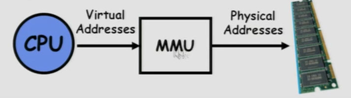

--------------------------------

* Review: Virtual Machine Abstraction

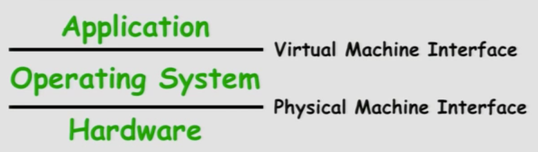

--------------------------------

#### Protection Mechanism:	Protecting Precesses from Each Other
1. Address Translation
2. Dual Mode Operation

* Dual Mode Operation -- the other half of protection
    + _Hardware_ provides at least two modes:
        - "Kernel" mode (or "supervisor" or "protected")
        - "User" mode:  Normal programs executed
    + Some instructions/ops prohibited in user mode:
        eg. cannot modify page tables in user mode
        ( >> Attempt to modify --> Exception generated )
    + Transitions from user mode to kernel mode:
        - System Calls, Interrupts, Other exceptions

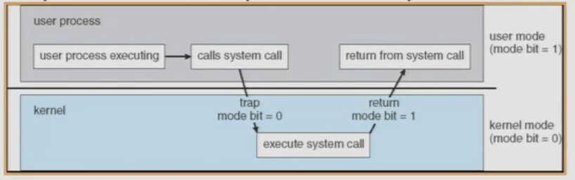

* Why this direction (Kernel -> User) is not hard?
	- Because Kernel is already scheduling. Removing privileges go in this direction is easy for kernel.

Example: What happen in a Search Query?

#### TextBook:
Text:   Operating Systems Concepts
        8th Edition, 2008, Silbershatz, Galvin, Gagne

-----
