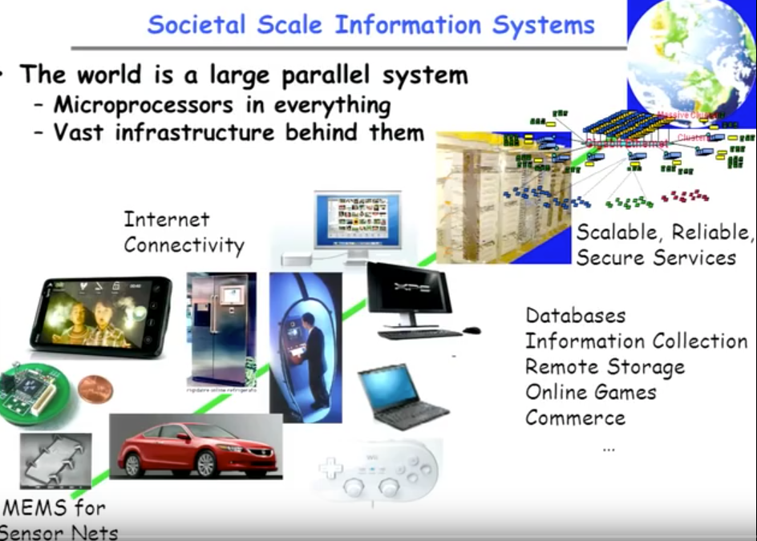

## Class 1  What is an Operating System?

* Moore's Law(摩尔定律)

——————————————————————————————————————————

* Societal Scale Information Systems

——————————————————————————————————————————

* New Challenge: Slowdown in Joy's law of Performance

* Joy's Law of Performance:

	- First formulated by Sun Microsystems co-founder Bill Joy in 1983

	- states that the peak computer speed doubles each year and thus is given by a simple function of time.
--> Sea change in chip design: Multiple "cores"/ processor per chip.
多核使得问题更加复杂了。

——————————————————————————————————————————

* ManyCore Chips

  **Parallelism must be exploited at all levels.(必须在各个层面上利用并行性。）**

——————————————————————————————————————————

* Another Challenge:  Power Density(比功率、功率密度)

	+ Power density becomes too high to cool chips inexpensively.(功率密度变得太高以至于不能廉价地冷却芯片。)

    - Moore's Law Extrapolation(推测、推断)
    - Flip side(比较不重要的方面): 相等、或更少的总能耗的情况下产生更多的功能。

——————————————————————————————————————————

* Computer System Organization:

	- monitor: 显示器
	- disk controller:	磁盘控制系统
	- USB controller: USB控制器
	- graphics adapter: 图形配适器

——————————————————————————————————————————

* Functionality comes with great complexity!

	Pentium IV Chipset（奔腾IV芯片组)
	Pentium 奔腾处理器/Intel第五代x86架构的微处理器。

——————————————————————————————————————————————

* Sample of Computer Architecture Topics

		Pipelining and Instruction Level Parallelism -- 流水线和指令级并行
		Superscalar 超标量体系结构
		Coherence 相关性	Bandwidth 带宽	Latency 潜伏期
		interleaving 交错
		Bus protocols	 总线协议

	+ 缓冲存储器(Cache,缓存)
		- 数据交换的缓冲区(称作Cache),是在CPU中速度非常块，而容量却很小的一种存
		储器,是计算机存储器中最强悍的存储器。由于技术限制，容量很难提升。当某一硬
		件要读取数据时，会先从缓存中查找需要的数据，如果找到了则直接执行，找不到的
		话则从内存中找。由于缓存的运行速度比内存快得多，故缓存的作用就是帮助硬件更
		快地运行。

	+ VLSI -- 超大规模集成电路(Very Large Scale Integration)
		- 几毫米见方的硅片上集成上万至百万晶体管、线宽在1微米以下的集成电路。由于
		晶体管与连线一次完成，故制作几个至上百万晶体管的工时和费用是等同的。大量生
		产时，硬件费用几乎可不计，而取决于设计费用。
		- 用超大规模集成电路制造的电子设备，体积小、重量轻、功耗低、可靠性高。利用
		超大规模集成电路技术可以将一个电子分系统乃至整个电子系统“集成”在一块芯片
		上，完成信息采集、处理、存储等多种功能。

	+ RAID -- 磁盘阵列（Redundant Arrays of Independent Disks)
		- 磁盘阵列是由很多价格较便宜的磁盘，组合成一个容量巨大的磁盘组，利用个别磁
		盘提供数据所产生加成效果提升整个磁盘系统效能。利用这项技术，将数据切割成许
		多区段，分别存放在各个硬盘上。

* Core Device vs. I/O Device:

Core device主要指芯片内部所使用的器件，数量最为庞大，为了达到节约功耗而常常会采用较低的电压（一般有1.0v ，1.2v，1.5v和1.8v）。
与core相对应的是I/O（input/output)，就是芯片与外部接口交互时所使用的器件，这类器件的工作电压一般比较高，且取决于外部接口的兼容·工作电压（一般为1.8v, 2.5v , 3.3v和5v）。
I/O Devices: Disks, Displays, Keyboards

* ROW vs. RAW

ROM和RAM指的都是半导体存储器，ROM是Read Only Memory的缩写，RAM是Random Access Memory的缩写。ROM在系统停止供电的时候仍然可以保持数据，而RAM通常都是在掉电之后就丢失数据，典型的RAM就是计算机的内存。

RAM，Random-Access Memory，即随机存取存储器，其实就是内存，断电会丢失数据。
主要分为 _SRAM（static）和 DRAM（dynamic)_。
主要的区别在于 存储单元，DRAM使用电容电荷进行存储。需要一直刷新充电；
SRAM是用锁存器锁住信息，不需要刷新。但也需要充电保持。

_DRAM（Dynamic Random Access Memory)_，即动态随机存取存储器，最为常见的系统内存。DRAM 只能将数据保持很短的时间。为了保持数据，DRAM使用电容存储，所以必须隔一段时间刷新（refresh）一次，如果存储单元没有被刷新，存储的信息就会丢失。 （关机就会丢失数据）

———————————————————————————————————————————————————

代码越来越长、复杂。

___________________________________________________

- Example: Some Mars Rover("Pathfinder") Requirements

____________________________

________________________________

- How do we tame complexity ?

**Questions ———— No!**

	Pentium 奔腾处理器/Intel第五代x86架构的微处理器,PowerPC 是一种精简指令集
	(RISC)架构的中央处理器, ColdFire冷火处理器, ARM 是Acorn有限公司面向低预算
	市场设计的第一款RISC微处理器, MIPS 是单字长定点指令平均执行速度 Million
	Instructions Per Second的缩写，每秒处理的百万级的机器语言指令数。这是衡量
	CPU速度的一个指标。

	Cable 有线电视电缆, DSL 数字用户线路Digital Subscriber Line，是以电话线
	为传输介质的传输技术组合, Wireless, Firewalls 防火墙, 是一种位于内部网络与
	外部网络之间的网络安全系统。

————————————————————————————————————————————————————

- OS Tool: Virtual Machine Abstraction

* Virtual Machine Interface

* Physical Machine Interface

———————————————————————————————————————————————

#### Virtual Machines

* Virtual Machines

    + Software emulation(仿真) of an abstract machine
        - Make it look like hardware has features you want
        - Programs from one hardware & OS on another one
    + Programming simplicity
        - Each process thinks it has all memory/CPU time
        - Each process thinks it owns all devices
        - Different Devices appear to have same interface
        - Device Interfaces more powerful than raw hardware
            -> Bitmapped display -> windowing system
            -> Ethernet card -> reliable, ordered, networking(TCP/IP)
    + Fault Isolation
        - Processes unable to directly impact other processes
        - Bugs cannot crash whole machine
    + Protection and Portability
        - Java interface safe and stable across many platforms
    + Useful for OS development -- Layers of OSs
        - When OS crashes, restricted to one VM
        - Can aid testing programs on other OSs

———————————————————————————————————————————

* What does an Operating System do?   
    + Silerschats & Gavin:
        - "An OS is Similar to a government"
        - Question: does a government do anything useful by itself?
    + Coordinator & Traffic Cop:
        - Manages all resources
        - Settles conflicting requests for resources
        - Prevent errors and improper use of the computer
    + Facilitator(促进者):
        - Provides facilities that everyone needs
        - Standard Libraries, Windowing systems
        - Make application programming easier, faster, less error-prone
    + Some features reflect both tasks:
        - E.g. File system is needed by everyone(Facilitator)
        - But File system must be Protected(Traffic Cop)

* What is an Operating System, ...?
    + Most Likely:
        - Memory Management
        - I/O Management
        - CPU Scheduling
        - Communications?(Does Email belong in OS?)
        - Multitasking/multiprogramming?
    + What about?
        - File System?
        - Multimedia Support?
        - User Interface?
        - Internet Browser?
    + Is this only interesting to Academics?

### Operating System Definition
    - No universally accepted definition
    - "Everything a vendor(小贩) ships when you order an operating system" is good approximation(近似值) -- But varies wildly
    - "The one program running at all times on the computer" is the _Kernel_(核心).
        Everything else is either a system program(ships with the operating system) or an application program

 _Loading the program is a function of OS._
* What if we didn't have OS ?
    - Source Code -> Compiler -> Object Code -> Hardware
    - How do you get object code onto the hardware?
    - How do you print out the answer?
    - Once upon a time, had to Toggle in program in binary and read out answer from LED's !

* Simple OS: What is only one application?
    + Examples:
        - Very early computers
        - Early PCs
        - Embedded controllers(elevators, cars, etc )
    + OS becomes just a library of standard services
        - Standard device drivers
        - Interrupt handlers
        - Math libraries

**MS-DOS**: A computer operating system by Microsoft Corporation(微软公司). It stands for "_Microsoft Disk Operating System_", and came from an operating system Microsoft bought called QDOS, or the "Quick and Dirty Operating System." ... OS/2 was originally made by a joint agreement with companies that are called Microsoft and IBM.

* MS-DOS Layer Structure

----------------------------------------

P.S. ROM是Read Only Memory的缩写，RAM是Random Access Memory的缩写。ROM在系统停止供电的时候仍然可以保持数据，而RAM通常都是在掉电之后就丢失数据，典型的RAM就是计算机的内存。

--------------------------------
More thought on Simple OS
    - What about Cell-phones, Xboxes, etc?
        Is this organization enough?
        What about an Android or iphone phone?
    - Can OS be encoded in ROM/Flash ROM?

--------------------------------
More complex OS: Multiple Apps
    + Full Coordination and Protection
        - Manage interactions between different users
        - Multiple programs running simultaneously
        - Multiplex and protect Hardware Resources
            -> CPU, Memory, I/O devices like disks, printers, etc
    + Facilitator
        - Still provides Standard libraries, facilities
    + Would this complexity make sense if there were only one application that you cared about?

--------------------------------

* Protecting Processes from Each Other
    + Problem: Run multiple applications in such a way that they are protected from one another
    + Goal:
        - Keep User Programs from Crashing OS
        - Keep User Programs from Crashing each other
        - Keep part of OS from Crashing other part?
    + _Mechanisms(机制)_:
        1. Address Translation
        2. Dual(双重的) Mode Operation
    + Simple Policy:
        - Programs are not allowed to read/write memory of other programs or of OS

--------------------------------
- Example of Address Translation

Program 有自己的 Virtual Address(method等), 通过translation map
可以找到Physical Address

————————————————————————————————

 **Address Translation**
     * Network address translation (NAT) is a method of remapping one IP address space into another by modifying network address information in the IP header of packets while they are in transit(在途中) across a traffic routing device.

* Address Space
    - A group of memory addresses usable by something
    - Each program(process) and kernel has potentially different address spaces.

* Address Translation
    - Translate from Virtual Addresses (emitted by CPU) into Physical Addresses(of memory)
    - Mapping _often_ performed in Hardware by Memory Management Unit(MMU)

------------------------------------------------------
* Why study OS?
    + Learn how to build complex systems:
        How to manage complexity for future projects?
    + Engineering issues
        Why is the web so slow sometimes?  Can you fix it
        What features should be in the next mars Rover?
        What do large distributed systems work?
    + Buying and using a personal computer
        Why different PCs with same CPU behave differently?
        How to choose a processor (Opteron, Itanium, Celeron, Pnetium, Hexium?)
        Should you get Windows XP, 2000, Linux, Max OS...
        Why does Microsoft have such a bad name?
    + Business issues
        Should yours division buy thin-clients vs PC?
* In conclusion...
    OS provide a virtual machine abstraction to handle diverse hardware

**DNS(Domain Name System)**: is a hierarchical(分级的) decentralized(分散的) naming system for computers, services, or other resources connected to the Internet or a private network.

------------------------------------------------------------------

## Class 2  History of the World Parts 1-5 Operating Systems Structure

* Review: Address Translation

* Address Space
    - A group of memory addresses usable by something
    - Each program(process) and kernel has potentially different address spaces.

* Address Translation
    - Translate from Virtual Addresses (emitted by CPU) into Physical Addresses(of memory)
    - Mapping *often* performed in Hardware by __Memory Management Unit(MMU)__

--------------------------------

* Review: Virtual Machine Abstraction

--------------------------------

#### Protection Mechanism:	Protecting Precesses from Each Other
1. __Address Translation__
2. __Dual Mode Operation__

* Dual Mode Operation -- the other half of protection
    + _Hardware_ provides at least two modes:
        - "Kernel" mode (or "supervisor" or "protected")
        - "User" mode:  Normal programs executed
    + Some instructions/ops prohibited in user mode:
        eg. cannot modify page tables in user mode
        ( >> Attempt to modify --> Exception generated )
    + Transitions from user mode to kernel mode:
        - System Calls, Interrupts, Other exceptions

* Why this direction (Kernel -> User) is not hard?
	- Because Kernel is already scheduling. Removing privileges go in this direction is easy for kernel.

---------------

* UNIX System Structure

* Kernel Mode is some sort of **monolithic(整体的) structure**, which means it's not protected from itself. If some part of the kernel over here has a bug, it can screw up another part of the kernel.
（ I/O system, file system, CPU scheduling ）

----------

* Moore's Law Change Drives OS Change

		CPU: MHz (megahertz 兆赫)
		Caoacity: KB (kilobytes 千字节), MB (megabytes 兆字节)
		Net bandwidth(净带宽、实际带宽): bit per second
		Number(#) of addr bits: bits
		#users/machine: how many user per machine

* Moore's Law Effects
	+ Nothing like this in any othre area of business

	+ Transportation in over 200 years:
		- 2 orders of magnitude from horseback @10 mphto concorde(协和式飞机) @1000 mph
		- Computers do this every decade (at least until 2002)

	+ Techniques have to vary over time to adapt to changing tradeoffs(折衷、权衡)

-----------

#### History

##### Phase 1 (1948-1970): Hardware Expensive, Humans Cheap

* When computers cost millions of $'s, optimize for more efficient use of the hardware!
	+ Lack of interaction between user and computer

* User at console(控制台用户): one user at a time
* Batch monitor(批处理监视器): load program, run, print

* Optimize to better use hardware
	- When user thinking at console, computer idle(空闲的) -> BAD (A big waste)!
	- Feed computer batches and make users wait
	- Autograder for this course is similar

* __No protection__: what if bathc program has bug?
	- It will bring the whole machine down.

----------

* Core Memories(1950s & 60s)

	Magnetic core memory (磁芯存储器、磁芯记忆体)：利用磁性材料製成之記憶體，
	其原理為：將磁環（磁芯）帶磁性或不帶磁性之狀態， 用以代表1或0之位元，一長串1
	或0之組合就代表要儲存之資訊。 磁芯記憶體是一種随机存取记忆体（Random Access
	 Memory），在電腦中可擔任主記憶體的角色。

	magnetization (磁化）
	iron rings (铁环）
	mesh of wires (钢丝网)

----------

##### Phase 1.5 (late 60s/early 70s):

* __Data channels, Interrupts__(数据通道，中断): overlap I/O and compute

	+ DMA - Direct Memory Access for I/O devices

			DMA (Direct Memory Access 直接内存存取) 是所有现代电脑的重要特
			色，它允许不同速度的硬件装置来沟通，而不需要依赖于CPU的大量中断负载。
			否则，CPU需要从来源把每一片段的资料复制到暂存器，然后把它们再次写回到
			新的地方。在这个时间中，CPU 对于其他的工作来说就无法使用。

	+ I/O can be completed asynchronously(异步地)

* __Multiprogramming__(多道程序): several programs run simultaneously

	- Small jobs not delayed by large jobs
	- More overlap between I/O and CPU
	- Need memory protection between programs and/or OS

* __Complexity gets out of hand__(复杂性失控):

	- Multics: announced in 1963, ran in 1969
		> 1777people "contributed to Multics" (30-40 core dev)

		> Turing a ward lecture from Fernando Corbato(Key researcher): "On buliding systems that will fail"

	- Os 360: released with 1000 known bugs (APARs)

		- APAR (authorized program analysis report 授权程序分析报告) is a term used in IBM for a description of a problem with an IBM program that is formally tracked until a solution is provided.

* __OS finally becomes an important science__:
	- How to deal with complexity?
	- UNIX based on Multics, but vastly simplified

-----------------

* A Multics System (多路信息计算系统) -- Circa (大约) 1976

-----------------

* Early Disk History

+ Bit vs. Byte (字节与字长的区别)
	- Bit: “位”或“比特”，是计算机运算的基础，属于二进制的范筹
	- Byte: “字节”，是计算机文件大小的基本计算单位.在应用层通常是用byte来作单位，表示文件的大小，在用户看来就是可见的数据大小。

			Seagate，希捷（Seagate Technology Cor）成立于1979年，目前是全球
			最大的硬盘、磁盘和读写磁头制造商，总部位于美国加州司各特谷市。希捷在设
			计、制造和销售硬盘领域居全球领先地位，提供用于企业、台式电脑、移动设备
			和消费电子的产品。

---------------

##### Phase 2 (1970 - 1985):	 Hardware Cheaper, Humans Expensive

* Computers available for tens of thousands of dolars instead of millions

* OS Technology maturing/stabilizing

* __Interactive timesharing__(交互式分时):
	+ Use cheap terminals (~$1000) to let *multiple users* interact with the system at the same time
	+ Sacrifice *CPU time* to get better *response time*
	+ Users do debugging, editing and email online

* __Problem: Thrashing__(颠簸、打乱)
	- Performance very non-linear response with load
	- Thrashing caused by many factors including: Swapping, queueing

		

----------------

* The ARPANet (1968 -1970's)

* "阿帕"（ARPA），是美国高级研究计划署（Advanced Research Project Agency）的简称。他的核心机构之一是信息处理（IPTO Information Processing Techniques Office），一直在关注电脑图形、网络通讯、超级计算机等研究课题。
	- 1969年11月，美国国防部高级研究计划管理局（ ARPA ）开始建立一个命名为ARPAnet的网络，但是只有4个结点，分布在洛杉矶的加利福尼亚州大学洛杉矶分校、加州大学圣巴巴拉分校、斯坦福大学、犹他州大学四所大学的4台大型计算机。

* IMP (Interface message processor 接口信息处理机 )
	- 接口信息处理机按照ARPA网络的术语把*转发节点*通称为*接口信息处理机*。IMP是一种专用于通信的计算机，有些IMP之间直接相连，有些IMP之间必须经过其他的IMP间接相连。

* IBM (International Business Machines Corporation 国际商业机器公司)
	- IBM生产并销售计算机硬件及软件，并且为系统架构和网络托管提供咨询服务。主要客户是政府和企业。IBM虽然是一家商業公司，但在材料、化学、物理等科学领域卻也有很高的成就，利用這些學術研究為基础，发明很多产品。比较有名的IBM发明的产品包括硬盘、自動櫃員機、通用产品代码、SQL、关系数据库管理系统、DRAM及沃森。

* No network to Europe

---------------

##### Phase 3 (1981 - ):	 Hardware Very Cheaper, Humans Very Expensive

* Computer costs $1K, Programmer costs $100K/year
	- If you can make someone 1% mor efficient by giving them a computer, it's worth it!
	- Use computers to make people more efficient

* __Personal computing__:
	- Computers cheap, so give everyone a PC

* __Limited Hardware Resources Initially__(最初硬件资源有限):
	- Os becomes a subroutine(子程序) library (子程序库)
	- One application at a time (MSDOS, CP/M, ...)

* __Eventually PCs become powerful__:
	- OS regains all the complexity of a "big" OS
	- multiprogramming, memory protection, etc (NT, OS/2)

		    Question: As hardware gets cheaper does need for OS go
		     away?(是否随着硬件的发展、可以不再需要OS？)---- Whether they
		     ever go away hard to say.

* Graphical User Interfaces

* Xerox Star: 第一款配有滑鼠的商业电脑,也是商业电脑特色与元素的先驱，可以说说现代电脑的元祖雏形。

`Suit(诉讼)， 1988年苹果告微软侵权、败诉。`

* Win NT: is pretty much a **real operating system(OS)** wiht actual protection just like multics

* Win 2000 / Win XP/ Win Vista/ Win 7: these are pretty much **full operating systems(OS)**

	> HAL(Hardware Abstraction Layer 硬件抽象层),位于操作系统 内核与硬件电路之间的接口层，其目的在于将硬件抽象化。

	>> 将硬件差别与操作系统其他层相隔离的一薄层软件，它是通过采用使多种不同硬件在操作系统的其他部分看来是同一种虚拟机的做法来实现的。

	>> 最初是由Microsoft公司为确保WindowsNT的稳定性和兼容性而提出的。后来，这种HAL设计思路被一些嵌入式操作系统参考，其系统内核被分成两层，上层称为“内核(Kernel)”，底层则称为“硬件抽象层”。在EOS中，HAL独立于EOS内核；对于操作系统和应用软件而言，HAL是对底层架构的抽象。

	>> 它隐藏了特定平台的硬件接口细节,为操作系统提供虚拟硬件平台,使其具有硬件无关性,可在多种平台上进行移植。 从软硬件测试的角度来看，软硬件的测试工作都可分别基于硬件抽象层来完成，使得软硬件测试工作的并行进行成为可能。

---------------

##### Phase 3 (1981 - ):	 Distributed Systems

* Networking (Local Area Networking)
	+ Different machines share resources
	+ Printers, FIle Servers, Web Servers
	+ Client - Server Model
* Services
	- Computing
	- File Storage(文件存储器)

---------------

##### Phase 4 (1988 - ):	Internet

* Developed by the research community
	+ Based on open standard: Internet Protocol
	+ Internet Engineering Task Force(IETF)
* Technical basis for many other types of networks
	+ Intranet: enterprise IP network
* Services Provided by the Internet

    - Shared access to computing resources:telnet(1970's)
    - Shared access to data/files: FTP,NFS,AFS(1980's)
    - Communication medium over which people interact
    	- email(1980's), on-line chat rooms, instant messaging(1990's)
    	- audio, video(1990's, early 00's)
    - Medium for information dissemination
    	- USENET (1980's)
    	- WWW(1990's)
    	- Audio, video(late 90's, early 00's)- replacing radio, TV?
    	- File sharing(late 90's, early 00's)

	> Internet Protocol (互联网协议, IP): The Internet Protocol is the principal communications protocol in the Internet protocol suite(互联网协议族) for relaying packets across network boundaries. Its routing function enables internet working, and essentially establishes the Internet.是用于封包交換数据网络的一种协议。IP是在TCP/IP协议族中网络层的主要协议，任务是根据源主机和目的主机的地址来传送数据。为此目的，IP定义了寻址方法和数据报的封装结构。它的寻径功能使网络互联，并且基本上建立了互联网。

	> Internet Protocol Suite (互联网协议族, IPS): 是一个网路通讯模型，以及一整个网络传输协议家族，为网络的基础通讯架构。常被称为TCP/IP协议族(TCP/IP)。该协定家族的两个核心协定: TCP(传输控制协议)和IP(互联网协议)是最早通过的标准。由于在网络通讯协议普遍采用分层的结构，当多个层次的协议共同工作时，类似计算机科学中的堆栈，因此又被称为TCP/IP协议栈。这些协议最早源发于美国国防部(DoD)的ARPA网项目，因此也被称作DoD模型。这个协定套组由互联网工程任务组负责维护。

	> Internet Engineering Task Force(互联网工程任务组, IETF):负责互联网标准的开发和推动。是全球互联网最具权威的技术标准化组织，当前绝大多数国际互联网技术标准出自IETF。IETF由互联网结构委员会（Internet Architecture Board, IAB）监督，IAB向互联网协会（Internet Society，ISOC）负责。

    ------------------

* ARPANet Evolves into Internet
	+ First E-mail SPAM message: 1 May 1978 12:33 EDT
	+ 80-83: TCP/IP, DNS; ARPANET and MILNET split
	+ 85-86: NSF builds NSFNET as backbone, links 6 Supercomputer centers, 1.5 Mbps, 10,000 computers

----------------

* Communication Network: refers to the method that employees pass on information to other employees in an organization. Four different types: the wheel network, chain network, circle network, and all-channel network.

---------------

* What is a Communication Network? (End-system CEntric View)
	+ Network offers one basiv service: move information
		- Bird, fire, messenger, turck, telegraph, telephone, internet...
		- Another example, transportation sevice: move objects (Horse, train, truck, airplane...)
	+ What distinguish different types of networks?
		- The sevices they provide
	+ What distinguish the sevices?
		- Latency (潜在因素)
		- Bandwidth (Highest BW? "Sneakernet")
		- Loss rate (损失率)
		- Number of end systems (端系统)
		- Servive interface (how to invoke the service?)
		- Others (Reliability, unicast vs. multicast, real-time...)

* What is a Communication Network? (Infrastructure Centric View)
	+ Communication medium: electron, photon
	+ Network components:
		- Links - carry bits from one place to another (or maybe multiple places): fiber, copper, satellite, ...
		- Interface - attach devices to links
		- Switches/routers - interconnect links: electronic/optic, crossbar/Banyan
		- Hosts - communication endpoints: workstations, PDAs, cell phones, toasters
	+ Protocols - rules governing communication between nodes
		- TCP/IP, ATM, MPLS, SONET, Ethernet, X.25

* Types of Networks
	+ Geographical distance
		- Local Area Networkss(LAN): Ethernet, Token ring, EDDI
		- Metropolitan Area Networks (MAN): DQDB, SMDS
		- WIde Areaa Networks(WAN): DQDB, SMDS
		- Wide Area Networks(WAN): X.25, ATM, frame relay
		- Caveat(附加说明、警告): LAN, MAN, WAN may mean different things (Service, network technology, networks)

>> ISP(互联网服务提供商 Internet Service Provider)，即向广大用户综合提供互联网接入业务、信息业务、和增值业务的电信运营商。

>> NAP是因特网的路由选择层次体系中的通信交换点。 每个网络接入点都由一个共享交换系统或者局域网组成，用来交换业务量。通达因特网主干线的点。ISP互相连接的点。NAP 可用作主要业务提供者的数据互换点。

>> ICP(互联网内容提供商 Internet Content Provider），向广大用户综合提供互联网信息业务和增值业务的电信运营商。

------------

> LAN(局域网 Local Area Network),is a computer network that interconnects computers within a limited area such as a residence, school, laboratory, university campus or office building.
> 指在某一区域内由多台计算机互联成的计算机组。一般是方圆几千米以内。局域网可以实现文件管理、应用软件共享、打印机共享、工作组内的日程安排、电子邮件和传真通信服务等功能。局域网是封闭型的，可以由办公室内的两台计算机组成，也可以由一个公司内的上千台计算机组成

> 具体到路由器，我们一般组网，都是组建的LAN网络，用户在局域网里通信、传输文件。其获取到的是内部IP，LAN 内部是交换机。我们可以不连接 WAN 口，把路由器当做普通交换机来使用, 一般用到的LAN的场景：

>>1.接电脑的网线，需要插到路由器的LAN口

>>2.二级路由，一般都是从上级路由的LAN口接线

> 一般路由器的LAN口会图上颜色和WAN口区分，一般LAN口数目会多于LAN口。

-----------------

> WAN(广域网 Wide Area Network ), not only covers a larger geographic distance, but also generally involves leased telecommunication circuits.(租用电信电路)
> 是一种跨越大的、地域性的计算机网络的集合。通常跨越省、市，甚至一个国家。广域网包括大大小小不同的子网，子网可以是局域网，也可以是小型的广域网。

> 接外部 IP 地址用，通常指的是出口，转发来自内部 LAN 接口的 IP 数据包。基本每个路由器都有WAN口，当然也有路由猫这种特例。WAN的应用场景：

>> 1.从猫引出的来网线，要插到路由器的WAN口

>> 2.二级路由，上级网线插到二级路由的WAN口

> 一般路由器都会有一个WAN口，也有多个WAN口的路由。

-----------

> WLAN(无线局域网 Wireless LAN), 和LAN不同，WLAN的数据通过电磁波传输，也就是常说的空气传输。WLAN 利用电磁波在空气中发送和接受数据，而无需线缆介质。
> 使用 ISM (Industrial、Scientific、Medical) 无线电广播频段通信。WLAN 的 802.11a 标准使用 5 GHz 频段，支持的最大速度为 54 Mbps，而 802.11b 和 802.11g 标准使用 2.4 GHz 频段，分别支持最大 11 Mbps 和 54 Mbps 的速度。最新的11AC已经达到竟然的1.3Gbps。

> 由于WLAN采用全新的802.11协议，其设置要比普通的有限路由器复杂，好多朋友在配置无线网络的时候遇到问题。同时，WLAN没有硬件接口，支持WLAN的路由器，可以通过ISM定义的电磁波来彼此通信。

-----------

>> Summary:

>> WAN 口是对外的接口，和运营商、上级网络打交道。LAN 和W LAN 是对内的接口，内部的电脑、手机、PAD，都是接入到 LAN 或者 WLAN。一般的无线路由器，包含了完整的LAN、WAN、WLAN功能。

----------

> WAN(城域网 Metropolitan Area Network),是在一个城市范围内所建立的计算机通信网。在80年代末，在LAN的发展基础上提出的，在技术上与LAN有很多相似，而与广域网(WAN)区别较大。
> WAN一个重要用途是用作骨干网，通过它将位于同一城市内不同地点的主机、数据库，以及LAN等互联网连接起来，这与WAN的作用有相似之处，但两者在实现方法与性能上有很大差别。WAN不仅用于计算机通信，同时可用于传输话音、图像等信息，成为一种综合利用的通信网，但属于计算机通信网的范畴，不同于综合业务通信网(ISDN)。

------------

* The Morris Internet Worm (1988)

* LoveLetter Virus

---------------

##### Phase 5 (1995 - ):	Mobile Systems

* OS Concept & Feature

---------------

### Summary: History of OS

* Change is continuous and OSs should adapt
	+ Not: look how stupid batch processing was
	+ But: made sense at the time
* Situation today is much like the late 60s
	+ Small OS: 100K lines
	+ Large OS： 10M lines(5M for the browser!) -- (100-100 people-years)

* Complexity still reigns
	+ NT developed (early to late 90's): Never worked well
	+ Windows 2000/XP: Very successful
	+ Windows Vista (aka "Longhorn") delayed many times
		- Finnaly released in Jan 2007
		- Promised by removing some of the intended technology
		- Slow adoption rate, even in 2008/2009

-----------

* OS __Components__ -- What are the pieces of the OS?
	+ Process Management
	+ Main-Memory Management
	+ I/O System Management

* OS __Services__ -- What things does OS do?
	+ Services that (more-or-less) map onto(映射到) components
		+ Program excution
			- How do you execute concurrent sequences of instructions?
		+ I/O operations
			- Standardized interfaces to extremely diverse devices
		+ File system manipulation
			- How do you read/write/preserve fiels?
			- Looming concern(隐忧): How do you even find files?
		+ Communications
			- Networking protocols/Interface with CyberSpace?
	+ Cross-cutting capabilities(横切能力)
		- Error detection & recovery
		- Resource allocation
		- Accounting

* OS __Structure__ -- What is the organizational Principle?

1. Simple - Only one/two levels of code

> Simple Structure

> UNIX: Also "Simple" Structure, UNIX -- limited by hardware functionality
>> Original UNIX operating system consists of two separable parts:
>>> 1. Systems programs
>>> 2. The kernel

>>>> Consists of everything below the system-call interface and above the physical hardware

>>>>  Provides the file system, CPU scheduling, memory management, and other operating-system functions;

>>>> Many interacting functions for one level

>

2. Layered - Lower levels independent of upper levels
	+ OS id divided many layers(levels)
		- Each built on top of lower layers
		- Bottom layer (layer 0) is hardware
		- Highest layer (layer N) is the user interface
	+ Each layer uses functions(operations) and services of only lower-level layers
		- Advantage: modularity --> Easier debugging/Maintenance
		- Not always possible: Does process scheduler lie above or below virtual memory layer?
			--> Need to reschedule processor while waiting or paging
			--> May need to page in information about tasks

3. Microkernel - OS built from many user-level processes
	+ Move as much form the kernel into "user" space
		- Small core OS running at kernel level
		- OS Services built from many independent user-level processes
	+ Communication between modules with message passing
	+ Benefits:
		- Easier to extend a microkernel
		- Easier to port OS to new architectures
		- More reliable (less code is running in kernel mode)
		- Fault Isolation (parts of kernel protected from other parts)
		- More secure

4. Modular
		- Core kernel with Dynamically loadable modules

* Conclusion

--------------

## Class 3 Concurrency(并发性): Process, Threads, Address Space

#### Review

*  History of OS

* Migration of OS Concepts & Features

-----------

* Goals For Today
	+ Finish discussion of OS structure
	+ How do we provide multiprogramming?
	+ What are Processes?
	+ How are they related to Thread and Address Spaces?

----------

* UNIX System Structure -- (Simple - Only one/two levels of code)

> Kernel Mode is protected mode.
> Two Level here: User Mode & Kernel Mode
>> If any bugs in file system, then it will crush virtual memory system because there is no protection boundery.

---------

* Microkernel Structure -- (OS built from many user-level processes)

	* Moves as much from the kernel into "user" space;

	* Benefits;

	* Detriments(损害);

* Partition Based Structure for Multicore chips?

#### TextBook:
Text:   Operating Systems Concepts
        8th Edition, 2008, Silbershatz, Galvin, Gagne

-----
