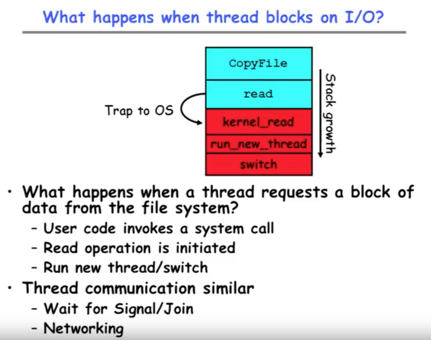
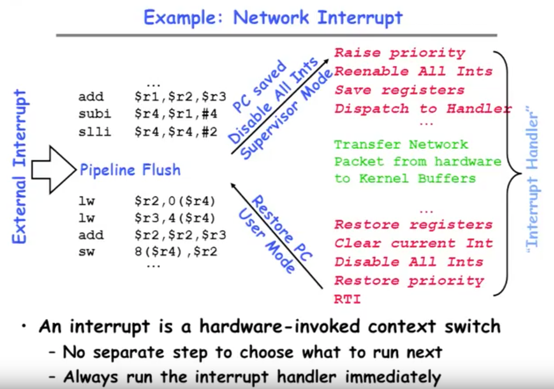
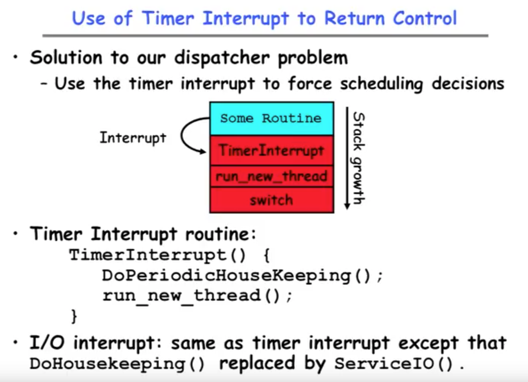

* What happens when thread blocks on I/O ?

> I/O represents a system call, it's a different one than yield. But basically that system call goes in to say the read system call which then does its reading and then calls run new thread and switch and essentially this looks the same as yield. Because we would then end up going to another thread now.
> 
> read is kind of implicitly switches to another thread. The read happens because over time the disk blocks come in eventually we end up back on the run cue and then we just return back out a read and we continue.

---------------

* External Events

	+ What happens if thread never does any I/O, never waits, and never yields control?
		- COuld the ComputePI program grab all resources and never release the processor?
		- Must find way that dispatcher can regain control!
		
	+ Answer: Utiliza External Events
		- Interrupts: signals from hardware or software that stop the running code and jump to kernel
		- Timer: like an alarm clock that goes off every some many milliseconds(毫秒)

> Interrupt Handler(中断处理器)
	
----------------
	
* Use of Timer Interrupt(定时器中断) to Return Control

> The only way we could get switched away is when the timer goes off, that's called preemption.(优先权)

* I/O interrupt: same as timer interrupt except that _DoHousekeeping()_ replaced by _ServiceIO()_

--------------

* Choosing a Thread to Run

	+ How does Dispatcher decide what to run?
	
		- Zero ready threads - dispatcher loops
			- Alternative is to create an "idle thread"
			- Can put machine into low-power mode
		- Exactly one ready thread - easy
		- More than one ready thread: use scheduling priorities

* Possible Prioroties:
	+ LIFO(last in, first out)
		- put ready threads on front of list, remove from front
	+ Pick one at random
	+ FIFO(first in, first out)
		- put ready threads on back of list, pull them from front 
		- This is fair and is waht Nachos does
	+ Priority queue:
		- 	Keep ready list sorted by TCV priority field

--------------	

#### Summary

* The state of a thread is contained in the TCB
	+ Registers, PC, stack pointer
	+ States: New, Ready, Running, Waiting, Terminated

* Multithreading provides simple illusion of multiple CPUs 
	+ Switch registers and stack to dispatch new thread
	+ Provide mechanism to ensure dispatcher regains control

* Switch routine
	+ Can be very expensive if many registers
	+ Must be very carefully constructed!

* Many scheduling options
	+ Decision of which thread to run complex enough for complete lecture
	
--------------		
	
	
	
