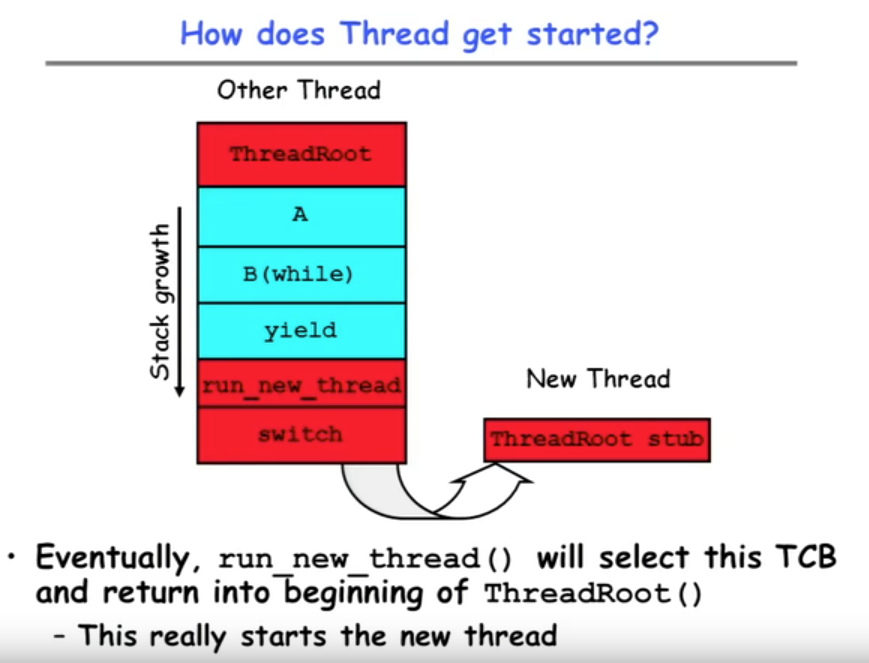
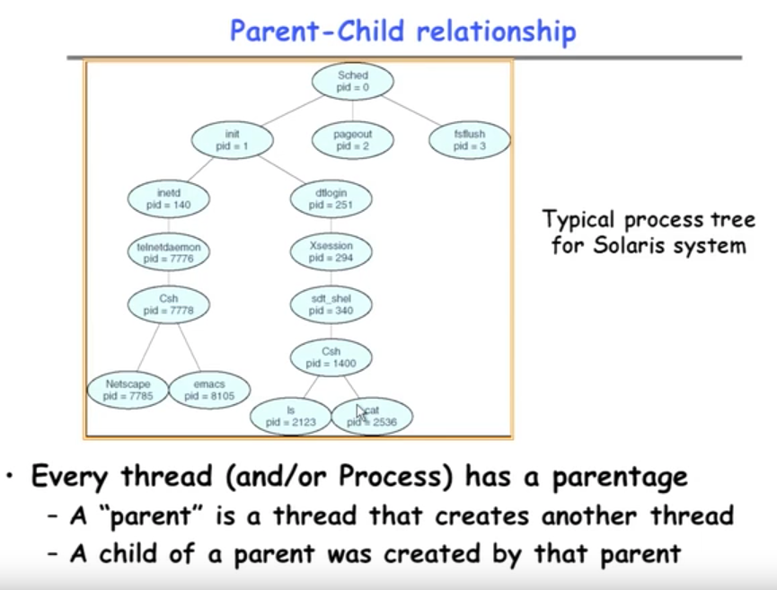
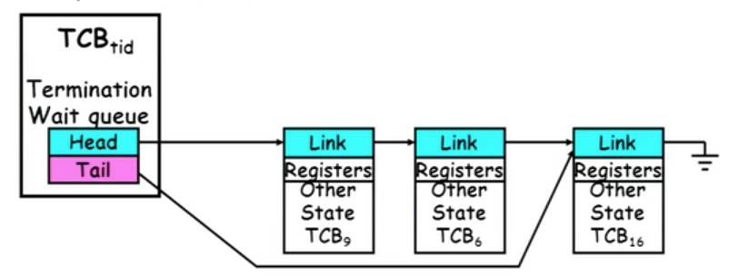

#### Goals for Today
* More on Interrupts
* Thread Creation/Destruction
* Cooperating Threads

-----------------

* Interrupt Controller (中断控制器)

>> Interrupt is a physical signal coming from some device (like CD-Rom, printer, network card). Interrupt is a wire that goes into the system and when it's asserted, it says I need service and when it's not asserted it says nothing. 
> (In system programming, an interrupt is a signal to the processor emitted by hardware or software indicating an event that needs immediate attention.)
> 
> Yellow thing represents something that's inside the chip, a chip's talking to CPU.

>> In computing, a __programmable interrupt controller (PIC)__ is a device that is used to combine several sources of interrupt onto one or more CPU lines, while allowing priority levels to be assigned to its interrupt outputs. 


* Interrupts invoked with interrupt lines from devices
 
* Interrupt controller chooses interrupt request to honor 
	- Mask enables/disables interrupts
	- Priority encoder picks highest enable interrupt
	- Software Interrupt Set/Cleared by Software
	- _Interrupt indentity specified with ID line_

* CPU can disable all interrupts with internal flag

* Non-Maskable interrupt line (NMI) can't be disable


> __Interrupt Mask__ is basically a bit mask that says which of these interrupts  can even bother the processor at any time. If you got a zero in the mask then it doesn't matter what happens on the interrupt line it's ignored.
 
> When receive more than one interrupts, then priority encoder will choose amongst the interrupts that have actually been selected. What __Priority Encoder__ do here is it picks the interrupts turns that into an ID and hands that off to the CPU at the same time it maybe gives an interrupt signal. This Id is some number that says 02 might be the printer. 
 
> The CPU receive interrupts at all will basically stop waht it's doing go off and run an interrupt routine which depends on what this ID is. So it might actually run a different interrupt routine for the network and a different one for the disk and so on.

> If this bit says disable, then this interrupt is entirely ignored in the CPU, we won't look at anything. 

> __Timer__ here is something that you programmed to say how often it goes off or if it goes off at a certain time in place.


>> __Maskable interrupt__ 可屏蔽的中断(IRQ): a hardware interrupt that may be ignored by setting a bit in an interrupt mask register's (IMR) bit-mask.
 
>> __Non-maskable interrupt__ 不可屏蔽中断(NMI): a hardware interrupt that lacks an associated bit-mask, so that it can never be ignored. NMIs are used for the highest priority tasks such as timers, especially watchdog timers.
 
>> __Priority encoder__ （优先编码器）is a circuit or algorithm that compresses multiple binary inputs into a smaller number of outputs. The output of a priority encoder is the binary representation of the original number starting from zero of the most significant input bit. They are often used to control interrupt requests by acting on the highest priority encoder.


---------------


* Disable/Enable All interrupts -> Internal CPU disable bit
	+ RTI reenables interrupts, returns to user mode

* Raise/Lower priority: change interrupt mask

* Software interrupts can be provided entirely in software at priority switching boundaries (软件中断可以完全在软件中以优先级切换边界提供。)


---------------


* This is often called __preemptive multithreading__, since threads are preempted for better scheduling
	+ Solves problem of user who doesn't insert yield(); 不需要 yield()也可以被取代、抢占


>> These threads can be scheduled by the CPU. This can occur at the OS level or at the application level. It can implement parallel processing when the system contains multiple CPU's. PREEMPTIVE MULTITHREADING means that the execution of a thread can be "preempted", i.e. interrupted, by another thread.


> **Cooperative vs. Preemptive Threading** 
> In cooperative models, once a thread is given control it continues to run until it explicitly yields control or it blocks. 
> In a preemptive model, the virtual machine is allowed to step in and hand control from one thread to another at any time. Both models have their advantages and disadvantages.

>> Coopertating Thread 可以让线程自己决定什么时候放弃处理器来等待其他的线程,也就是由开发者控制当前线程执行时间，执行完了才让出cpu资源.如果没控制好，会让某个线程占用过多cpu时间，导致“hungry”.


---------------

* **ThreadFork(): Create a New Thread**

* _ThreadFork()_ is a user-level procedure that creates a new thread and places it on ready queue
	+ We called this CreateThread() earlier

* __Arguments__ to _ThreadFork()_
	+ Pointer to application rountine (fcnPtr)
	+ Pointer to array of arguments (fcnArgPtr)
	+ Size of stack to allocate

* __Implementation__
	+ Sanity Check arguments
	+ Enter Kernel-mode and Sanity Check arguments again
	+ Allocate new Stack and TCB
	+ Initialize TCB and place on ready list (Runnable) 

> Sanity Check (合理性检验)，指快速评估计算结果或分析结论是否合理，是否根本没有正确的可能。Make it easier for a user lever debugger to help the user.


---------------

* How do we initialize TCB and Stack?

	+ Initialize Register fields of TCB
		- Stack pointer made to point at stack
		- PC return address -> OS (asm) rountine _ThreadRoot()_
		- Two arg registers (a0 and a1) initialized to _fcnPtr_ (function pointer) and _fcnArgPtr_ (the pointer to the arguments), respectively (总共有4个新的Registers, a0, a1, return address, sp)


* Initialize stack data?
	- No. Important part of stack frome is in registers (ra)
	- Think of stack frame as just before body of _ThreadRoot()_ really gets started.


---------------

* How does Thread get started? 



---------------

* What does ThreadRoot() look like?

")

---------------

* What does ThreadFinish() do?

	+ Needs to re-enter kernel mode (system call) (重新进入kernel mode意味着 Thread 的结束)
	
	+ "Wake up" (place on ready queue) threads waiting for this thead
		- Threads (like the parent) may be on a wait queue waiting for this thread to finish
		
	+ Can't deallocate(解除分配、重新分配) thread yet (要先从当前Thread终止，由其他的Thread进行分配）
		- We are still running on its stack!
		- Instead, record thread as "waitingToBeDestroyed"
	
	+ Call `run_new_thread()` to run another thread:
	
		```c++
		run_new_thread() {
			newThread = PickNewThread();
			switch(curThread, newThread);
			ThreadHouseKeeping();
		}
		```
		
		- `ThreadHouseKeeping()` notices waitingToBeDestroyed and deallocates the finished thread's TCB and stack
		
	
---------------

* Additional Detail

	+ Thread Fork is not the same thing as UNIX fork
		- UNIX for creates __a new process__ so it has to create a __new address space__
		- For now, don't worry about how to create and switch between address spaces
	
	+ Thread fork is very much like an asynchronous procedure call
		- Runs procedure in separate thread
		- Calling thread doesn't wait for finish
	
	+ What if thread wants to exit early?
		- `ThreadFinish()` and `exit()` are essentially the same procedure entered at user level

		
---------------

	

---------------

* ThreadJoin() system call

	+ One thread can wait for another to finish with the `ThreadJoint(tid)` call
		- Calling thread will be taken off run queue and placed on waiting queu for thread _tid_ (thread ID). 当前Thread想暂停、并开始执行tid，待其完成后继续进行

	+ Where is a logical place to store this wait queue?
		- On queue inside the TCB
		
	
	+ Similar to `wait()` system call in UNIX
		- Let's parents wait for child processes
		
		
----------------

* Use of Join for Traditional Procedure Call


		
+ A tranditional procedure call is logically equivalent to doing a ThreadFork followed by `ThreadJoin()`

+ Why not do this for every procedure?
	- Context Switch overhead
	- Memory Overhead for stacks

	
----------------

* Kernel vs. User-Mode threads

	+ Kernel Threads
		- Native threads supported directly by the kernel
		- Every therad can run or block independently
		- One process may have several threads waiting on different things
		
	+ Downside(缺点) of kernel threads: a bit expensive
		- Need to make a crossing into kernel mode to schedule

		————————————————————————————	
	
	+ Even higher weight option: User Threads
		- User program provides scheduler and thread package
		- May have several user threads per kernel thread
		- User threads may be scheduled non-premptively relative to each other (only switch on yield())
		- Cheap

	+ Downside of user threads:
		- When one thread blocks on I/O, all threads block
		- Kernel cannot adjust scheduling among all threads
		- Option: _Scheduler Activations_	 —— (Have kernel inform user level when thread blocks)
		

----------------


----------------

* Multiprocessing vs. Multiprogramming


				 
	
----------------

* Correctness for systems with concurrent threads (具有并发线程的系统的正确性)


+ Independent Threads
	- No state shared with other threads
	- Deterministic(确定性的) -> Input state determines results
	- Reproducible(可复制的) -> Can recreate Starting Conditions, I/O
	- Scheduling order doesn't matter (if `switch()` works!!!)


+ Cooperating Threads
	- Shared State between multiple threads
	- Non-deterministic 
	- Non-reproducible
	
		
+ Non-deterministic and Non-reproducible means that __bugs can be intermittent__(间歇的)
	- Sometimes called "Heisenbugs"
	
	> Heisenbugs: these are the bugs where you go to look at them and they disappear on you.
	

----------------

* Interactions Complicate Debugging (交互使得更难debug)

	+ Is any program truly independent ?
	
	+ You probably don't realize how much you depend on reproducibility
	
	+ Non-deterministic errors are really difficult to find!

	
	
	

----------------

#### Summary

* Interrupts: hardware mechanism for returning control to operating system
	- Used for important/high-priority events
	- Can force dispatcher to schedule a different thread (premptive multithreading)


* New Threads Created with `ThreadFork()`
	- Create initial TCB and stack to point at `ThreadRoot()`
	- `ThreadRoot()` calls thread code, then `ThreadFinish()` 
	- `ThreadFinish()` wakes up waiting threads then prepares TCB/stack for distruction


