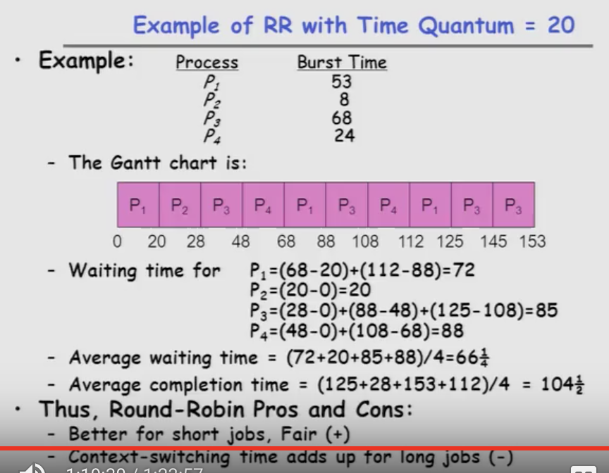

--------------------

* Scheduling Policy Goals/Criteria
	
	+ Minimize Response Time
		- Minimize ellapsed time to do an operation (or job)
		- Response time is what user see
			* Time to echo a keystroke in editor
			* Time to compile a program
			* Real-Time Tasks: Must meet deadlines imposed by World
			
	+ Maximize Throughput(生产量、吞吐量)
		- Maximize operations (or jobs) per second
		- Throughput related to response time, but not identical:
			* Minimizing response time will lead to more context switch than if you only maximized throughput
		- Two parts to maximizing throughput
			* Maximize overhead (eg. context-swiching)
			* Efficient use of resources (CPU, disk, memory, etc)

	+ Fairness
		+ Shared CPU among users in some equitable way
		+ Fairness is not minimizing average response time:
			* Better average response time by making system _less_ fair

		
--------------------

* First-Come, First-Served(FCFS) Scheduling
		
	+ First-Come, First-Served(FCFS)
		- Also "First-In, First-Out(FIFO)" or "Run untill done"
			* In early system, meant one program shceduled util done (including I/O); Now means keep CPU untill thread blocks
		
	+ _Convoy effect(护送效应): short process behind long process_ 
		
	
	
	
		
		
	+ In second case:
		- Average waiting time is much better
		- Average completion time is better

	+ __FIFO Pros and Cons__
		- Simple (+)
		- Short jobs get stuck behind long ones (-)
			* Safeway: Getting milk, always stuck behind cart full of small items. Upside: get to read about space aliens!	
		
--------------------

* Round Robin (RR)
		
	+ FCFS Scheme: Potentially bad for short jobs!
		- Depends on submit order
		- If you are first in line at supermakrket with milk, you don't care who is behind you, on the other hand..
		
	+ Round Robin Scheme
		- Each process gets a small unit of CPU time (time quantum), usually 10-100 milliseconds
		- After quantum expires, the process is preempted and added to the end of the ready queue
		- n processes in ready queue and time quantum is _q_ --> 
			* Each process gets 1/n of the CPU time
			* In chunks of at most _q_ time units
			* __No process waits more than (n-1)q time units__
		
	+ Performance
		- q large --> FCFS
		- q small --> Interleaved (really small --> hyperthreading?)
		- q must be large with respect to context switch, otherwise overhead is too high (all overhead) 
	
	

		
		
	
	
+ Thus, Round-Robin Pros and Cons:
	- Better for short jobs, Fair (+)
	- Context-switching time adds up for long jobs (-)
		
		
--------------------

* Round Robin Discussion
	
	+ How to choose time slice?
		- Too big? -- Response time suffers
		- Infinite？ -- Get back FIFO
		- Too small? -- Throughput suffers!

	+ Actual chices of timeslice:
		- Initially, UNIX timeslice one second:
			* Worked ok when UNIX was used by one or two people
			* What if three compilation going on? 3 seconds to echo each keystroke!(3秒来回击每个击键)
		- In practice, need to balanve short-job performance and long-job throughput
			* Typical time slice today is between __10ms - 100ms__
			* Typical context-switching overhead is __0.1ms - 1ms__
			* Roughly __1%__ overhead due to context-switching

		

		
		
--------------------

* Comparisons between FCFS & Round Robin	
	+ Assuming zero-cost context-switching time, is RR always better then FCFS?
	
	+ Completion Times:
		* Both RR and FCFS finish at the same time. Average response time is much worse under RR!

	+ Also: Cache state must be shared between all jobs with RR but can be devoted to each job with FIFO
		* _Total time for RR longer even for zero-cost switch!_

	

--------------------
		
	
		
--------------------

#### Summary
		
* __Four Conditions required for Deadlock__: 

	+ __Mutual exclusion__
		- Only one thread at a time can use a resource

	+ __Hold and wait__
		- Thread holding at least one resource is waiting to acquire additional resources held by other threads

	+ __No preemption__
		- Resources are released only voluntarily by the thread holding the resource, after thread is finished with it

	+ __Circular wait__
		- There exists a set {T1, ..., Tn} of threads with a cyclic waiting pattern
		
		
* __Scheduling__: selecting a waiting process from the ready queue and allocating the CPU to it

* __FCFS Scheduling__:
	+ Run threads to completion in order of submission
	+ Pros: Simple
	+ Cons: Short jobs get stuck behind long ones

* __Roud-Robin Scheduling__: 
	+ Give each thread a small amount of CPU time when it executes; cycle between all ready threads
	+ Pros: Better for short jobs
	+ Cons: Poor when jobs are same length

* __Shortest Job First(SJF)/Shortest Remaining Time First(SRTF)__:
	+ Run whatever job has the least amount of computation to do/least remaining amount of computation to do
	+ Pros: Optimal (average response time)
	+ Cons: Hard to predict future, Unfair
		

		
		
		
	
	
	
	
	
	
	
	
	
		
		