> **Concurrency(并发性)**: they could run at the same time or they could be interleaved in any arbitrary way(它们可以同时运行，也可以以任意方式进行交错) -- "一个时间段内多个程序进行"
	 
> **Parallelism(并行性)**: things are running at the same time  -- "一个时间点上多个程序进行"

* Concurrency（并发性）
	+ "Thread" of execution
		- Independent Fetch/Decode/Execute loop(独立提取、解码、执行循环)
		- Operating in some Address space
	+ Uniprogramming: __one thread at a time__
		- *MS/DOS, early Macintosh, Batch processing* 
		- Easier for operating system builder
		- Get rid concurrency by defining it away
		- Doea this make sense for personal computers? 
	+ Multiprogramming: __More than one tread at a time__
		- Multics, UNIX/Linux, OS/2, Windows NT/2000/XP, Mac OS X
		- Often called "multitasking", but multitasking has other meanings(talk about this later)

* The Basic Problem of Concurrency
	+ The basic problem of concurrency involves resources:
		- Hardware: single CPU, single DRAM, single I/O devices
		- Multiprogramming API: users think they have exclusive access to shared resources(对共享资源的独占访问权。)
	+ OS Has to coordinate all activity
		- Multiple users, I/O interrupts, ...
		- How can it keep all these things traight? 
	+ Basic Idea: Use Birtual Machine abstraction
		- Decompose hard problem into simpler ones
		- Abstract the notion of an excuting program
	+ Dijkstra did this for the "THE system"
		- Few thousand lines vs. 1 million lines in OS 360(1K bugs)
	
	>>>戴克斯特拉算法（Dijkstra's algorithm，又译迪杰斯特拉算法）由荷兰计算机科学家艾茲赫尔·戴克斯特拉在1956年提出。戴克斯特拉算法使用了廣度优先搜索解决赋权有向图的单源最短路径问题。该算法存在很多变体；戴克斯特拉的原始版本找到两个顶点之间的最短路径，但是更常见的变体固定了一个顶点作为源节点然后找到该顶点到图中所有其它节点的最短路径，产生一个最短路径树。
	
	
--------------

* Recall(61C): What happens during execution?
	
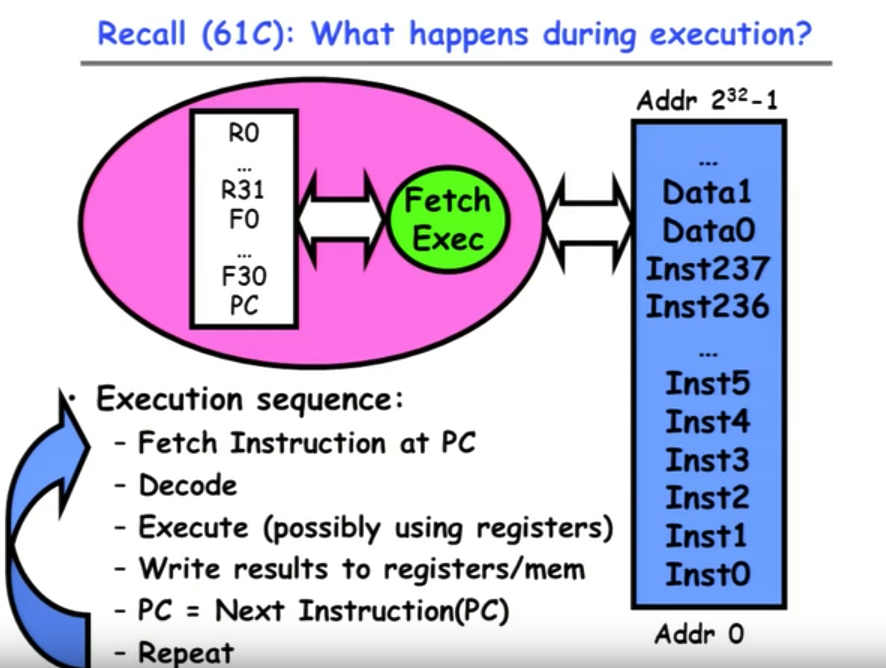
	

* How can we gice the illusion of multiple processor?
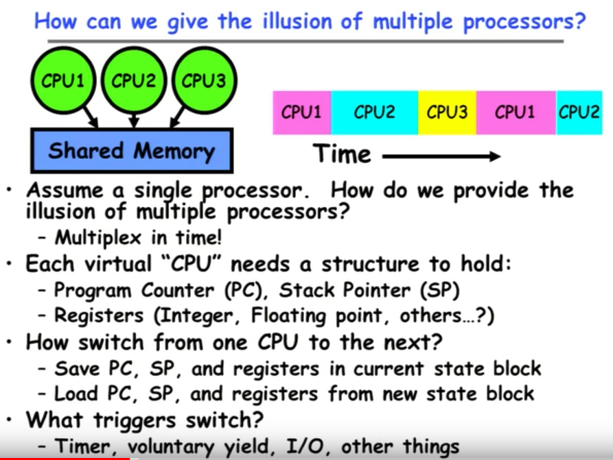
	
> Program Couter(程序计数器，PC)是一个处理器中的寄存器，用于指示计算机在其程序序列中的位置。它通常称为 Intel x86 和 Itanium 微处理器中的指令指针(IP),有时称为指令地址寄存器（IAR)、指令计数器或只是指令序列器的一部分。

> Stack Point(对战指针，SP) 

* Properties of this simple multiprogramming technique
	+ All Virtual CPUs share same non-CPU resources 
		- I/O deveices the same
		- Memory the same
	+ Consequence of sharing:
		- Each thread can access the data of every other thread (good for sharing, bad for protection)
		- Thread can share instructions (good for sharing, bad for protection)
		- Can threads overwrite OS functions？
	+ This(unprotected) model common in:
		- Embeedded applicatoins
		- Windows 3.1/Machintosh (switch only with yield)
		- Windows 95-ME? (switch with both yield and timer)

--------------

* Modern Technique: SMT/Hyper-threading(超线程)
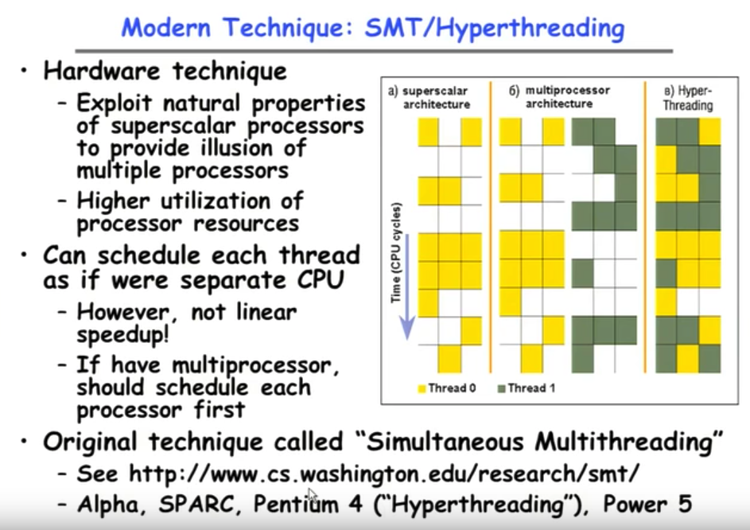

> “超线程”（Hyperthreading Technology）技术就是通过采用特殊的硬件指令，可以把两个逻辑内核模拟成两个物理超线程芯片，在单处理器中实现线程级的并行计算，同时在相应的软硬件的支持下大幅度的提高运行效能，从而实单处理器上模拟双处理器的效能。从实质上说，超线程是一种可以将CPU内部暂时闲置处理资源充分“调动”起来的技术。
 
>> supersalar architecture(超标量体系结构)
	
>> multiprocessor architecture(多处理器体系结构)

--------------
	
* How to protect threads from one another?
	+ Need three important things:
		1. Protection of _memory_
			- Every task does not have access to all memory
		2. Protection of _I/O devices_
			- Every task does not have access to every device
		3. Protection of _Access to Processor_: Preemptive switching from task to task(从任务到任务的抢占式切换)
			- Use of timer
			- Must not be possible to disable timer from usercode

			
--------------

* Recall: Program's Address Space

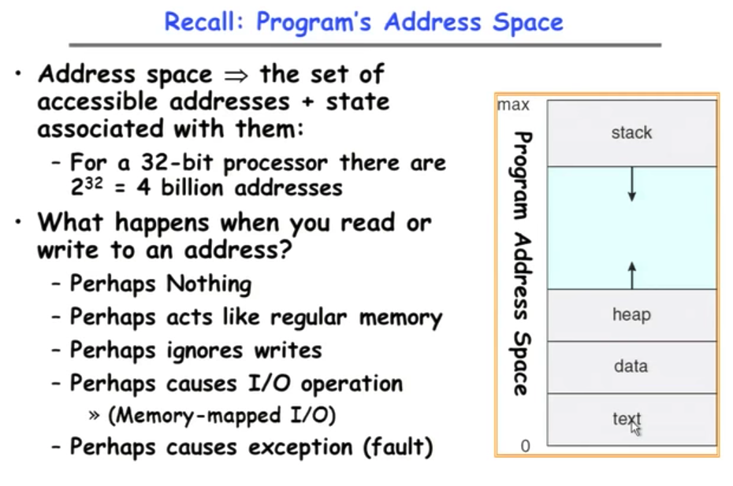

--------------

* Traditional UNIX Process
	+ Process: Operating system abstraction to represent what is needed to run a single program
		- Often called a "__HeavyWeight Process__"
		- Formally: a single, sequential stream of execution in its own address space
	+ Two parts:
		1. Sequential Program Execution Stream
			- Code executed as a single, sequential/stream of execution
			- Includes State of CPU registers(寄存器)
		2. Protected Resources
			- Main Memory State (contents of Address Space)
			- I/O state (i.e. file descriptors)
	+ Important: There is no concurrency in a heavyweight process

	> __Lightweight__(轻量级进程) and __heavyweight processes__ are complementary concepts in that one can run multiple lightweight processes inside a heavyweight process. In fact, your assignments will be doing exactly this, creating Xinu lwps within a Unix hwp.
	>> 在计算机操作系统中, __轻量级进程（LWP)__是一种实现多任务的方法。与普通进程相比，LWP与其他进程共享所有（或大部分）它的逻辑地址空间和系统资源；与线程相比，LWP有它自己的进程标识符，并和其他进程有着父子关系；这是和类Unix操作系统的系统调用vfork()生成的进程一样的。另外，线程既可由应用程序管理，又可由内核管理，而LWP只能由内核管理并像普通进程一样被调度。Linux内核是支持LWP的典型例子。

--------------

* How do we multiplex processes?
	
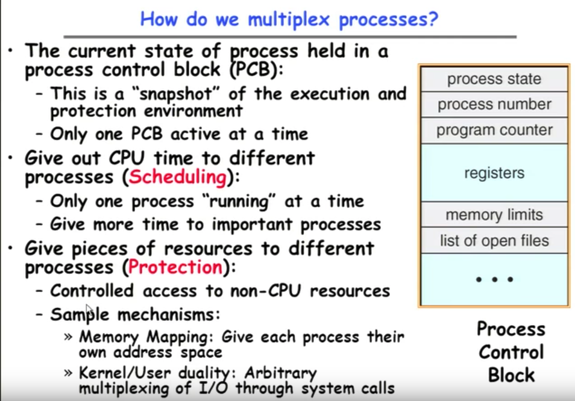

>> 为了描述控制进程的运行，系统中存放进程的管理和控制信息的数据结构称为**进程控制块（PCB Process Control Block)**，它是进程实体的一部分，是操作系统中最重要的记录性数据结构。

* CPU Switch From Process to Process
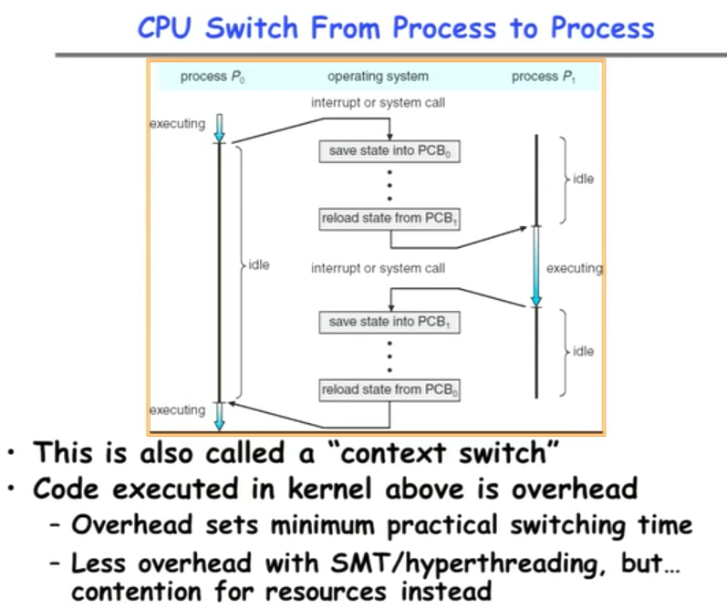
———— No complex! Because there is only one CPU.

> __Context Switch__ (上下文交换), 又称环境交换，是一个储存和重建CPU 的状态 (內文)，因此令多个进程(process)可以分享单一CPU资源的计算过程。
>>内核中执行的代码是开销(Code executed in kernel aboce is oeverhead开销)
>>>用超线程减少开销，但是争夺资源

--------------

* Diagram of Process State
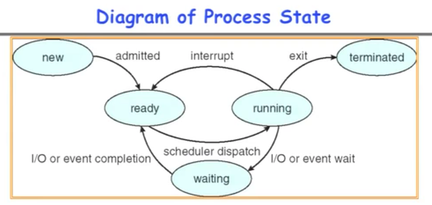

* As a process executes, it changes state:
	+ **new**: The process is being created
	+ **ready**: The process is waiting to run
	+ **running**: Instructions are being executed
	+ **waiting**: Process waiting for some event to occur
	+ **terminated**: The process has finished execution

--------------

* Process Scheduling 

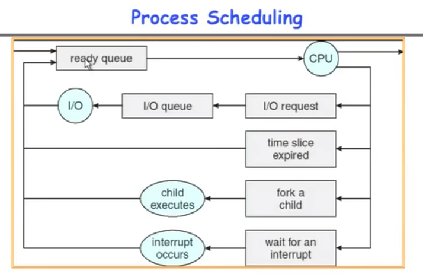

* PCBs move from queue to queue as they change state
	+ Decision about which order to remove from queues are __Scheduling__ decisions
	+ Many algorithms possible (few weeks from now)

--------------

* What does it take to create a process
	+ Must construct new PCB
		- Inexpensive
	+ Must set up new page tables for address space
		- More expensive
	+ Copy data from parent process? (Unix _fork()_)
		- Semantics(语义学; 词义学) of Unix _fork()_ are that the child process gets a complete copy of the *parent memory and I/O state*
		- Originally very expensive
		- Much less expensive with "copy on write"
	+ Copy I/O state (file handles, etc)
		- Medium expense

--------------

* Process =? Program

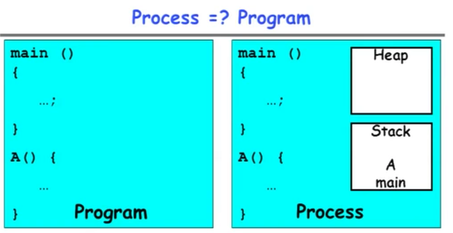

* More to a process than just a program (Process > Program):
	+ Program is just part of the process state
	+ I run emacs on lectures.txt, you run it on homework.java -- same program, different processes

* Less to a process than a program (Process < Program):
	+ A program can invoke more than one process
	+ cc starts up cpp, cc1, cc2, as, and Id

>A process is __more and less than / not the same as__ a program 

--------------

* Multiple Processes Collaborate(协作) on a Task

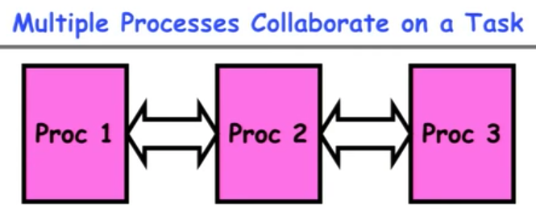

* High Creation/Memory Overhead
* (Relatively) High Context-Switch Overhead
* Need Communication mecahnism:
	+ Separate Address Spaces Isolates Processes(分离的地址空间隔离进程) -- make sure that memory space didn't overlap
	+ Shared-Memory Mapping
		- Accomplished by mapping addresses to common DRAM
		- Read and Write through memory
	+ Message Passing
		- *send()* and *receive()* messages
		- Works across network

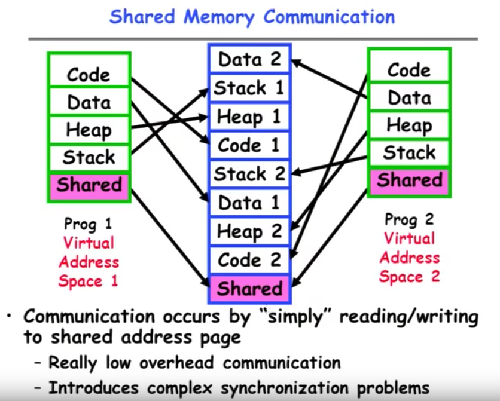

--------------

* Modern "Lightweight" Process with Threads

	+ _Thread_: a sequential execution stream within process (sometimes called a "Lightweight process")
		- Process still contains a single Address Space
		- No protection between threads
	+ _Multithreading_: a single program made up of a number of different concurrent activities
		- Sometimes called multitasking, as in Ada..
		 
	+ Why separate the concept of a *thread* from that of a *process*?
		- Discuss the "thread" part of a process (__concurrency__)
		- Separate from the "address space" (__Protection__)
		- Heavyweight Process = Process with one thread

> __Thread(线程) 和 Process(进程) 都是一个时间段的描述，是CPU工作时间段的描述，不过是颗粒大小不同。__
>>在CPU看来所有的任务都是一个一个的轮流执行的，具体的轮流方法就是：先加载程序A的上下文，然后开始执行A，保存程序A的上下文，调入下一个要执行的程序B的程序上下文，然后开始执行B,保存程序B的上下文.

> _Process(进程)_: 包换上下文切换的程序执行时间总和 = CPU加载上下文 + CPU执行 + CPU保存上下文.

>> 进程的颗粒度太大，每次都要有上下的调入，保存，调出。如果我们把进程比喻为一个运行在电脑上的软件，那么一个软件的执行不可能是一条逻辑执行的，必定有多个分支和多个程序段，就好比要实现程序A，实际分成 a，b，c等多个块组合而成。那么这里具体的执行就可能变成：程序A得到CPU -> CPU加载上下文，开始执行程序A的a小段，然后执行A的b小段，然后再执行A的c小段，最后CPU保存A的上下文。

> 这里a，b，c的执行是共享了A的上下文，CPU在执行的时候没有进行上下文切换的。这里的a，b，c就是线程，也就是说 _Thread(线程)_ 是共享了进程的上下文环境的更为细小的CPU时间段。

--------------

* Single & Multithreaded Processes

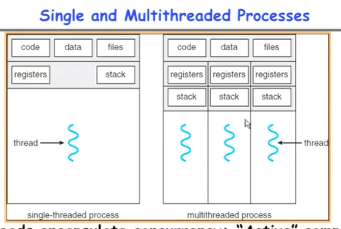

+ Threads encapsulate(封装) concurrency: "Active" component
+ Address spaces encapsulate protection: "Passive" part
	- Keeps buggy program from trashing the system
+ Why have multiple thread per address space?

--------------

* Examples of multithreaded programs
	+ Embedded systems
		- Elevators, Planes, Medical systems, Wristwatches(手表)
		- Single Program, concurrent operations
	+ Most modern OS kernels
		- Internally concurrent because have to deal with concurrent requests by multiple users
		- But no protection needed within kernel
	+ Network Servers
		- Concurrent requests from network
		- Again, single program, multiple concurrent operations
		- File server, Web server, and airline reservation systems

* Thread State		
	+ State shared by all threads in process/address space
		- Contents of memory (global variables, heap)
		- I/O state (file system, network connections, etc)
	+ State "private" to each thread
		- Kept in TCB = Thread Control Block
		- CPU registers(including, program counter)
		- Execution stack - what is this?

--------------

* Execution Stack Example

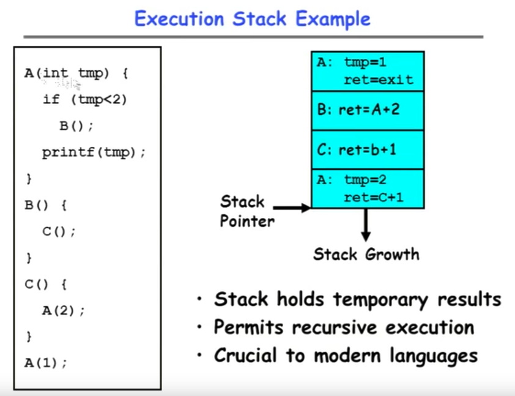

--------------

* Classification 

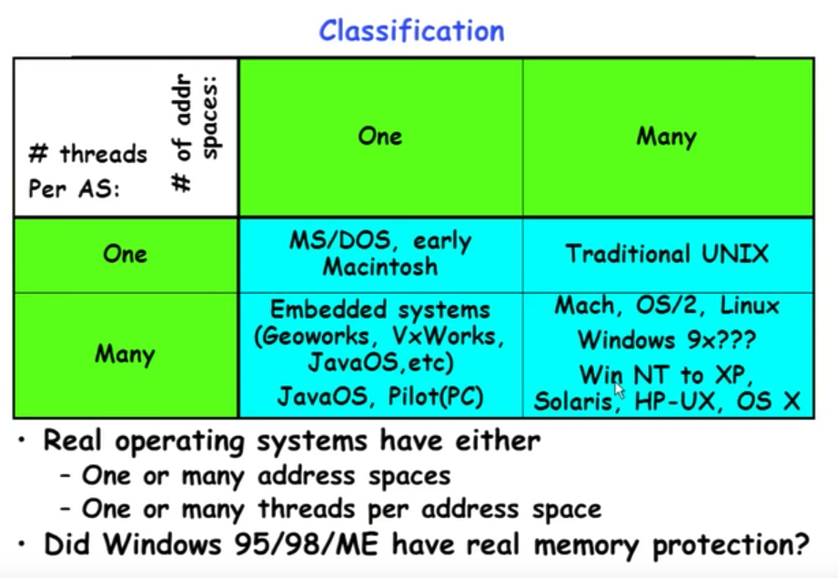

### Summary
* Processes have two parts
	+ Threads (Concurrency)
	+ Address Spaces (Protection)
	
* Concurrency accomplished by multiplexing CPU Time:
	+ Unloading(卸载) current thread (PC, registers)
	+ Loading(加载) new thread (PC, registers)
	+ Such context switching may be voluntary (_yield()_, I/O operations) or involuntary (timer, other interrupts)

* Protection accomplished restricting access:
	+ Memory mapping isolates processes from each other
	+ Dual-mode for isolating I/O, other resources

* Book talks about processes
	+ When this concerns __concurrency__, really talking about __thread__ portion of a process
	+ When this concerns __protection__, talking aobut __address space__ portion of a processs

	
	
	
	
	