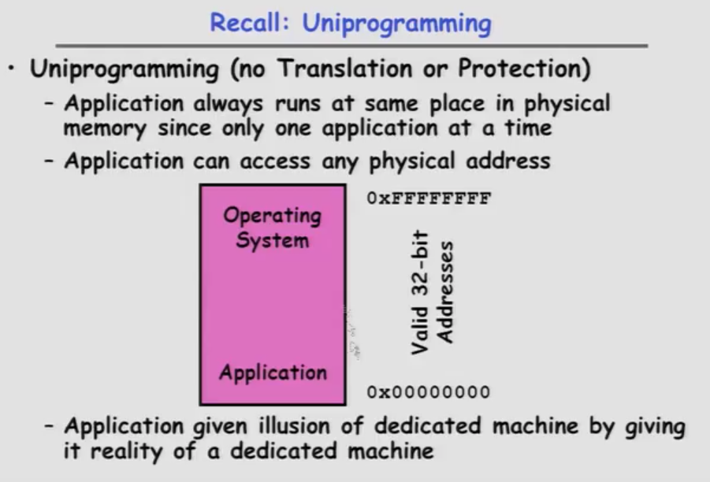

------------------

* Recall: Uniprogramming

	+ Uniprogramming (no Translation or Protection)
		- Application always runs at same place in physical memory since only one application at a time
		- Applicaation can access any physical address
		- Application given illusion of dedicated machine by giving it reality of dedicated machine(通过赋予专用机器的真实性赋予专用机器的错觉)
	
	

------------------

* Multiprogramming (First Version)

	+ Multiprogramming without Translation or Protection
		- Must somehow prevent address overlap between threads
		- Trick: Use Loader/Linker: Adjust addresses while program loaded into memory (loads, stores, jumps)
			* Everything adjusted to memory location of program
			* Translation done by a linker-loader
			* Was pretty common in early days

	+ With this solution, no protection: bugs in any program can cause other programs to crash or even the OS
			

	")

------------------

* Multiprogramming (Version with Protection)

	+ Can we protect programs from each other without translation?
		- Yes: use two special registers _Base_ and _Limit_ to prevent user from staying outside designated area(指定的区域)
			* If user tries to access an illegal address, cause an error
		- During switch, kernel loads new base/limit from TCB 
			* User not allowed to change base/limit registers
	

")

------------------

* Segmentation with Base and Limit registers

	+ Could use base/limit for __dynamic address translation__ (often called "segmentation"):
		- Alter address of every load/store by adding "base"
		- User allowed to read/write within segment
			* Accesses are relative to segment so don't have to be relocated when program moved to different segment
		- User may have multiple segments available (e.g x86)
			* Loads and stores include segment ID in opcode:
			* Operating system moves around segment base pointers as necessary

------------------

* Issues with simple segmentation method
	
	+ Fragmentation(分裂、破碎) problem
		- Not every process is the same size
		- Over time, memory space becoms fragmented
	
	+ Hard to do inter-process sharing 
		- Want to share code segments when possible
		- Want to share memory between processes
		- Helped by providing multiple segments per process

	+ Need enough physical memory for every proecss

	

------------------

* Multiporgramming (Translation and Protection Version 2)

	+ Problem: Run multiple applications in such a way that they are protected from one another
	
	+ Goals:
		- Isolate processes and kernel from one another
		- Allow flexible translation that:
			* Doesn't lead to fragmentation
			* Allows easy sharing between processes
			* Allows only part of process to be resident in physical memory
			
	+ (Some of the required) Hardware Mechanisms:
		- General Address Translation
			* Flexible: Can fit physical chunks of memory into arbitrary places in users address space
			* Not limited to small number of segments
			* Think of this as providing a large number (thousands) of fixed-sized segments (called "pages")
		- Dual Mode Operation
			* Protection base involving kernel/user distinction

	")

------------------

* Example of General Address Translation

------------------

* Two Views of Memory

	+ Recall: Address Space
		* All the addresses and state a process can touch
		* Each process and kernel has different address space
		
	+ Consequently: Two Views of Memory:
		* View from the CPU (what program sees, virtual memory)
		* View from memory (physical memory)
		* Translation box converts between the two views
	
	+ Translation helps to implement protection
		* If task A cannot even gain access to task B's data, no way for A to adversely affect B
	
	+ With translation, every program can be linked/loaded into same region of user address space
		* Overlap avoided through translation, not relocation

------------------

#### Summary

* Shortest Job First (SJF)/ Shortest Remaining Time First(SRTF):
	+ Run whatever job has the least amount of computation to do/least remaining amount of computation to do
	+ Pros: Optimal (average response time)
	+ Cons: Hard to predict future, Unfair

* Multi-Level Feedback Scheduling:
	+ Multiple queues of different priorities
	+ Automatic promotion/demotion of process priority in order to approximate SJF/SRTF

* Lottery Scheduling:
	+ Given each thread a priority-dependent number of tokens (short tasks --> more tokens)
	+ Resreve a minimun number of tokens for every thread to ensure forward progress/fairness

* Evaluation of mechanisms:
	+ Analytical(分析的), Queuing Theory, Simulation

