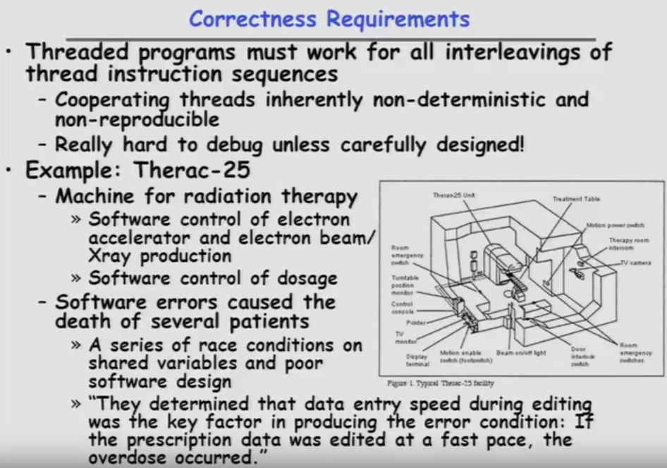
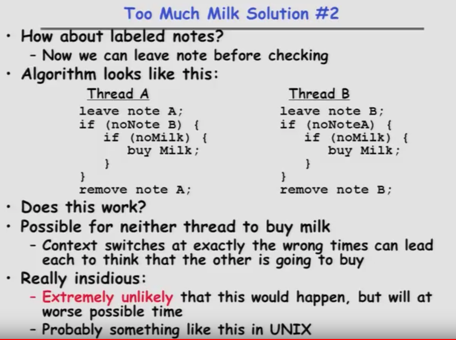

--------------------

* Correctness Requirements

	+ Threaded programs must work for all interleavings of thread instruction sequences
		- Cooperating threads inherently non-deterministic and non-reproducible
		- Really hard to debug unless carefully designed!

	+ Example: Therac-25; Software errors caused the death of sesveral patients
	
	

	

--------------------

* Space Shuttle Example
	

	
> primary avionics 初级航空电子
	
	
--------------------

> Could this happen on a uniprocessor? 
>> Yes! Unlikely, but if you depending on it not happenning, it will and your system will break...

--------------------

--------------------

* Definitions

	+ __Synchronization__:	using atomic operations to ensure cooperation between threads
		- For now, only loads and stores are atomic
		- We are going to show that its hard to build anything usefule with only reads and writes

	+ __Mutual Exclusion__: ensuring that only one thread does a particular thing at a time
		- One thread _excludes_ the other while doing its task
		
	+ __Critical Section__: piece of code that only one thread can execute at once. Only one thread at a time will get into this section of code.
		- Critical section is the result of mutual exclusion
		- Critical section and mutual exclusion are two ways of describing the same thing.
		
		> 每个线程中访问临界资源的那段程序称为 __临界区（Critical Section）__ （ _临界资源_ 是一次仅允许一个线程使用的共享资源）。每次只准许一个线程进入临界区，进入后不允许其他线程进入。不论是硬件临界资源，还是软件临界资源，多个线程必须互斥地对它进行访问。(critical section 是每个线程中访问临界资源的那段代码，不论是硬件临界资源，还是软件临界资源，多个线程必须互斥地对它进行访问。)

	+ __Lock__: prevents someone from doing something 
		- Lock before entering critical section and before accessing shared data
		- Unlock when leaving, after accessing hared data
		- Wait if locked
		
		>>> All synchronization involves waiting
	

> Fixes too much !

--------------------

* Too Much Milk:	Correctness Properties

	+ Need to be careful about correctness of concurrent programs, since non-deterministic (非确定的)
		- Always write down behavior first
		- Impulse is to start coding first, then when it doesn't work, pull hair out
		- Instead, think first, then code
	
	+ What are the correctness properties for the "Too much milk" problem?？？
		- Never more than one person buys
		- Someone buys if needed

	+ Restrict ourselves to use only atomic load and store operations as building blocks (限制我们只使用原子负载和存储操作作为构建块)

--------------------
##### Solution 1

> Why only occasionally?
>>> These checks here are not atomic. Suppose that both of us check for there being no milk and now by the way, there is a invisible roomate. And both of you see there's no note at the same time, both of you leave a note and head out to buy milk.

>> So there is a synchronization condition built into this code that is a weird interleaving where things switch just at the wrong time. Right after you've looked throught the conditions you switch over to the other guy they look through the condition they leave not you come back and leave the note...

> 这种情况其实更差。因为看似解决掉了问题所在，但实际上有少数机会还是会发生错误，并且很难debug！

--------------------

##### Solution 1.5

--------------------

##### Solution 2

> Maby A leave a note and B leave a note, then nobody buys any milk.

> 在极少数情况下会出错、发生没有人去购买牛奶，因为彼此都认为对方会去购买。这种极端的潜在的情况下发生会使得非常的麻烦。This is one of the heisenbugs or it looks like it that it's going to show up at the worst possible time. This one's even less likely than the previous one.

> 与并发相关的关键术语:
>> __原子操作__ ：要保证指令的序列作为一个组来操作执行，要么都不执行；要么执行要直接执行到指令完毕，中间不能中断

>> __临界区__ ：是一段代码，在这段代码中进程将访问共享资源，当有一个进程在这段代码中运行时，其他进程不能在这段代码中运行

>> __死锁__ ：两个或两个以上的进程因其中的每个进程都在等待其他进程做完某些事情而不能继续执行，这种情形称为死锁

>> __互斥__ ：当一个进程在临界区访问共享资源时，其他进程不能进入该临界区访问任何共享资源，这种情形称为互斥

>> __同步__ ：同步是在互斥的基础上（大多数情况），通过对其他机制实现访问者对资源的有序访问

>> __饥饿__ ：指一个可运行的进程尽管能继续执行，但被调度程序无限期地忽视，而不能调度执行的情形

>> __竞争条件__ ：多个线程或进程在读写一个共享数据时，结果依赖于它们执行的相对时间，这种情形称为竞争条件

--------------------

##### Solution 3

>> One thing we can say about this code is each chunk(块）here is protecting a critical section. So basically think of this part leave note A while note B is an entry and the remove note is a exit and this if no milk buy milk is a critical section. And it's over here to that we want to make sure only one of the people do at a time. We don't want any interleaving on the if no milk buy milk critical section. That's what this is being what we're protecting here.

--------------------

##### Solution 4

--------------------

#### Summary

* Concurrent threads are a very useful abstraction
	+ Allow transparent overlapping of computation and I/O
	+ Allow use of parallel processing(并行处理) when available

