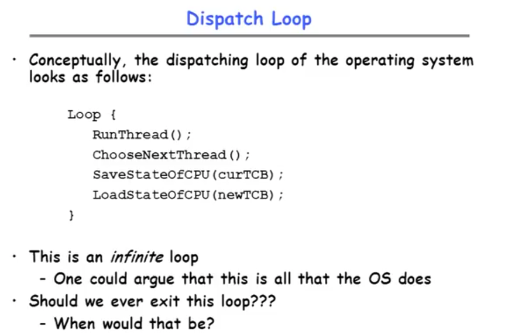
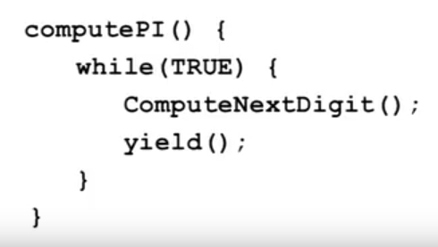
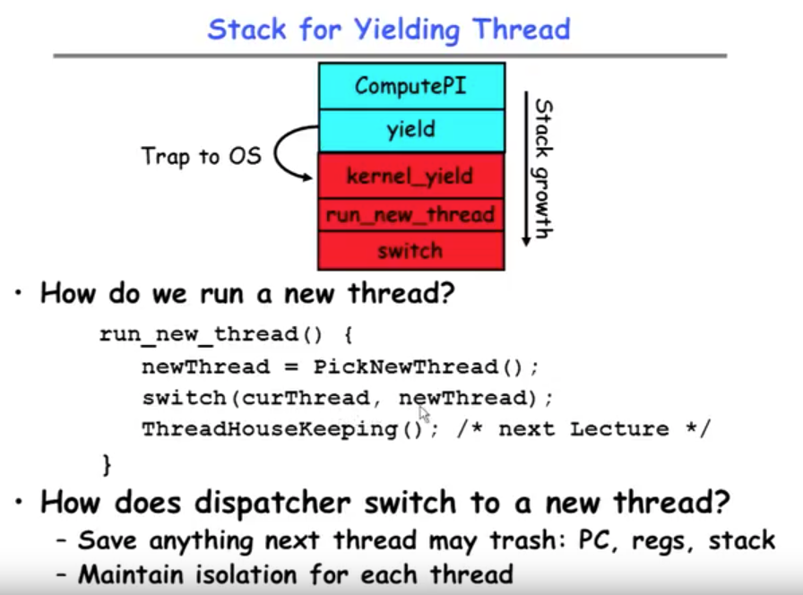
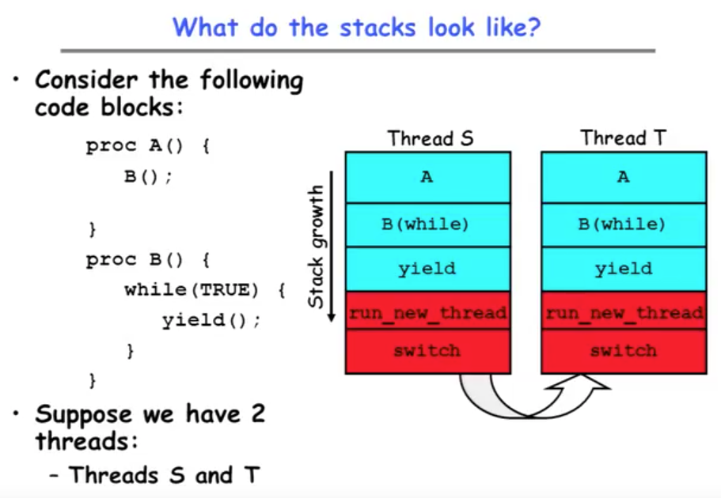
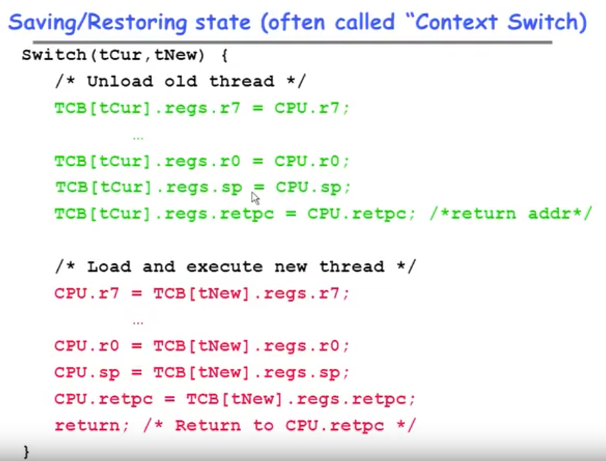
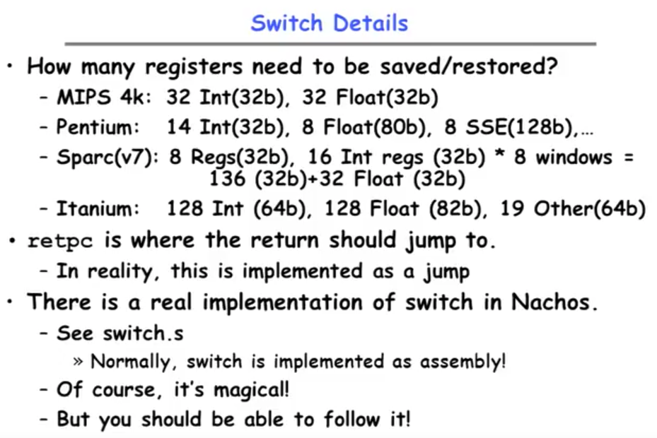
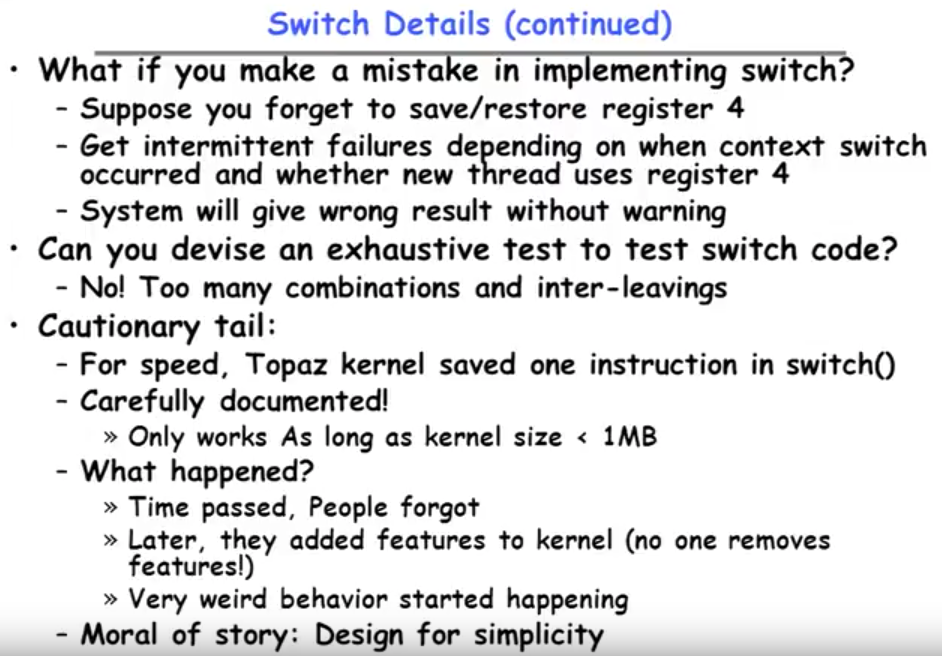

* Dispatch Loop
 

--> Way to exit the loop:	Turn it off, blue screen, etc.
	
	
----------------	
	
* Running a thread
	+ Consider first portion:		_RunThread()_
	
	* How do I run a thread?
		+ Load its state (registers, PC, stack pointer) into CPU
		+ Load environment (virtual memory space, etc)
		+ Jump to the PC

	* How does the dispatcher get control back? (调度器如何取回控制权）
		+ **Internal events**: thread returns control voluntarily
		+ **External events**: thread gets preempted
	
	
	
* Internal Events
	+ Blocking on I/O
		- The act of requesting I/O implicitly yields the CPU
		
	+ Waiting on a "signal" from other thread
		- Thread asks to wait and thus yields the CPU
	
	+ Thread executes a _yield()_
		- Thread volunteers to give up CPU
		
	
	
	
* Stack for Yielding Thread

> Blue: User Mode	
> Red: Kernel Mode

* How do we run a new thread?
	> run_new_thread() {
		newThread; switch; ThreadHouseKeeping;	}

* How does dispatcher switch to a new thread?
	+ Save anything next thread may trash: PC, regs, stack
	+ Maintain isolation for each thread
	
-------------

* What do the stacks look like?

	
	
* Saving/Restoring state (often called "Context Switch)

--------------

* Switch Details

> Switch can vary a lot depending on the architecture, depends on the processor.

> nachos(烤干酪辣味玉米片，墨西哥)
> 
> Nachos操作系统 (Not Another Completely Heuristic Operating System)，是一个可修改和跟踪的操作系统教学软件。（Heuristic 启发式的）它给出了一个支持多线程和虚拟存储的操作系统骨架，可让学生在较短的时间内对操作系统中的基本原理和核心算法有一个全面和完整的了解。
> 
> Nachos的主体是用C++的一个子集来实现的。目前面向对象语言日渐流行，它能够清楚地描述操作系统各个部分的接口。Nachos没有用到面向对象语言的所有特征，如继承性、多态性等，所以它的代码就更容易阅读和理解。
> 
> Nachos共有五个功能模块，分别是机器模拟、线程管理、文件系统管理、用户程序和虚拟存储以及网络系统。
	

