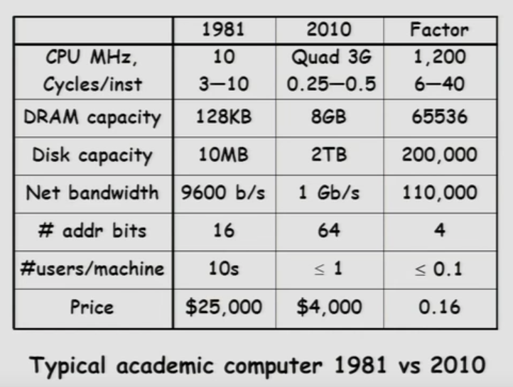
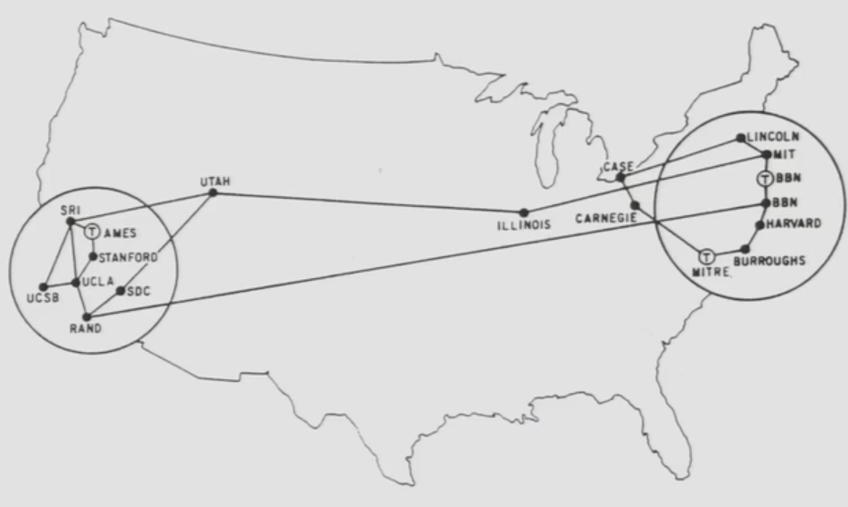

* UNIX System Structure

* Kernel Mode is some sort of **monolithic(整体的) structure**, which means it's not protected from itself. If some part of the kernel over here has a bug, it can screw up another part of the kernel.
（ I/O system, file system, CPU scheduling ）

----------

* Moore's Law Change Drives OS Change

		CPU: MHz (megahertz 兆赫)
		Caoacity: KB (kilobytes 千字节), MB (megabytes 兆字节)
		Net bandwidth(净带宽、实际带宽): bit per second
		Number(#) of addr bits: bits
		#users/machine: how many user per machine
		
			
* Moore's Law Effects
	+ Nothing like this in any othre area of business
	
	+ Transportation in over 200 years:
		- 2 orders of magnitude from horseback @10 mphto concorde(协和式飞机) @1000 mph
		- Computers do this every decade (at least until 2002)
	
	+ Techniques have to vary over time to adapt to changing tradeoffs(折衷、权衡)

	
-----------

#### History

##### Phase 1 (1948-1970): Hardware Expensive, Humans Cheap 

* When computers cost millions of $'s, optimize for more efficient use of the hardware!
	+ Lack of interaction between user and computer 

* User at console(控制台用户): one user at a time
* Batch monitor(批处理监视器): load program, run, print

* Optimize to better use hardware
	- When user thinking at console, computer idle(空闲的) -> BAD (A big waste)!
	- Feed computer batches and make users wait
	- Autograder for this course is similar
	
* __No protection__: what if bathc program has bug?
	- It will bring the whole machine down.
	
----------

* Core Memories(1950s & 60s)

	Magnetic core memory (磁芯存储器、磁芯记忆体)：利用磁性材料製成之記憶體，
	其原理為：將磁環（磁芯）帶磁性或不帶磁性之狀態， 用以代表1或0之位元，一長串1
	或0之組合就代表要儲存之資訊。 磁芯記憶體是一種随机存取记忆体（Random Access
	 Memory），在電腦中可擔任主記憶體的角色。
	
	magnetization (磁化）
	iron rings (铁环）
	mesh of wires (钢丝网)
	
----------
	
	
##### Phase 1.5 (late 60s/early 70s):

* __Data channels, Interrupts__(数据通道，中断): overlap I/O and compute
  
	+ DMA - Direct Memory Access for I/O devices
	
			DMA (Direct Memory Access 直接内存存取) 是所有现代电脑的重要特
			色，它允许不同速度的硬件装置来沟通，而不需要依赖于CPU的大量中断负载。
			否则，CPU需要从来源把每一片段的资料复制到暂存器，然后把它们再次写回到
			新的地方。在这个时间中，CPU 对于其他的工作来说就无法使用。	
			 
	+ I/O can be completed asynchronously(异步地)

* __Multiprogramming__(多道程序): several programs run simultaneously

	- Small jobs not delayed by large jobs
	- More overlap between I/O and CPU
	- Need memory protection between programs and/or OS
	
* __Complexity gets out of hand__(复杂性失控):

	- Multics: announced in 1963, ran in 1969
		> 1777people "contributed to Multics" (30-40 core dev)
		
		> Turing a ward lecture from Fernando Corbato(Key researcher): "On buliding systems that will fail"
		
	- Os 360: released with 1000 known bugs (APARs)
	
		- APAR (authorized program analysis report 授权程序分析报告) is a term used in IBM for a description of a problem with an IBM program that is formally tracked until a solution is provided. 
	
* __OS finally becomes an important science__:
	- How to deal with complexity?
	- UNIX based on Multics, but vastly simplified
	
	

-----------------

* A Multics System (多路信息计算系统) -- Circa (大约) 1976

-----------------

* Early Disk History 

+ Bit vs. Byte (字节与字长的区别)
	- Bit: “位”或“比特”，是计算机运算的基础，属于二进制的范筹
	- Byte: “字节”，是计算机文件大小的基本计算单位.在应用层通常是用byte来作单位，表示文件的大小，在用户看来就是可见的数据大小。 
	
			Seagate，希捷（Seagate Technology Cor）成立于1979年，目前是全球
			最大的硬盘、磁盘和读写磁头制造商，总部位于美国加州司各特谷市。希捷在设
			计、制造和销售硬盘领域居全球领先地位，提供用于企业、台式电脑、移动设备
			和消费电子的产品。
		

---------------

##### Phase 2 (1970 - 1985):	 Hardware Cheaper, Humans Expensive

* Computers available for tens of thousands of dolars instead of millions

* OS Technology maturing/stabilizing

* __Interactive timesharing__(交互式分时):
	+ Use cheap terminals (~$1000) to let *multiple users* interact with the system at the same time
	+ Sacrifice *CPU time* to get better *response time*
	+ Users do debugging, editing and email online
	
* __Problem: Thrashing__(颠簸、打乱)
	- Performance very non-linear response with load 
	- Thrashing caused by many factors including: Swapping, queueing

		
	
----------------	

* The ARPANet (1968 -1970's)
	

* "阿帕"（ARPA），是美国高级研究计划署（Advanced Research Project Agency）的简称。他的核心机构之一是信息处理（IPTO Information Processing Techniques Office），一直在关注电脑图形、网络通讯、超级计算机等研究课题。
	- 1969年11月，美国国防部高级研究计划管理局（ ARPA ）开始建立一个命名为ARPAnet的网络，但是只有4个结点，分布在洛杉矶的加利福尼亚州大学洛杉矶分校、加州大学圣巴巴拉分校、斯坦福大学、犹他州大学四所大学的4台大型计算机。

* IMP (Interface message processor 接口信息处理机 )
	- 接口信息处理机按照ARPA网络的术语把*转发节点*通称为*接口信息处理机*。IMP是一种专用于通信的计算机，有些IMP之间直接相连，有些IMP之间必须经过其他的IMP间接相连。
	
* IBM (International Business Machines Corporation 国际商业机器公司)	
	- IBM生产并销售计算机硬件及软件，并且为系统架构和网络托管提供咨询服务。主要客户是政府和企业。IBM虽然是一家商業公司，但在材料、化学、物理等科学领域卻也有很高的成就，利用這些學術研究為基础，发明很多产品。比较有名的IBM发明的产品包括硬盘、自動櫃員機、通用产品代码、SQL、关系数据库管理系统、DRAM及沃森。
	
	

* No network to Europe
	
	
	
---------------

##### Phase 3 (1981 - ):	 Hardware Very Cheaper, Humans Very Expensive

* Computer costs $1K, Programmer costs $100K/year
	- If you can make someone 1% mor efficient by giving them a computer, it's worth it!
	- Use computers to make people more efficient
	
* __Personal computing__:
	- Computers cheap, so give everyone a PC 
	
* __Limited Hardware Resources Initially__(最初硬件资源有限):
	- Os becomes a subroutine(子程序) library (子程序库)
	- One application at a time (MSDOS, CP/M, ...)

* __Eventually PCs become powerful__:
	- OS regains all the complexity of a "big" OS
	- multiprogramming, memory protection, etc (NT, OS/2)
	
	
		    Question: As hardware gets cheaper does need for OS go
		     away?(是否随着硬件的发展、可以不再需要OS？)---- Whether they
		     ever go away hard to say.
	
	
* Graphical User Interfaces

	

* Xerox Star: 第一款配有滑鼠的商业电脑,也是商业电脑特色与元素的先驱，可以说说现代电脑的元祖雏形。

`Suit(诉讼)， 1988年苹果告微软侵权、败诉。`

* Win NT: is pretty much a **real operating system(OS)** wiht actual protection just like multics

* Win 2000 / Win XP/ Win Vista/ Win 7: these are pretty much **full operating systems(OS)**

	> HAL(Hardware Abstraction Layer 硬件抽象层),位于操作系统 内核与硬件电路之间的接口层，其目的在于将硬件抽象化。 
	
	>> 将硬件差别与操作系统其他层相隔离的一薄层软件，它是通过采用使多种不同硬件在操作系统的其他部分看来是同一种虚拟机的做法来实现的。
	
	>> 最初是由Microsoft公司为确保WindowsNT的稳定性和兼容性而提出的。后来，这种HAL设计思路被一些嵌入式操作系统参考，其系统内核被分成两层，上层称为“内核(Kernel)”，底层则称为“硬件抽象层”。在EOS中，HAL独立于EOS内核；对于操作系统和应用软件而言，HAL是对底层架构的抽象。
	
	>> 它隐藏了特定平台的硬件接口细节,为操作系统提供虚拟硬件平台,使其具有硬件无关性,可在多种平台上进行移植。 从软硬件测试的角度来看，软硬件的测试工作都可分别基于硬件抽象层来完成，使得软硬件测试工作的并行进行成为可能。
	
	
	
	
---------------
	
##### Phase 3 (1981 - ):	 Distributed Systems

* Networking (Local Area Networking)
	+ Different machines share resources
	+ Printers, FIle Servers, Web Servers
	+ Client - Server Model
* Services
	- Computing 
	- File Storage(文件存储器)

	

---------------
	
##### Phase 4 (1988 - ):	Internet

* Developed by the research community
	+ Based on open stndard: Internet Protocol
	+ Internet Engineering Task Force(IETF)
* Technical basis for many other types of networks
	+ Intranet: enterprise IP network
* Services Provided by the Internet
		
    - Shared access to computing resources:telnet(1970's)
    - Shared access to data/files: FTP,NFS,AFS(1980's)
    - Communication medium over which people interact
    	- email(1980's), on-line chat rooms, instant messaging(1990's)
    	- audio,video(1990's, early 00's)
    - Medium for information dissemination
    	- USENET (1980's)
    	- WWW(1990's)
    	- Audio,video(late 90's,early 00's)- replacing radio, TV?
    	- File sharing(late 90's, early 00's) 

	> Internet Protocol (互联网协议, IP): The Internet Protocol is the principal communications protocol in the Internet protocol suite(互联网协议族) for relaying packets across network boundaries. Its routing function enables internetworking, and essentially establishes the Internet.是用于封包交換数据网络的一种协议。IP是在TCP/IP协议族中网络层的主要协议，任务是根据源主机和目的主机的地址来传送数据。为此目的，IP定义了寻址方法和数据报的封装结构。它的寻径功能使网络互联，并且基本上建立了互联网。
	
	> Internet Protocol Suite (互联网协议族, IPS): 是一个网路通讯模型，以及一整个网络传输协议家族，为网络的基础通讯架构。常被称为TCP/IP协议族(TCP/IP)。该协定家族的两个核心协定: TCP(传输控制协议)和IP(互联网协议)是最早通过的标准。由于在网络通讯协议普遍采用分层的结构，当多个层次的协议共同工作时，类似计算机科学中的堆栈，因此又被称为TCP/IP协议栈。这些协议最早源发于美国国防部(DoD)的ARPA网项目，因此也被称作DoD模型。这个协定套组由互联网工程任务组负责维护。
	
	> Internet Engineering Task Force(互联网工程任务组, IETF):负责互联网标准的开发和推动。是全球互联网最具权威的技术标准化组织，当前绝大多数国际互联网技术标准出自IETF。IETF由互联网结构委员会（Internet Architecture Board, IAB）监督，IAB向互联网协会（Internet Society，ISOC）负责。

				
	
	
	