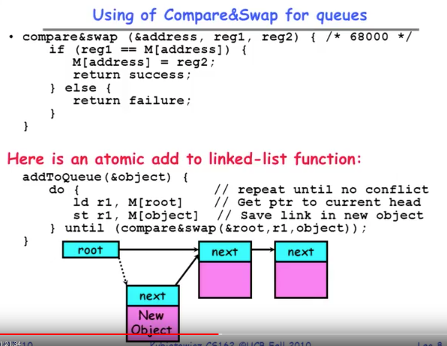
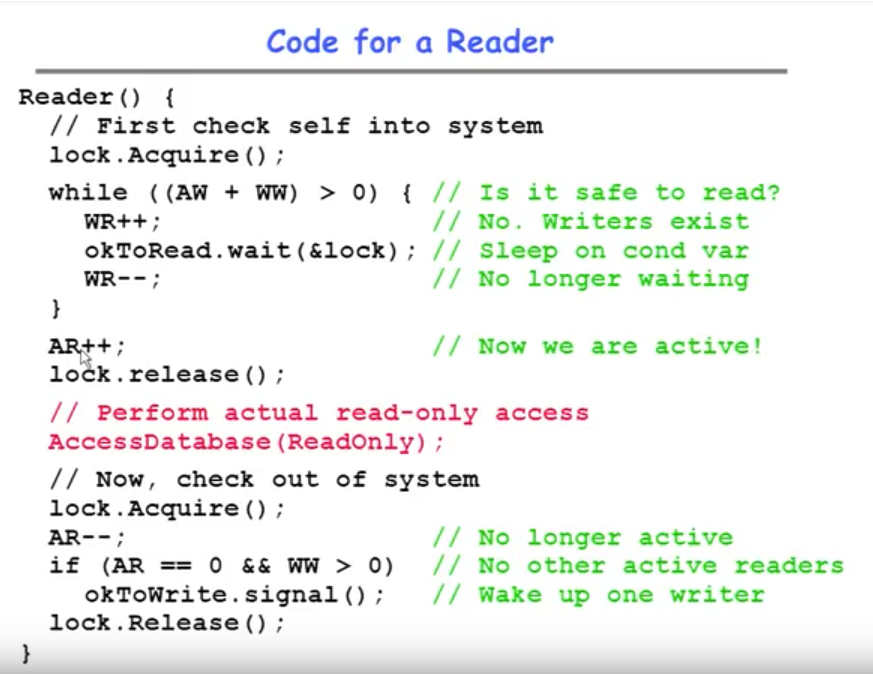
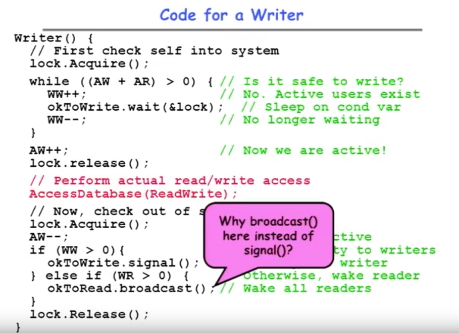
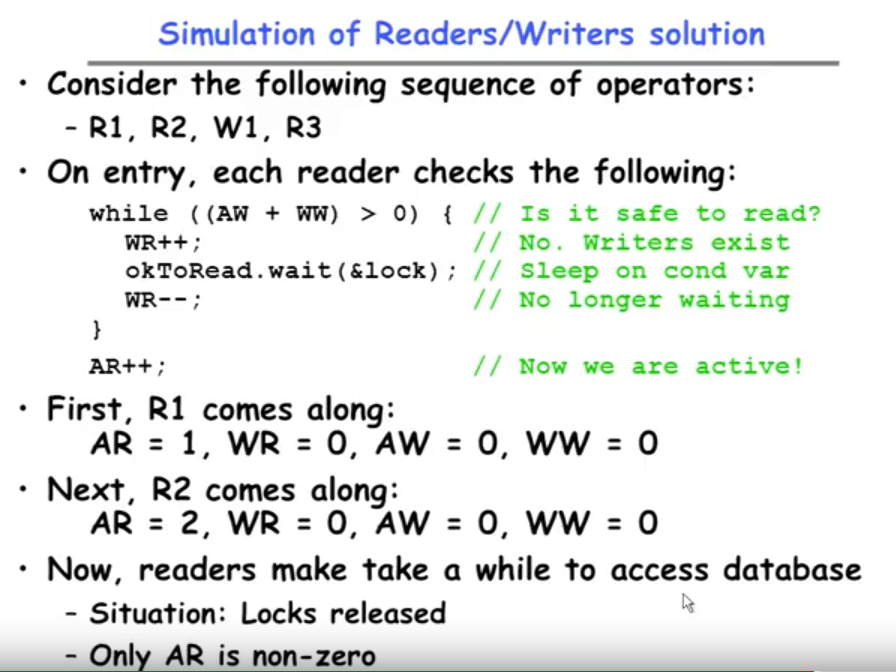
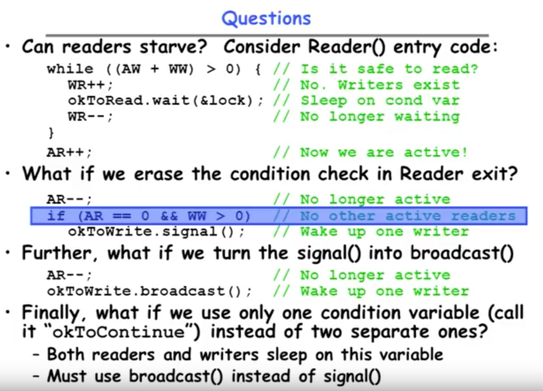
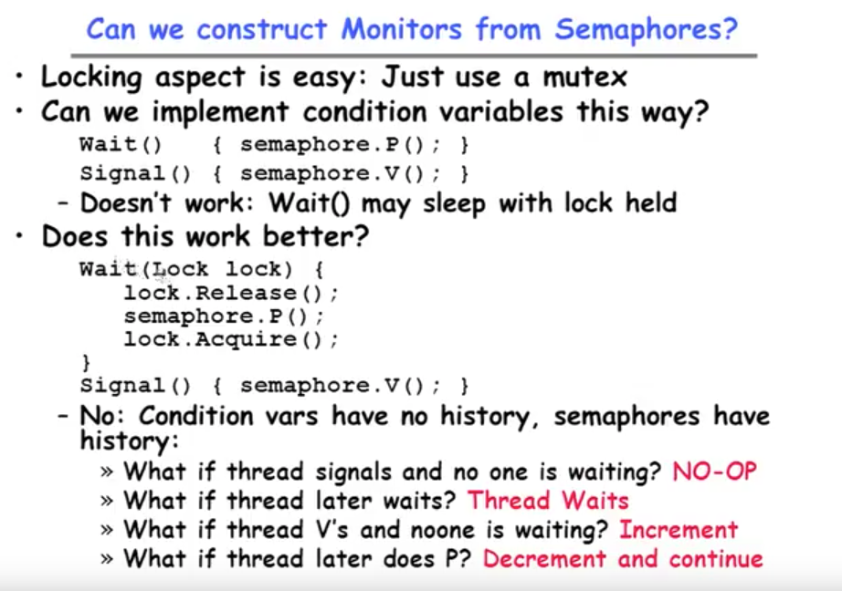
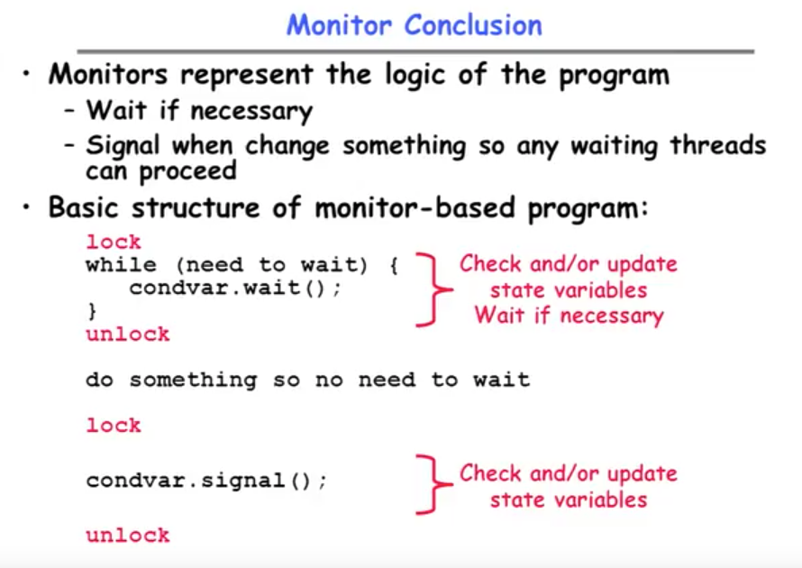

---------------

#### Goals for Today

* Continue with Synchronization Abstractions 
	- Monitors and condition variables
* Readers-Writers problem and solution
* Language Support for Synchronization

---------------

* Using of Compare& Swap for queues

>> As long as what's in the root still matches what's in our one, then go ahead and store the object address into root. Otherwise, it fails and we do all this over again.

> It's a great example of a lock free algorithm that's permitted by a more complex atomic operation and as many people as you want can be simultaneously adding to the head of this linked list.

---------------

* Readers/Writers Problems

	+ Motivation: Consider a shared database
		- Two classes of users:
			* Readers - never modify database
			* Writers - read and modify database
			
		- Is using a single lock on the whole database sufficient?
			* Like to have many readers at the same time
			* Only one writer at a time
	
	

---------------

* Basic Readers/Writers Solution

	+ Correctness Constraints:
		- Readers can access database when no writers
		- Writers can access database when no readers or writers
		- Only one thread manipulates state variables at a time
	
	+ Basic structure of a solution:

> Two condition variables are going to make our solution simple initially

---------------

* Code for a Reader
 
	> The first thing you're going to do is this is a monitor. What's the pattern is you grab the lock you do some stuff. So we just grab the lock.
 

* Why Release the Lock here？

	1. Statement number 1 is no longer touching any of shared variables that are parts of the control entrance, so we can release it. 
	2. So somebady else can read. If we don't release lock here, then another reader would get stuck trying to acquire and they would never make it down here. The fact we released the lock means that there's a potential for more than one reader to actually make it into the database at the same time as well.

---------------

* Code for a Writer

+ Why did I release the lock in the middle?

	- By releasing the lock here, we make sure that the reader code can actually at least get in there and generate waiting readers on the reader code.
	- If we did the read right inside the lock, it would still be correct. But it would be a little more chaotic because we'd have a whole bunch of people sleeping on the acquire of the lock. It's one thing. And the second is as a general rule, if you can set up your monitors so that you're not holding the lock for a huge period of time but rather for kind of the minimum that's required. It's probably a better programming style but you're right it could still be right.

* Why broadcast() here instead of signal()?

> We're broadcasting means that every reader is going to come out a wait but they're going to come out a wait one at a time (because only one can hold the lock at a time). So the fact that we did broadcast put a whole bunch of them onto the ready queue but only one at a time cna they wake up with the lock (because only one can have a lock). So the first one will wake up go back here and say "I can really run go through". The second one will wake up and so on.

* Why do we only do signal on the writers?

> Basically we're only gonna let one writer through the loop anyway. Let's suppose that we set a bunch of a mop and a bunch of them down here. ( 看Writer()前半code )Then the first one will wake up fall through this loop increase active writers (AW++), the next one will wake up and then suddently it'll get stuck and go back to sleep again. So basically we broadcast on the right what happens is one of them makes it through and all the rest of them go through the trouble waking up doing some calculation going back to sleep.
>> 因为每次 Writer()判断一次成功后 AW++。 因此如果此时返回 while loop，就必定会满足 (AW + AR) > 0, 进而进入loop进行sleep

> So basically we're allowing more than one reader to actually be runnig at a time.

---------------

* Why does this code check for waiting writers(WW) first before checks for waiting readers(WR) ?

> Because the writers have more up-to-date information I would buy that as one.
 
>If we did the broadcast first and there was a waiting writer, all these readers would broadcast they'd wake up they go right back to sleep again. Because we actually and this was pointed out very early we actually gave precedence to the writers in this part of code. So if we wake up a bunch of readers, and there was a waiting writer that would be pointless because they'd all just go back to sleep. (Writer() 前半code)

>> There is no danger of actually losing data because we're making all the writers will work their way through here. The danger here is starvation(饥饿) which means that the readers will never get to run. Not actually going to lase any data. If you have so many writers that they're overwriting the same record over and over again, it may be that there's some updates that are never observed by anybody but that's different than losing data. It just means that there's a more up-to-date version and intermediate version just never got noticed by anybody.

---------------

* Simulation of Readers/Writers solution

> 1. When W1 comes, it can't write because there is 2 readers (AW + AR > 0). So the writer just goes to sleep.

> 2. When R3 comes, (AW + WW > 0), R3 is sleeping

> 3. Our two finishes it's going to exit, it's substract one from active readers. We're now down to one. The last of the readers finishes, it wakes up a writer. (Because it says if active readers(AR) is zero and there's a waiting writer(WW), --> signal() )

> 4. Now we've got an active writer(AW) and a waiting reader(WR).

> WR = 1, do a broadcast. It wakes up the reader so now we have one active reader(AR). When it completed, done.

---------------

* Question

> 1. Individual writer and a group of reader?
>> No, readers won't starve.

> 2. Earse the condition check?
>> Won't give us incorrect behaviors. Because the writers are in a loop. They're clever enough to say " I just woke up, let me recheck my condition is it ok for me to run?". If not, go to sleep. (进入口还会有检查，因此不会出错)

> 3. Turn signal() into broadcast()?
>> If there is 20 writers waiting and we're still an active reader in the system and we wake them all up. It works! Because every writer wakes up, goes checks its condition goes back to sleep again. _But it's not good code, because it's wasting time waking things up only to put them back to sleep again._ So the original code has a nice economy of scheduling to it, only wakes somebody up that them can go forward.

> 4. Only one condition variable?
>> It works! Because everybody wakes up they check their conditions. The furtunate one who happens to wake up at the right time to meet the conditions gets to go and the rest of them go back to sleep again. 

---------------

* Can we construct Monitors from Semaphores?

> 1. If you go to sleep having grabbed the lock by executing wait(), you've just deadloacked your system again. Because remember how wait() needs to somehow atomically release the lock after putting you to sleep. So this code is very broken for at least that reason. __If you don't have a condition variable, do not go to sleep holding a lock!__

> 2. No. Condition variables have no history, semaphores have history.

>> 1). signal() but no one is waiting?  ---- Nothing! You could signal your hearts contents, you could signal your loop for a thousand times. If there is no thread wait (like a tree falls in a forest, does anybody hear anything? -- No). 

>> 2). thread later waits? __In a condition variables, wait _always_ put you to sleep!__

> Problem with the prvious try is that P() and V() are basically commutative(可交换的、替代的).

---------------

* Monitor Conclusion

	+ Monitors represent the logic of the program
		- Wait if necessay
		- Signal when change something so any waiting threads can proceed

	+ Basic structure of monitor-based program:

---------------

#### Summary

* Semaphores: Like integers with restricted interface 
	+ Two operations:
		- P(): Wait if zero; decrement when becomes non-zero
		- V(): Increment and wake a sleeping task (if exists)
		- Can initialize value to any non-negative value
	+ Use separate semaphore for each constraint

* Monitors: A lock plus one or more condition variables
	+ Always acquire lock before accessing shared data
	+ Use condition variables to wait inside critical section
		- Three Operations: __Wait()__, __Signal()__, __Broadcast()__
		
* Readers/Writers
	+ Readers can access database when no writers
	+ Writers can access database when no readers
	+ Only one thread manipulates state variables at a time

* Language support for synchronization:
	+ Java provides __synchronized__ keyword and one condition-variable per object (with __wait()__ and __notify()__ )
		
		
		
		
		
		
		
		
		
		

