## 操作系统

### Contents

* 1      操作系统实力、历史、如何学习...
* 2.1   操作系统的启动
* 2.2   中断、异常、系统调用
* 3     操作系统怎么管理内存
    * 3.1   计算机体系结构及内存分层体系
    * 3.2   地址空间&地址生成
    * 3.3   连续内存分配：内存碎片与分区的动态分配
    * 3.4   ~~~~~~~~~~：压缩式与交换式碎片整理
* 4.1   非连续内存分配：分段
* 4.2   ~~~~~~~~~~~~：分页
* 4.3   ~~~~~~~~~~~~：页表概述、TLB
* 4.4   ~~~~~~~~~~~~：二级、多项页表
* 4.5   ~~~~~~~~~~~~：反向页表

### 1.2 什么是操作系统
操作系统站着管理的角度上，给底层应用程序提供管理、控制和服务。
~不属于特定的功能，而是完成对硬件的管理、协调和控制。

* 功能上分类：
    + 用户角度：~是一个控制软件
        管理应用程序；
        为应用程序提供服务(声音)；
        杀死程序。
    + 对其控制管理的对象而言：~是资源管理
        管理外设、分配资源；

* 资源管理角度：

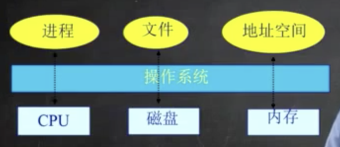

* 操作系统架层次结构

 **操作系统位于应用软件(办公软件、视频播放软件)之下，为应用软件提供服务支撑**
    - 硬件之上
    - 应用程序之下

* Linux、Windows、Android 的 界面 属于外壳(Shell)，并不是内核(Kernel)!

* Kernel - 操作系统内部组件，包括：
    - CPU调度器
    - 物理内存管理
    - 虚拟内存管理
    - 文件系统管理
    - 中断处理与设备驱动

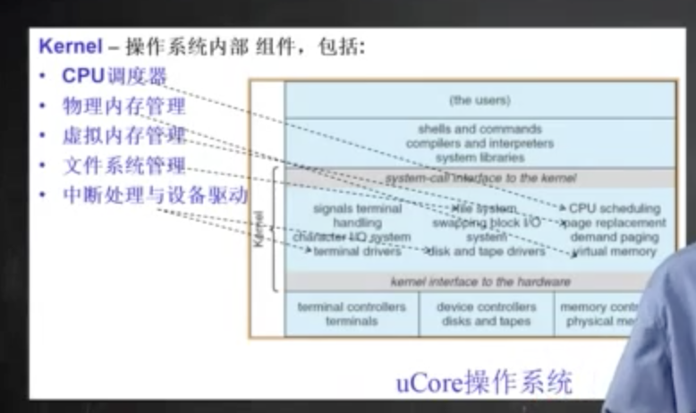

---------------

* OS Kernel 的特征
    + 并发
        - 计算机系统中同时存在多个运行的程序，需要OS管理和调度
    + 共享
        - “同时”访问
        - 互斥共享
    + 虚拟
        - 利用多道程序设计技术，让每个用户都觉得有一个计算机专门为他们服务
    + 异步
        - 程序的执行不是一贯到底，而是走走停停，向前推进的速度不可预知
        - 但只要运行环境相同，OS需要保证程序运行的结果也要相同

				并发: 一个时间段内多个程序进行
				并行: 一个时间点上多个程序进行

### 1.3 为什么要学习操作系统
+ 操作系统是一门综合课程 - 结合许多不同的课程。
    - 程序设计语言
    - 数据管理
    - 算法
    - 计算机体系结构
    - 材料
    - 操作系统概念和原理，源代码
    - 技能
    - 操作系统的设计和实现

+ 操作系统是计算机科学研究的基石之一
	- 计算机系统的基本组成部分
	- 由硬件的噶站和应用需求所驱动
	- 学术和工业的持续推进

			- 工业界：微软、谷歌、Facebook、苹果...
			- 学术界：ACM, IEEE, USENIX, CCF(国内)
			- 顶级会议:		SOSP (每两年，1967-...)
						  	USENIX (每两年，1994-...)

* 操作系统具有挑战性
	1. 很大（Windows XP 有4500万行）
	2. 管理并发/异步 (提高效率同时需要考虑避免出错）
	3. 代码管理原始硬件（时间问题复杂；需要应对非法行为、硬件故障）
	4. 代码必须高效，低耗CPU、内存、磁盘
	5. 必须比应用程序更高的稳定性（操作系统出错，意味着机器出错）
	6. 是系统安全的基础

* 操作系统需要权衡：
	- 空间与时间
	- 性能和可预测性
	- 公平和性能

* 硬件方面，操作系统需要：
	- 良好的硬件管理
	- 合理的资源分配
	- eg. 硬盘速度和CPU、内存相差很多，操作系统需要协调处理

### 1.5 操作系统实例
1. UNIX - 1972年由Kenneth Thompson 和 Dennis Ritchie在贝尔实验室设计

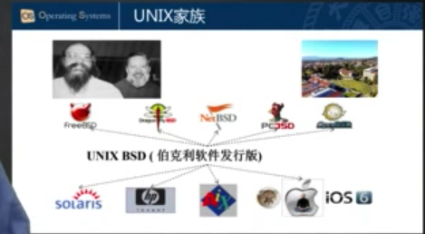

2. Linix (起源于UNIX)

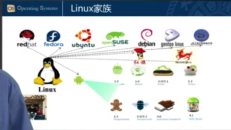

3. Windowx

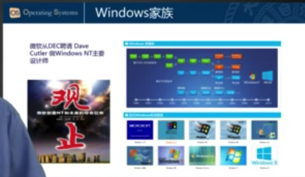

----------------

### 1.6 操作系统的历史、演变过程
	单用户系统
	批处理系统 - 保持多个程序工作在内存当中，并且在各自工作间复用CPU (batch)
	多道程序系统 （multiprogramming）
	分时 - 定时中断用于工作对CPU的复用 (timesharing 分时)
	个人计算机 - 每个用户一个系统 (PC)
	分布式计算 - 每个用户多个系统 (Distributed Systems)

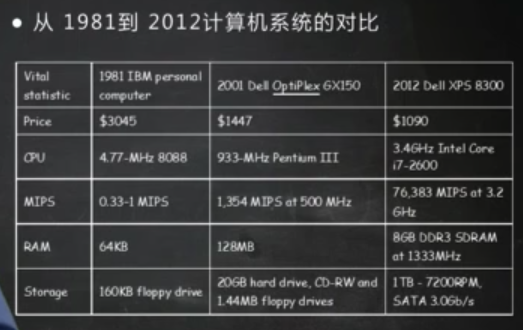

+ 早期计算机使用纸带传输程序和数据，操作系统只起到加载作用
+ CPU等硬件快速发展，计算机速度得到提升，性能未得到充分利用

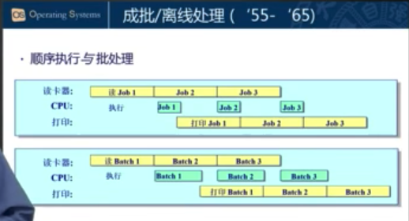
(此时可以提现OS的并发特征)

+ 内存的容量越来越大、CPU执行多个程序。

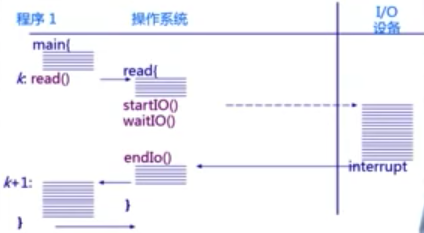

（CPU效率得到进一步增强)

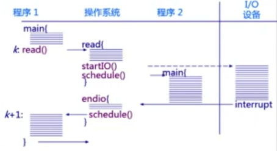

(I/O执行效率远低于CPU执行效率，因此可以利用等待I/O执行完毕的时间，CPU切换至其他程序。可以更加充分的利用CPU. ---- 这就是多道程序设计 ！)

* 为了更好地利用计算机资源，并且更好地和用户交互，出现了--分时系统(将时间分成很小块、使人感受不到，产生每人都占用一个计算机的错觉)

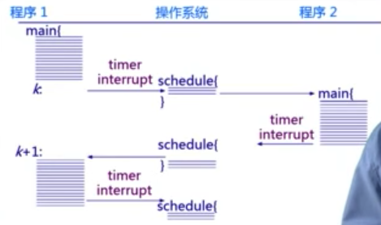

为什么每千分之一秒就可以打断程序的执行？ -- 特殊外设，时钟。帮助操作系统完成相应的分时调度。

--------------

* 个人操作系统

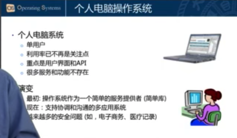

* 网络的快速发展，出现了分布式的操作系统

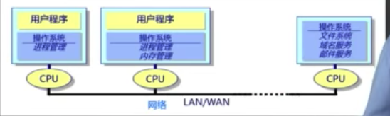

* 一般用户使用的是前端，计算、存储部分在数据中心完成，中间通过互联网连接。形成了分布式的计算环境。 这需要操作系统有新的应对:

	+ 松、紧耦合系统
		- 通过Internet的网络传输交互更加的有效、及时。
		- 数据中心方面可能是一个紧耦合的集运系统，如何使集运系统更好地完成计算功		  能，也是分布操作系统需要协调、管理的工作

 		_____________________

		松耦合：松耦合系统通常是基于消息的系统，此时客户端和远程服务并不知道
				对方是如何实现的。客户端和服务之间的通讯由消息的架构支配。只
				要消息符合协商的架构，则客户端或服务的实现就可以根据需要进行
				更改，而不必担心会破坏对方。

		紧耦合：紧耦合就是模块或者系统之间关系太紧密，存在相互调用。
				紧耦合系统的缺点在于更新一个模块的结果导致其它模块的结果变化，
				难以重用特定的关联模块。

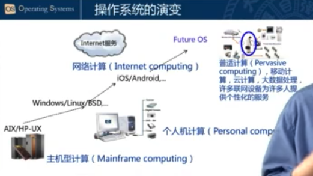
早期一台机器多个人进化成一个人多台机器。

--------------

### 1.7 操作系统的结构

* 简单操作系统： MS-DOS(1981~1994),不分模块的单体内核。

	    MS-DOS, 微软的第一个操作系统（汇编语言书写）, 在接口和功能水平没有很好
	    		地分离，是单体的、没有模块的设计。相对简单，完成功能比较弱。并且
	    		没有保护系统，故此这个操作系统容易被破坏、很难扩展。

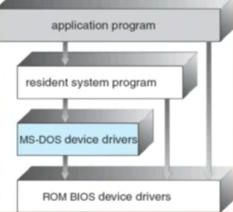

* 用于实验的uCore操作系统

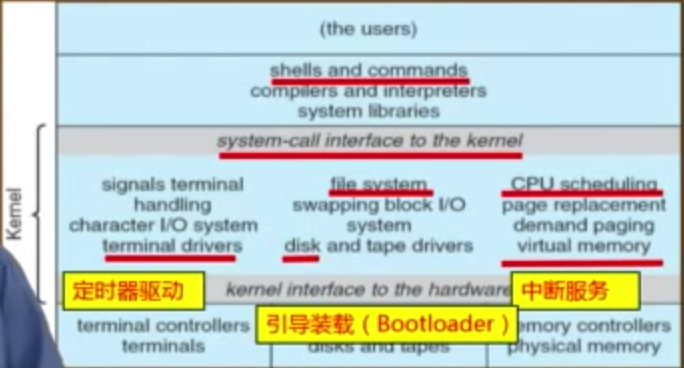

--------------

* 微内核结构(Microkernel)
	+ 尽可能把内核功能移到用户空间
	+ 用户模块之间的通信使用消息传递
	+ 好处：灵活/安全
	+ 缺点：性能

			只在操作系统内核只放最基本的功能:中断处理、消息传递。 而文件系统、内存
			管理、网络协议栈等都放在外围，以程序、服务的形式存在。服务与服务之间通
			过内核的消息传递机制传递，是一种松耦的架构，很灵活、互相不会破坏。但是
			这种灵活和安全有代价 -- 性能。
			例如，当文件系统和内存管理需要进行交互，则需要先把文件导到内核，内核再
			导给相应程序。需要完成多次拷贝，这样的开销远大于简单的函数调用方式。
			目前产业界很少采用微内核，因为其性能还没有得到解决。

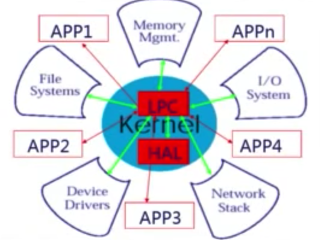

--------------

* 外核结构(Exokernel)：	学术界另一种更加极端的架构。
	+ 让内核分配机器的物理资源给多个应用程序，并让每个程序决定如何处理这些资源
	+ 程序能够链接到操作系统库(libOs)，实现操作系统的抽象
	+ 保护与控制分离（Exokernel完成硬件的隔离）

		    将内核分成两块。1).Exokernel, 和硬件打交道，主要完成硬件功能的复制。
		    2).libOs,建立在Exokernel之上，负责和具体应用打交道。
		     eg. browser有一个专门面向browser的libOs. 该libOs需要访问
		        Exokernel、进一步访问硬件。同时office也有一个相应的libOs,
		    	这两个libOs针对的应用不一样所以设计也不一样，他们唯一的共同点
		    	就是访问Exokernel, 由Exokernel统一完成对硬件的管理，使得两
		    	个独立的libOs可以同时独立安全的使用硬件资源。
		    优点：速度更快

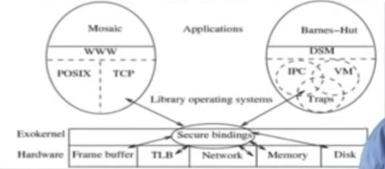

--------------

* VMM(虚拟机管理结构)
	+ 虚拟机管理器能够将单独的机器接口转化为很多虚拟机，每一个虚拟机都是一个原始计算机系统的有效副本，并能够完成所有的处理器指令

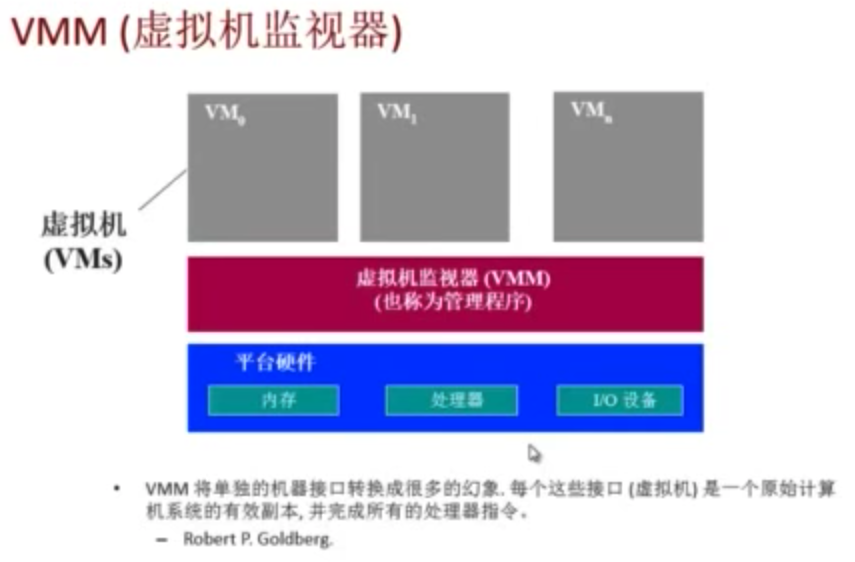

	  操作系统之下不再是硬件、而是VMM, VMM之下才是硬件，形成了一种隔离。
	  VMM虚拟出一台完整的计算机，包括CPU、内存和各种外设。因此OS以为是跑在一台
	完整的物理计算机上面。因此有了VMM,我们一台物理计算机可以变成多台，这可以有效
	的防止硬件资源(CPU等)过剩。

- VMM（虚拟机监视器）

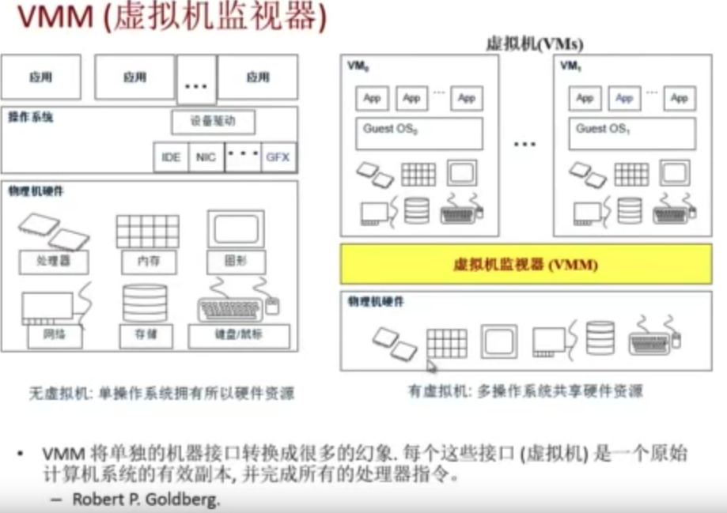

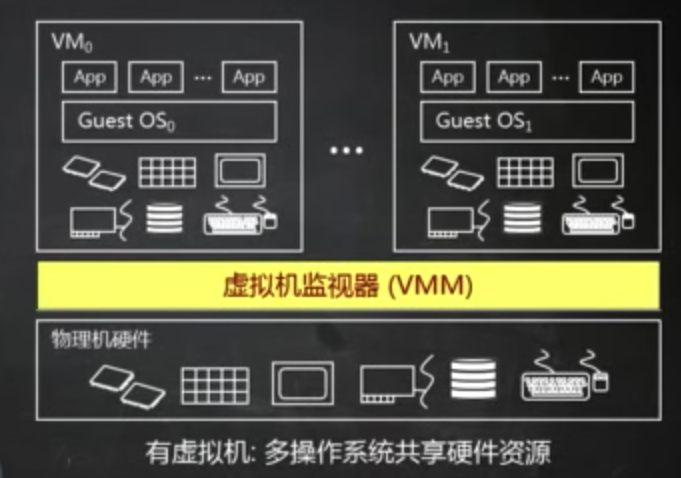

- 有虚拟机，多操作系统共享硬件资源。可以充分提高计算机效率。

--------------

**计算机硬件组成**

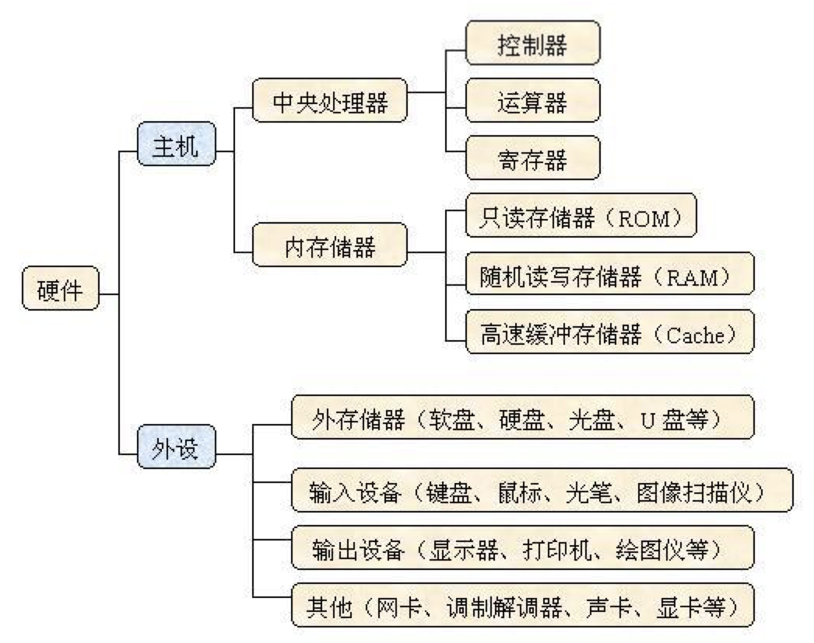

	计算机硬件组成：
	1. CPU：中央处理器（CPU，Central Processing Unit）
	是一块超大规模的集成电路，是一台计算机的运算核心（Core）和控制核心
	(Control Unit)。它的功能主要是解释计算机指令以及处理计算机软件中的数据。
	主要包括运算器（算术逻辑运算单元，ALU，Arithmetic Logic Unit）和高速
	缓冲存储器（Cache）及实现它们之间联系的数据（Data),控制及状态的总线（Bus）。
	它与内部存储器（Memory）和输入/输出（I/O）设备合称为电子计算机三大核心部件。

	2. 寄存器：寄存器是中央处理器内的组成部份。它跟CPU有关，拥有非常高的读写速度，
	所以在寄存器之间的数据传送非常快。寄存器是有限存贮容量的高速存贮部件，它们可用
	来暂存指令、数据和位址。在中央处理器的控制部件中，包含的寄存器有指令寄存器(IR)
	和程序计数器(PC)。在中央处理器的算术及逻辑部件中，包含的寄存器有累加器(ACC)。

	3. 存储器：范围最大，几乎涵盖了所有关于存储的范畴。(寄存器，内存，都是存储器
	里面的一种) 凡是有存储能力的硬件，都可以称之为存储器。(硬盘归入外存储器行列）

	4. 内存：内存既专业名上的内存储器，是存储器中的一种。它包涵的范围也很大，一般
	分为只读存储器(ROM)和随机存储器(RAM),以及最强悍的高速缓冲存储器(CACHE)。
	只读存储器(ROM)应用广泛，通常是一块在硬件上集成的可读芯片，作用是识别与控制硬
	件，特点是只可读取，不能写入。
	随机存储器(RAM)特点是可读可写，断电后一切数据都消失，内存条就是指RAM。

	5. 缓冲存储器(Cache,缓存)
	数据交换的缓冲区(称作Cache),是在CPU中速度非常块，而容量却很小的一种存储器，
	是计算机存储器中最强悍的存储器。由于技术限制，容量很难提升。
	当某一硬件要读取数据时，会先从缓存中查找需要的数据，如果找到了则直接执行，找
	不到的话则从内存中找。由于缓存的运行速度比内存快得多，故缓存的作用就是帮助硬件
	更快地运行。
	因为缓存往往使用的是RAM（断电即掉的非永久储存),所以在用完后还是会把文件送到
	硬盘等存储器里永久存储。电脑里最大的缓存是内存条，最快的是CPU上镶的L1和L2缓
	存，显卡的显存是给显卡运算芯片用的缓存，硬盘上也有16M或者32M的缓存。

* ROM、RAM 	-- 都是半导体存储器
	+ ROM(Read Only Memory) -- 只读存储器或者固化存储器,在系统停止供电的时候仍然可以保持数据

			最初把只能读的存储器叫做ROM(Read Only Memory),并且掉电后数据不会丢
			失。由于不能改写，因而使用起来很不方便。随着技术的进步，在ROM中使用一些
			新技术，就可以使它具有可以编程的功能。
			ROM有很多种，PROM(可编程的ROM)和 EPROM(可擦除可编程ROM)的区别是，
			PROM是一次性的，即软件灌入后，就无法修改了。这种是早期的产品，现在已经
			不可能使用了；EPROM是通过紫外光的照射擦出原先的程序，是一种通用的存储
			器。另外一种EEPROM是通过电子擦出，价格很高，写入时间很长，写入很慢。

	+ RAM(Random Access Memory) -- 随机存取存储器,通常都是在掉电之后就丢失数据，典型的RAM就是计算机的内存。

			RAM有两大类。一种称为静态RAM(Static RAM/ SRAM),当数据被存入其中后
			不会消失。SRAM速度非常快，是目前读写最快的存储设备。因此非常昂贵，所以
			只在要求很苛刻的地方使用，譬如CPU的一级缓冲，二级缓冲。
			另一种称为动态RAM(Dynamic RAM/ DRAM), DRAM必须在一定的时间内不停的
			刷新才能保持其中存储的数据。DRAM 只要1只晶体管就可以实现。DRAM保留数据
			的时间很短，速度也比SRAM慢，不过它还是比任何的ROM都要快，但从价格上来说
			DRAM相比SRAM要便宜很多，计算机内存就是DRAM的。

--------------

### 2.1 操作系统的启动

启动时主要三部分：	CPU, Memory, I/O （计算机三大核心部件）

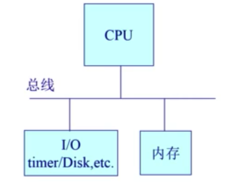

* DISK(硬盘）: 存放OS
* BIOS(基本I/O处理系统): 当计算机一接上电源，就可以让计算机系统开始检测各种外设。只有检测了外设之后才可以加载相应软件并执行。(外设包括键盘、屏幕、键盘...)

* Bootloader(加载程序)：Disk上一个小程序。主要负责加载OS，将OS从硬盘放到内存上去，使CPU可以开始执行OS。其常常放在Disk第一个主领导散驱(512个字节）

在内存上有一部分被BIOS预先占据。BIOS需要先从一个特定的地址(CS+IP)开始执行，然后完成一系列过程（包括：POST(加电自检 - 寻找显卡和执行BIOS）

	CS和IP合在一起可以共同决定一个内存地址。
	CS: 段寄存器
	IP: 指令寄存器

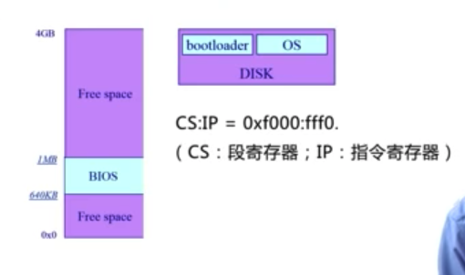

--------------

* 启动过程：
	1. BIOS加载Bootloader
		- BIOS将Bootloader从硬盘加载到内存。此时CPU的控制权由Bootloader掌握。
	2. Bootloader加载OS
		- Bootloader将OS的代码和数据从硬盘加载到内存。此时CPU的控制权由OS掌握。

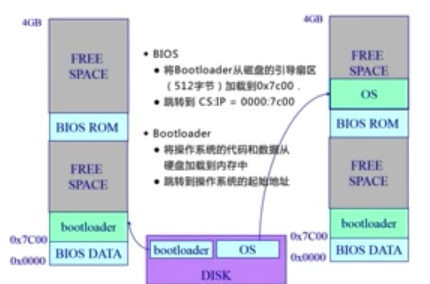

--------------

当操作系统启动后，如何与外设、程序交流？———— 操作系统的Interface !

* 操作系统的Interface
	+  面向外设：通过中断和I/O进行处理
	+  面向程序：通过系统调用、异常提供相应的功能

* 操作系统的中断、异常和系统调用
	+ 系统调用（来源于应用程序）：应用程序主动向操作系统发出服务请求	+ 异常（来源于不良的应用程序）：非法指令或者其他坏的处理状态（如内存出错）
	+ 中断（来源于外设）：来自不同的硬件设备的计时器和网络的中断

--------------

* Q. 为什么应用程序不能直接访问外设？为什么要通过操作系统？
	1. 安全性。在计算机运行中，OS是一个可信任的软件，内核是被信任的第三方，只有内核可以执行特权指令。而程序是不可信任的。OS可以提供安全的服务。
	2. 提高效率。 操作系统可以为上层应用程序提供更简单一致的应用接口，使得上层应用不用关注底下的不同Device。操作系统可以屏蔽底下不同Device的复杂性、差异性，使应用程序更通用、可移植。

	———— 根据这两点，才设计出 System call, exception 和 interrupt.

* 操作系统如何设计和实现中断、异常和系统调用？三者有什么区别和特点？

	+ 源头
		- 中断：外设
		- 异常：应用程序意想不到的行为
		- 系统调用：应用程序请求操作提供服务

	+ 处理时间
		- 中断：异步
		- 异常：同步
		- 系统调用：异步/同步
			（系统调用时，发出请求时候是同步的。但返回是异步。）

				异步： 当事件产生时，应用程序不知道什么时候会产生。
				同步：执行某特定指令之后，知道一定会产生。

	+ 响应
		- 中断：持续，对用户应用程序是透明的
		- 异常：杀死或者重新执行意想不到的应用程序指令
		- 系统调用：等待和持续

### 2.2 中断和异常处理机制

	* 中断是外设的事件
	* 异常是内部CPU的事件
	* 中断和异常迫使CPU访问一些被终端和异常服务访问的功能

	中断和异常都是对应用程序透明的。
	存在一个表可以查找到中断的来历。Key是中断/异常号，Value是相应的地址。
	不同的外设产生的中断有不同的编号，可以根据编号找到起始地址。

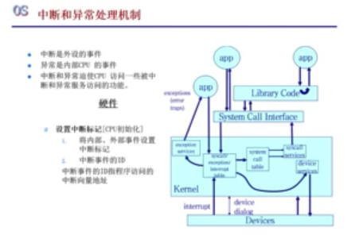

* 中断 —— 打断了当前程序的正常执行，所以硬件和软件需要有保存恢复机制，可以使得系统完成中断后继续运行。
	* 硬件：
		+ 设置中断标记[CPU初始化]
			1. 将内部、外部事件设置中断标记
			2. 中断时间的ID（CPU根据标记产生中断号并发给OS）
	* 软件(也就是OS)：
		+ 保存当前处理状态(便于后续恢复)
		+ 中断服务程序处理（OS根据中断号找到地址）
		+ 清除中断标记
		+ 恢复之前保存的处理状态

--------------

* 异常 —— 当应用程序执行了特定指令之后，触发的异常事件。
	（CPU也会得到一个异常编号并传给OS，找到地址）
	+ 保存现场
	+ 异常处理
		- 杀死产生了异常的程序
		- 重新执行异常指令
	+ 恢复现场

--------------

* 系统调用
	来源于应用程序需要操作系统提供服务，而这些服务不可以用应用程序来执行、而必须用OS来执行。这个过程需要一个接口----系统调用接口。

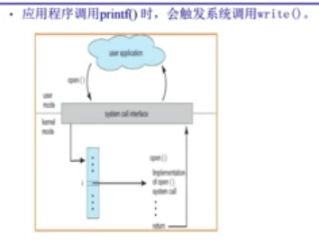

	应用程序调用printf()时，会触发系统调用write()

* 程序访问主要是通过高层次的API接口，而不是直接进行系统调用。

	    为了方便应用程序使用操作系统的系统调用的接口，产生了很多定义好的API。
	    eg.
	    	- Win32 API 用于Windows
	    	- POSIX API 用于POSIX-based systems (可移植性操作系统接口)
	    		可以跨平台使用，包括UNIX,LINUX,Mac OS X的所有版本。
	    	- Java API 用于JAVA虚拟机（JVM）
	    		Java的API并不是系统调用。最终还是需要Win32/POSIX API实现相应
	    		的操作系统服务。
	    * 最底层的是Win32 / POSIX，他们决定了操作系统到底可以提供哪些API!

* 操作系统怎么实现系统调用？
	+ 对于应用程序而言，不需要了解怎么实现，只需要知道系统调用的功能、参数以及如何定义的。

**系统调用处理过程**
应用程序会直接/间接的通过一个Libraray(库)来访问系统调用的接口，接着会触发一个从用户态到内核态的转换，从而使可控制权从应用程序转移到操作系统。OS可以向应用程序发出一些系统调用的参数，并对系统调用的ID号进行标识，完成识别进行具体的服务。

		用户态：应用程序在执行过程中，CPU所处于的状态--特权集很低，不能直接访问
				某些特殊的指令、也不能直接访问I/O.
		内核态：操作系统运行时CPU所处于的状态，此时CPU可以执行任何指令，可以控制
				整个计算机系统。
		——当应用程序处于用户态是，无法操控整个计算机系统。当操作系统处于内核态时，
		可以操控整个计算机系统。这提高了安全性。

这个过程中，除了用户态--内核态的特权集的转化，还有其他的变化。。

* 系统调用和传统函数调用的区别
	1. 过程
		- 当应用程序发起函数调用时，在一个栈空间内完成参数的传递、返回；
		- 系统调用时，需要切换堆栈，同时还需要完成特权集的转换（用户态-内核态)
		- 转换和堆栈的切换都需要一定的开销，因此系统调用
	2. 开销
		- 转换和堆栈的切换都需要一定的开销，因此系统调用的开销远大于比函数调用。
	3. 安全：系统调用更加安全可靠。

--------------

		中断、异常和系统调用跨越了操作系统和应用程序，操作系统和外设的边界。
		这种跨越可以使整个系统更加安全可靠正常的运行，但是也有一定的代价。

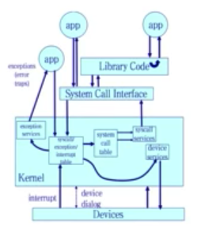

* 跨越操作系统边界的开销
	+ 执行时间上的开销超过程序调用
	+ 开销：
		- 建立中断/异常/系统调用号与对应的服务例程映射关系的初始化开销（OS在初始环节就需要先把这个表建立好）
		- 建立内核堆栈（OS有自己的堆栈、不能与应用程序堆栈混合。需要维护堆栈的开销）
		- 验证参数（OS不信任应用程序,需要对传入的参数进行验证）
		- 内核态映射到用户态的地址空间（OS将内核态的数据导入到用户态，内存拷贝也要开销）
		- 内核态独立地址空间(TLB)

--------------

### 3.1 计算机体系结构及内存分层体系

* 计算机体系结构/内存分层体系
	+ 计算机体系结构
	+ 内存分层体系
	+ 在操作系统的内存管理范例

**———— CPU + 内存 + 设备 ————**
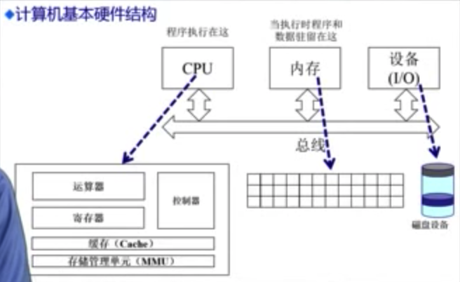

* 内存层次结构
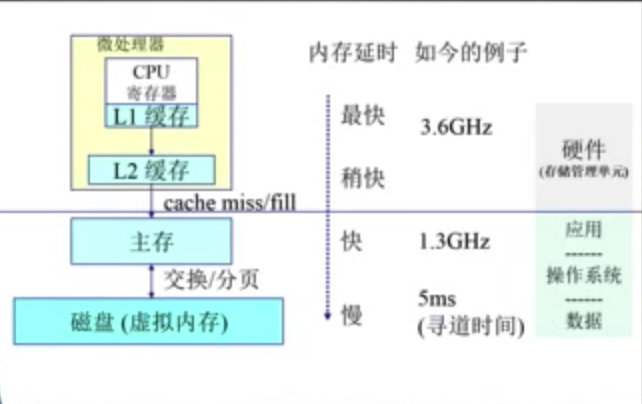
**CPU -> 磁盘 : 速度减弱、容量增加**

-----------

* 操作系统OS在内存管理上的目标：
	1. 抽象：由于OS有效管理，应用程序运行时不需要考虑一些底层细节(物理内存、外设的位置等)，只需要访问一个连续的地址空间--逻辑地址空间。
	2. 保护：内存中可以运行多个不同的应用程序，可能需要访问别的进程的地址空间。OS可以通过隔离机制将进程之间的地址空间的隔离，达到保护的目的。
	3. 共享：OS可以使进程安全有效的进行数据的传递、交互
	4. 虚拟化：OS将暂时不需要内存的数据临时放到硬盘，内存上只放最需要内存的数据。这样可以虚拟出足够大的内存。这种管理过程对应用程序透明。

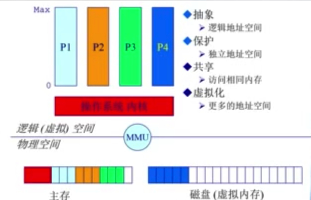

> P1正在CPU上面运行，可能需要更多的内存空间，OS可以将 P4（暂时不需要内存）放到磁盘（虚拟内存）上。
>> 物理空间 - CPU,内存；	逻辑（虚拟）空间 - 运行程序看见的空间

-----------

* 操作系统OS管理内存的不同方法（为了实现4个目标的手段）
	+ 程序重定位
	+ 分段
	+ 分页
	+ 虚拟内存
	+ 按需分页虚拟内存

* 由于OS本身只是一种软件，在实现4个目标/功能时OS需要**高度依赖于硬件**。
	1. 必须知道内存架构
	2. MMU(内存管理单元)：硬件组件负责处理CPU的内存访问请求

------------

### 3.2 地址空间 & 地址生成

* 地址空间
	1. 物理地址空间：硬件支持的地址空间（内存条所代表的主存、硬盘所代表的存储空间)，物理地址空间的管理和控制是OS来完成的。
	2. 逻辑地址空间：一个运行的程序所拥有的内存范围（相对简单、是一种一维的线性地址空间)。应用程序很容易访问。

	> 两者的联系：所有的逻辑地址空间的访问最终都落实在物理地址空间上。eg, 如图上的一条指令，其逻辑地址空间是 在程序 Program P上，但最终会被放置在主存或者硬盘上 -- 取决于OS的协调。

	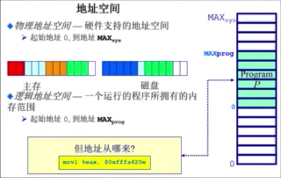

-----------------

* 逻辑地址的生成

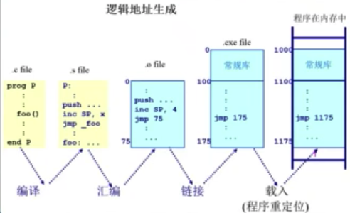

__1. 编译__ 一个函数的位置、变量的名字即是一种逻辑地址，人比较容易理解的方式。

__2. 汇编__ 更贴近机械语言。但依旧是用符号代表函数、变量的名字。和机械语言相比更容易被人理解。通过汇编器可以转换成机器语言(.O程序 -- 其实地址都是0开始，会把函数名、变量符号名转换成相应的地址。这些地址是相对从0开始的逻辑地址空间)

__3. 连接(Linker)__ 一个大程序可能会由很多小程序组成，小程序组成过程可能会使得不同小程序直接需要进行访问，从而形成很复杂的依赖关系。这个过程需要Linker进行处理 -- 将多个 .o 程序编译成一个单一的执行程序，如 .exe file( exe.file是可以在内存中执行，但目前存放在硬盘中的程序)。 这个程序的地址已经做了全局的分布，不同的 .o程序的地址在单一的程序中有相应的定义, 但这个定义还不在内存中。

__4. 载入(Loader也是个应用程序)__ 将放在硬盘中的执行程序放到内存中运行。 需要将放在内存的逻辑地址完成相应的分配，使得应用程序在内存中可以正常的运行。相对于执行程序而言，地址会有所偏移(存在一个偏移量，可以为0或者其他特定的值)，所有的程序都可以依据偏移量进行正确的数据访问和指令的操作。

—— 这个过程也是逻辑地址的生成过程。从最开始的符号逻辑地址 到最终可以在内存上运行的具体的逻辑地址，其中经历过很多的转换过程基本上都不需要OS的帮助。 **即使逻辑地址被放到了内存上，依旧还只是逻辑地址、并不是物理地址** 因为这是程序看到的地址，和物理地址存在着区别。

* 物理地址的生成

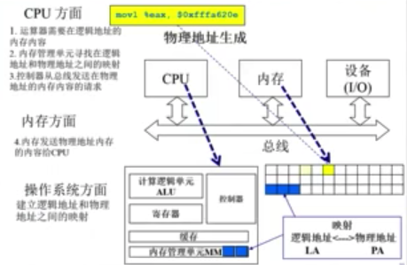

1. 当CPU要执行指令时，其ALU(计算逻辑单元)会发出请求（参数为 逻辑地址）需要这条指定的内容
2. CPU中的MMU(内存管理单元)会去查找逻辑地址的映射表中是否存在 相对应的物理地址。如果有，即找出；无则继续去内存的Map中查找。
3. 如果找到了对应的物理地址，则CPU中的控制器会给主存发出请求 - 需要某物理地址的内容(即指令的内容)
4. 主存会把内容通过总线传给CPU,CPU得到指令后就可以开始执行。

——在这个过程中，CPU所起到的作用：在四步之前建立好映射关系(逻辑地址到物理地址的映射关系，这个关系可以放在内存中由CPU进行缓存、从而加快访问过程)。
可以看出逻辑地址和物理地址的关系联系是通过OS完成的。

-----------------

另一方面，OS需要保证放在内存上的程序相互之间不能干扰，故此需要保证每个程序访问的地址空间是合法的、限制在约束范围之内的。这种限制和约束也是靠OS完成。

* 地址安全检查

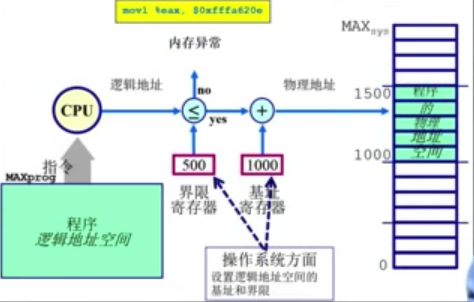

OS要确保每个程序有效的访问地址空间（起始地址+地址长度 / 基址+界限)。这个表也是由OS建立、维护的。当CPU要执行某指令时，会去查Map,得到逻辑地址以及逻辑地址是否满足区域的限制。如果满足，可以正确的取出指令； 如果不满足，CPU产生Memroy异常（内存访问异常)，从而让OS进一步的处理。

----------------

### 3.3 连续内存分配：内存碎片与分区的动态分配

* 内存碎片问题

	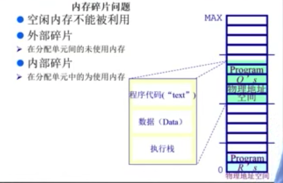

+ 内存碎片：无法进一步利用的空间。(在储存分配过程中产生的、不能供用户作业使用的主存里的小分区称成“内存碎片”)
+ 分类：
	- 外部碎片：再分配单元间的未使用内存
	- 内部碎片：再分配单元中的未使用内存（已经分配给了应用程序）

---------------

* OS需要提供内存分配的情况
	1. 当一个应用程序被允许运行、OS将其从硬盘加载到内存时需要在内存中分配其一个连续的区间。
	2. 当应用程序在运行时需要被分配一个连续的内存空间来进行数据的访问。

	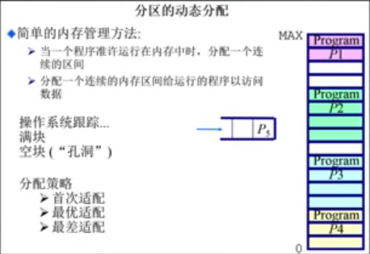

OS需要管理所有空闲、非空闲的内存空间，就必须知道哪些空间被占用或者仍旧空闲。这其中是通过一些数据结构和算法来进行有效的管理的。其中三个 __基本的算法/分配策略__ :

+ 第一适配(First Fit)
+ 最佳适配(Best Fit)
+ 最差适配(Worst Fit)

---------------

* __第一适配(First Fit): 为了分配 n 字节, 使用第一个尺寸比n大的可用的空闲块__

	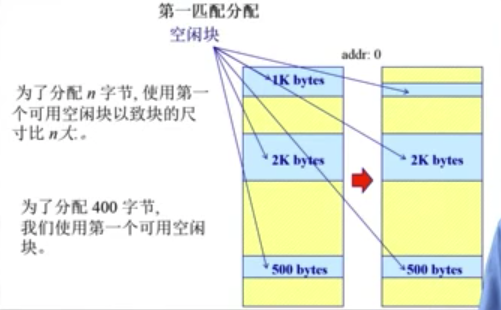
	———— 选择第一个 1K bytes 空闲块!

* 需求：
	+ 按**地址排序**的空闲块列表
	+ 分配需要寻找一个合适的分区
	+ 重分配需要检查，看是否自由分区能合并于相邻的空闲分区（若有）

* 优势
	+ 简单
	+ 易于产生更大的空闲块，向着地址空间的结尾

* 劣势
	+ 外部碎片（因为每次都只寻找第一个适合的分区，因此分区之间容易产生很多未被利用的小碎片）
	+ 不确定性

---------------

* __最佳适配(Best Fit): 寻找所有空闲块中最适合的空闲块(两者尺寸相差最小)__

	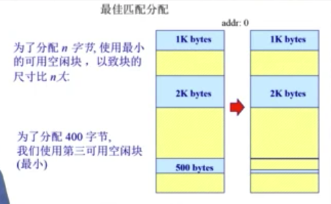
	———— 选择第三个 500 bytes 空闲块！

* 基本原理 & 实现
	+ 为了避免分割大空闲块
	+ 为了最小化外部碎片产生的尺寸

* 需求
	+ 按**尺寸排列**的空闲块列表
	+ 分配需要寻找一个合适的分区
	+ 重分配需要搜索及合并相邻的空闲分区（若有）

* 优势
	+ 当大部分分配是小尺寸时非常有效
	+ 比较简单

* 劣势
	+ 外部碎片(将外碎片拆得很细、不利于进一步的空间管理）
	+ 重分配慢
	+ 易产生很多没用的微小碎片（不怎么好）

---------------

* __最差适配(Worst Fit): 选择尺寸相差最大的空闲块__

	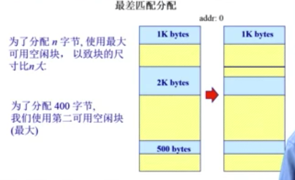
	———— 选择第二个 2K bytes 空闲块！

* 基本原理 & 实现
	+ 为了避免有太多微小的碎片

* 需求
	+ 按**尺寸排列**的空闲块列表
	+ 分配很快（获得最大的分区）
	+ 重分配需要合并于相邻的空闲分区（若有），然后调整空闲块列表

* 优势
	+ 介入分配是中等尺寸效果最好

* 劣势
	+ 重分配慢
	+ 外部碎片
	+ 易于破碎打得空闲块以致大分区无法被分配（因为大块的空闲块早已被拆分）

---------

**这三种适配并没有所谓的最好算法！因为应用程序的需求（大、小空间块）是随机的可变的，三者算法中没有任何一种可以满足所有的需求。**

---------

直接分配内存后，后续为了使碎片减少甚至消失，使内存空间尽量完整、连续，可以通过以下的方法：

### 3.4 连续内存分配：压缩式与交换式碎片整理

1. 压缩式碎片整理（紧致 compaction)
	+ 重置程序以合并孔洞
	+ 要求所有程序是 动态可重置的
	+ 议题：	何时重置？开销？

	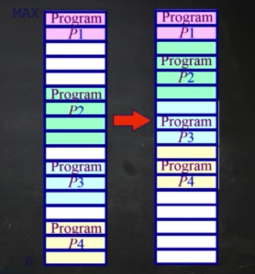

通过内存拷贝可以完成。

不能再程序运行的时候进行重置、只有当程序完成之后才可以开始拷贝。

在内存中频繁的拷贝、开销其实很大，甚至有可能会影响系统的正常执行。

--------------

* 交换式碎片整理(换入、换出 swapping)
	+ 充分的利用硬盘、把硬盘当做内存的后备。

	> eg, 如P3执行时需要更多内存，而P1,P2,P3已经把内存占满（compaction 此时无效). 那么此时可以将正在 等待的P4 挪到硬盘，将其空间暂时给P3使用。 此时，P4的数据只是从内存移到了硬盘、并没有丢失。 当P3并不需要这么多的内存、P4需要继续执行时，只要将P4从硬盘上考回内存即可。

	+ 议题：哪些程序交换？

	

。
