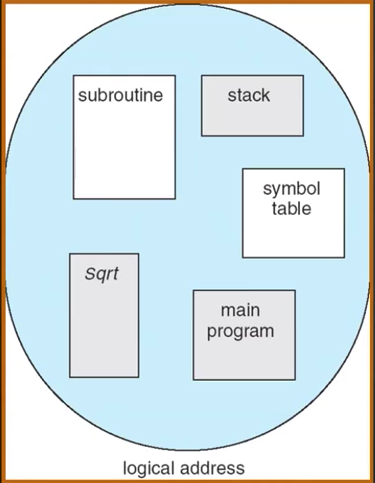
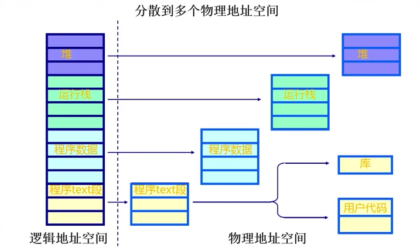
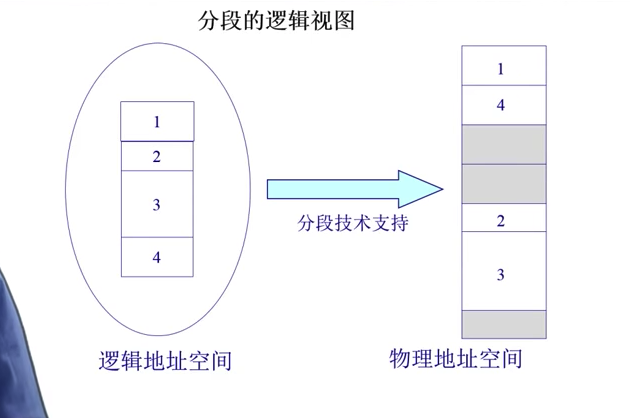
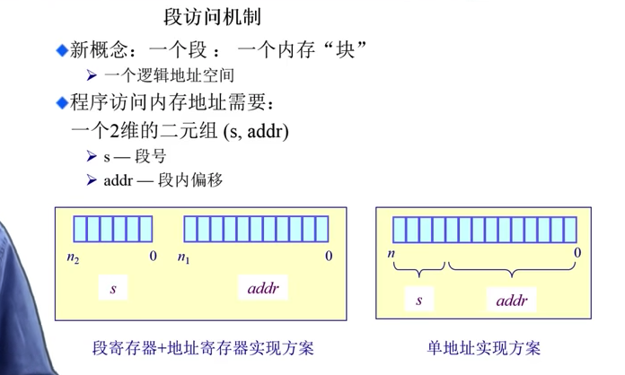
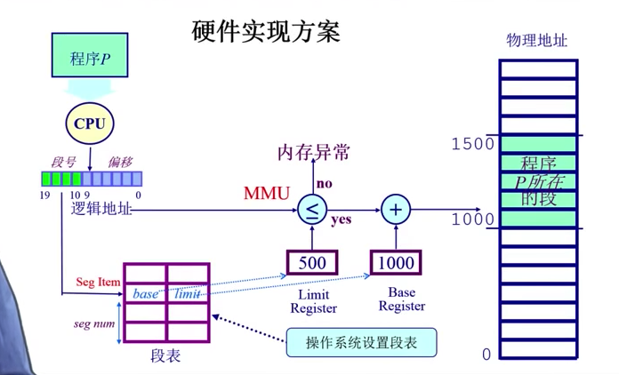

### 4.1 非连续内存分配：分段

##### Question： 
1. 为什么需要非连续内存分配？
2. 非连续内存的方法

-----------------

* 连续内存分配的缺点：
	+ 分配给一个程序的物理内存时连续的
	+ 内存利用率较低
	+ __有外碎片、内碎片的问题__
	
	为了解决碎片问题，可以采用_非连续分配_。
	
-----------------	
	
* 非连续分配的优点：
	+ 一个程序的物理地址空间是非连续的
	+ 更好的内存利用和管理（利于隔离、分配、保护）
	+ 允许共享代码与数据（共享库等...）
	+ 支持动态加载和动态链接
	

* 非连续分配的缺点：
	+ 如何建立虚拟地址和物理地址之间的转换
		- 软件方案
		- 硬件方案

-----------------	

* 两种硬件方案
	+ 分段
	+ 分页

-----------------	

* 分段
	+ 程序的分段地址空间
	+ 分段寻址方案
	
-----------------	
	
> 计算机程序其实是由各种各样的 段 组成的。如，在代码执行方面，有主程序、子程序，以及 共享的库。这些形成了代码不同的分段； 另一方面如数据， 有站段，堆段以及共享数据段。不同的段之间有不同的属性。因此，如果可以用某种方式把这些段区别、隔离，有助于更好的的管理程序。

-----------------	

>> 虚拟的逻辑地址空间可以视为 _连续的地址空间_ ,但是通过分段可以将之有效的隔离开。eg,堆栈地址被有效地隔离、分离出来了。这样可以使用户的代码段与主程序的代码段能共享、相互之间可以进行访问。
>>> 右侧是不连续的物理地址。中间需要特定的映射机制，建立相互对应的关联。

> 映射到物理地址空间(内存块)后，分段的大小、位置都可以不一样。 

>> 对于每一次的内存访问，通过软件的开销是很大的，因此，需要硬件的支持。那么如何通过硬件来支持的呢？

-----------------	

* 一维的逻辑地址是有不同的“段”组成的，段可以不连续。

* 段访问机制: 一个二维的二元组 (S, addr)
	1. S, 段号
	2. addr, 段内偏移

>>>  X86就是典型的使用“段寄存器 + 地址寄存器”的实现方案

-----------------	

* 硬件实现方案

> 一维的逻辑地址空间，需要映射到不同的(由不同的段组成的)物理地址上。

> 段表，是一种用于保存逻辑地址和物理地址段号的关系的保存机制。内部有两种重要信息，段的起始地址 + 段的长度限制。

> 段表是由OS在正式寻址之前就建立了的。 
>> 段表内的 index 是由 段号segment number 决定的。
>>> CPU会进行比对，看段地址是否满足这个限制 -- 访问是否合法、是否是合法的寻址。如果是非法访问，CPU会产生异常，交给OS处理(有问题则杀死)。

> 物理地址的形成，起始地址 + 限制。

