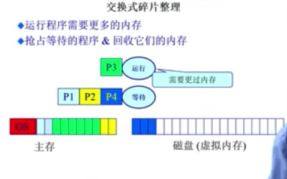

直接分配内存后，后续为了使碎片减少甚至消失，使内存空间尽量完整、连续，可以通过以下的方法：

### 3.4 连续内存分配：压缩式与交换式碎片整理

1. 压缩式碎片整理（紧致 compaction)
	+ 重置程序以合并孔洞
	+ 要求所有程序是 动态可重置的
	+ 议题：	何时重置？开销？

	

通过内存拷贝可以完成。

不能再程序运行的时候进行重置、只有当程序完成之后才可以开始拷贝。

在内存中频繁的拷贝、开销其实很大，甚至有可能会影响系统的正常执行。

--------------

* 交换式碎片整理(换入、换出 swapping)
	+ 充分的利用硬盘、把硬盘当做内存的后备。 
	
	> eg, 如P3执行时需要更多内存，而P1,P2,P3已经把内存占满（compaction 此时无效). 那么此时可以将正在 等待的P4 挪到硬盘，将其空间暂时给P3使用。 此时，P4的数据只是从内存移到了硬盘、并没有丢失。 当P3并不需要这么多的内存、P4需要继续执行时，只要将P4从硬盘上考回内存即可。
	
	+ 议题：哪些程序交换？

	

